# <a name="tutorial-use-cognitive-services-in-power-bi"></a>Esercitazione: Usare Servizi cognitivi in Power BI

Power BI mette a disposizione un set di funzioni di Servizi cognitivi di Azure per arricchire i dati nella preparazione dei dati self-service per i flussi di dati. I servizi attualmente supportati sono [Analisi del sentiment](https://docs.microsoft.com/azure/cognitive-services/text-analytics/how-tos/text-analytics-how-to-sentiment-analysis), [Estrazione frasi chiave](https://docs.microsoft.com/azure/cognitive-services/text-analytics/how-tos/text-analytics-how-to-keyword-extraction), [Rilevamento lingua](https://docs.microsoft.com/azure/cognitive-services/text-analytics/how-tos/text-analytics-how-to-language-detection) e [Assegnazione di tag alle immagini](https://docs.microsoft.com/azure/cognitive-services/computer-vision/concept-tagging-images). Le trasformazioni vengono eseguite nel servizio Power BI e non richiedono una sottoscrizione di Servizi cognitivi di Azure. Questa funzionalità richiede Power BI Premium.

Le trasformazioni di Servizi cognitivi sono supportate nella [preparazione dei dati self-service per i flussi di dati](https://powerbi.microsoft.com/blog/introducing-power-bi-data-prep-wtih-dataflows/). Per iniziare, usare gli esempi dettagliati per l'analisi del testo e l'aggiunta di tag alle immagini riportati di seguito.

In questa esercitazione verranno illustrate le procedure per:

> [!div class="checklist"]
> * Importare dati in Power BI
> * Assegnare un punteggio al sentiment ed estrarre le frasi chiave di una colonna di testo in un flusso di dati
> * Connettersi ai risultati da Power BI Desktop


## <a name="prerequisites"></a>Prerequisiti

Per completare l'esercitazione è necessario quanto segue: 

- Un account di Power BI. Se non si è ancora iscritti a Power BI, [iscriversi per ottenere una versione di prova gratuita](https://app.powerbi.com/signupredirect?pbi_source=web) prima di iniziare.
- Accesso a una capacità di Power BI Premium con il carico di lavoro di Intelligenza artificiale abilitato. Questo carico di lavoro verrà disattivato per impostazione predefinita durante l'anteprima. Se si usa una capacità Premium e le informazioni dettagliate sull'intelligenza artificiale non vengono visualizzate, contattare l'amministratore della capacità Premium per abilitare il carico di lavoro di Intelligenza artificiale nel portale di amministrazione.

## <a name="text-analytics"></a>Analisi del testo

Seguire i passaggi in questa sezione per completare la parte dell'esercitazione relativa all'analisi del testo.

### <a name="step-1-apply-sentiment-scoring-in-power-bi-service"></a>Passaggio 1: Applicare il processo di assegnazione di un punteggio al sentiment nel servizio Power BI

Per iniziare, passare a un'area di lavoro di Power BI con capacità Premium e creare un nuovo flusso di dati usando il pulsante **Crea** nell'angolo superiore destro dello schermo.

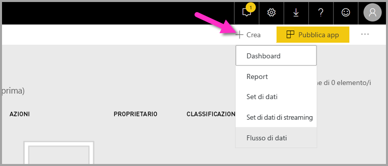

Nella finestra di dialogo del flusso di dati, che contiene le opzioni per la creazione di un nuovo flusso di dati, selezionare **Aggiungi nuove entità**. Scegliere quindi **Testo/CSV** dal menu delle origini dati.

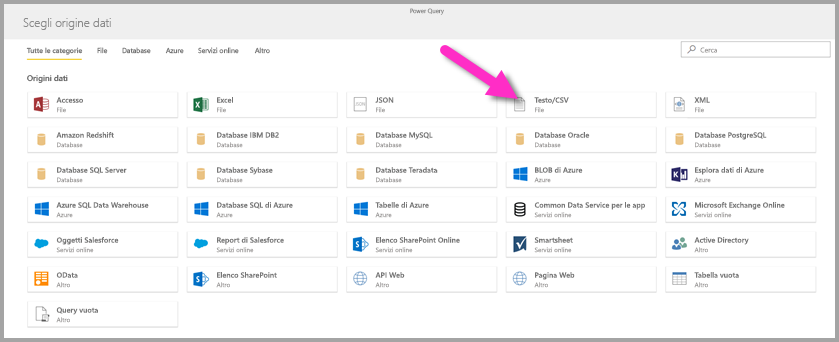

Nel campo URL incollare l'URL [https://pbiaitutorials.blob.core.windows.net/textanalytics/FabrikamComments.csv](https://pbiaitutorials.blob.core.windows.net/textanalytics/FabrikamComments.csv) e fare clic su **Avanti**.

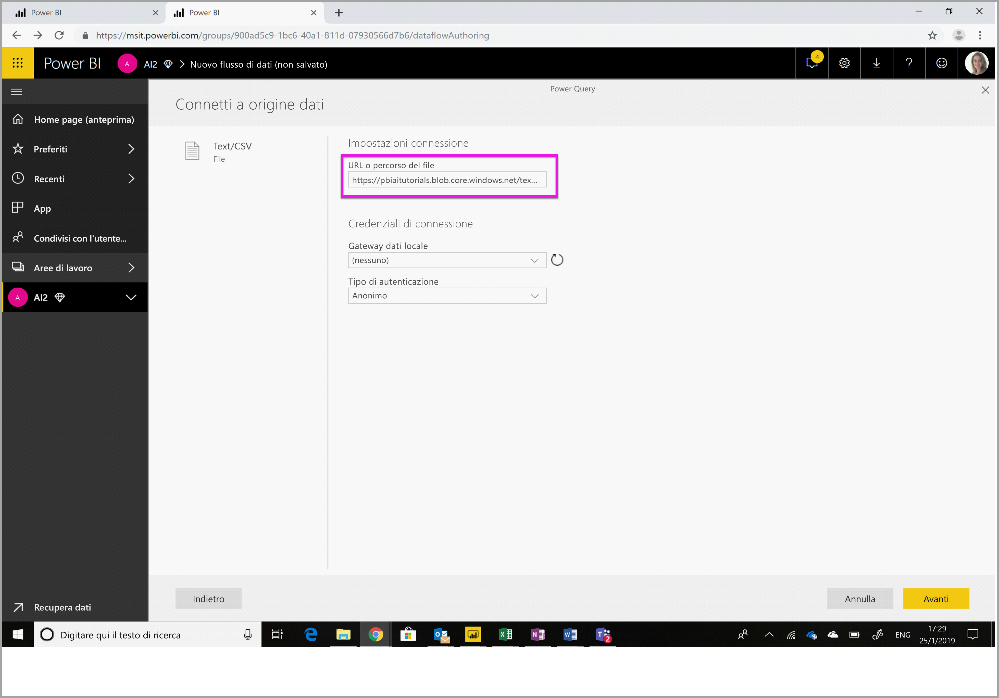

A questo punto i dati sono pronti per l'analisi del testo ed è possibile usare le funzioni Analisi del sentiment ed Estrazione frasi chiave nella colonna dei commenti dei clienti.

Nell'editor di Power Query selezionare **Informazioni dettagliate sull'intelligenza artificiale**.

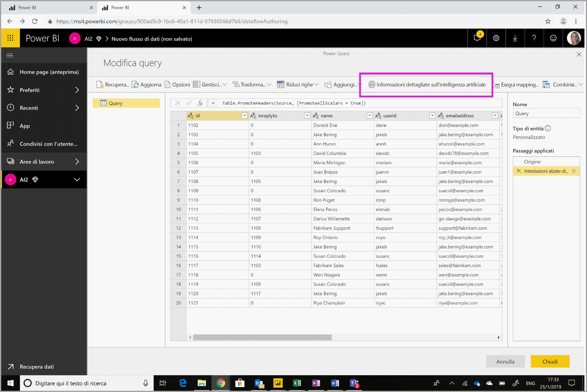

Espandere la cartella **Servizi cognitivi** e selezionare la funzione che si vuole usare. Questo esempio assegna un punteggio al sentiment della colonna dei commenti, ma è possibile seguire gli stessi passaggi per provare le funzioni Rilevamento lingua ed Estrazione frasi chiave.

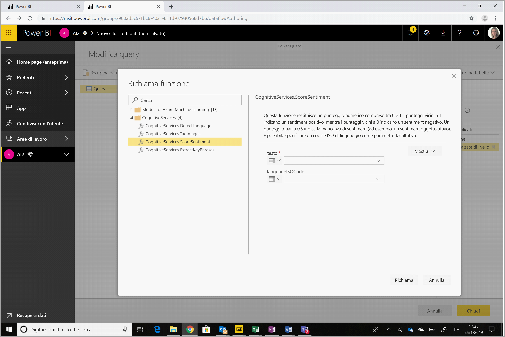

Dopo aver selezionato una funzione, vengono visualizzati i campi obbligatori e facoltativi. Per assegnare un punteggio al sentiment delle recensioni di esempio, selezionare la colonna delle recensioni come input di testo. Le informazioni delle impostazioni cultura sono un input facoltativo che richiede un formato ISO. Ad esempio, se si vuole che il testo sia considerato come in lingua inglese, immettere "en". Se il campo viene lasciato vuoto, Power BI rileva la lingua del valore di input prima di assegnare un punteggio al sentiment.

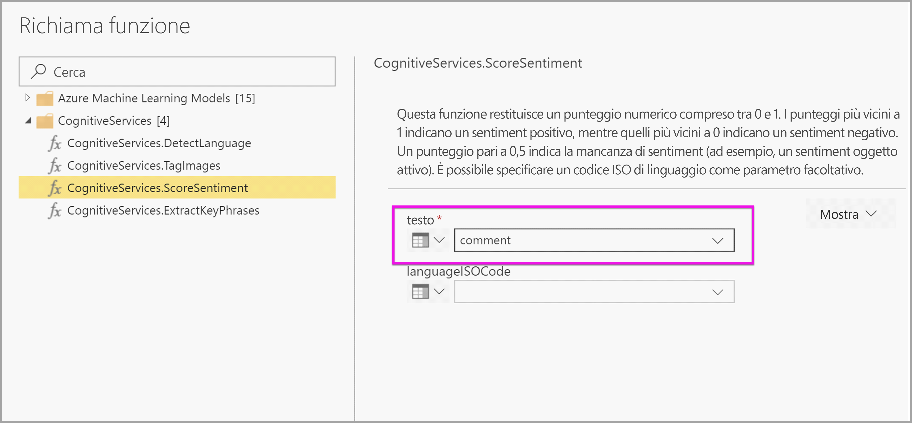

Selezionare **Richiama** per eseguire la funzione. Viene aggiunta alla tabella una nuova colonna con il punteggio del sentiment per ogni riga. È possibile tornare a **Informazioni dettagliate sull'intelligenza artificiale** per estrarre le frasi chiave del testo delle recensioni nello stesso modo.

Completate le trasformazioni, cambiare il nome della query in "Customer comments" e selezionare **Fine**.

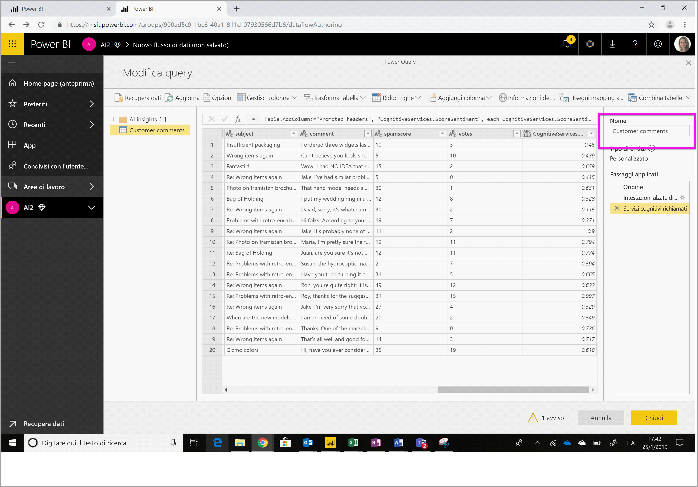

Scegliere **Salva** per salvare il flusso di dati e assegnargli il nome Fabrikam. Selezionare il pulsante **Aggiorna adesso** visualizzato dopo il salvataggio del flusso di dati.

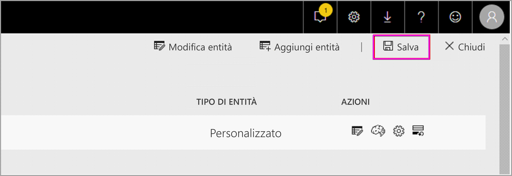

Dopo aver salvato e aggiornato il flusso di dati, è possibile usarlo in un report di Power BI.

### <a name="step-2-connect-from-power-bi-desktop"></a>Passaggio 2: Connettersi da Power BI Desktop

Aprire Power BI Desktop. Nella scheda Home della barra multifunzione selezionare **Recupera dati**.

Passare a **Flussi di dati Power BI (beta**) nella sezione Power BI e selezionare **Connetti**.

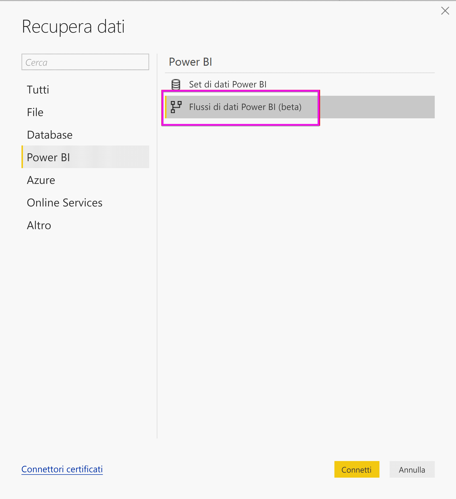

Trattandosi di una funzionalità di anteprima, il connettore chiederà di accettare le condizioni dell'anteprima. Dopo averle accettate, accedere con l'account dell'organizzazione.

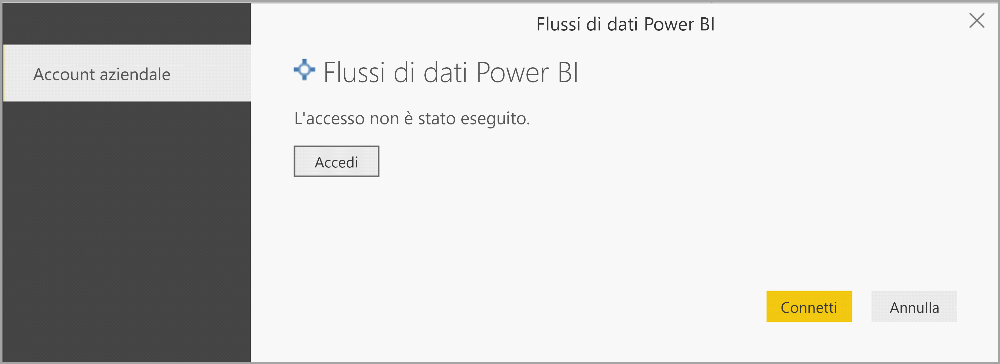

Selezionare il flusso di dati appena creato. Passare alla tabella dei commenti dei clienti e fare clic su **Carica**.

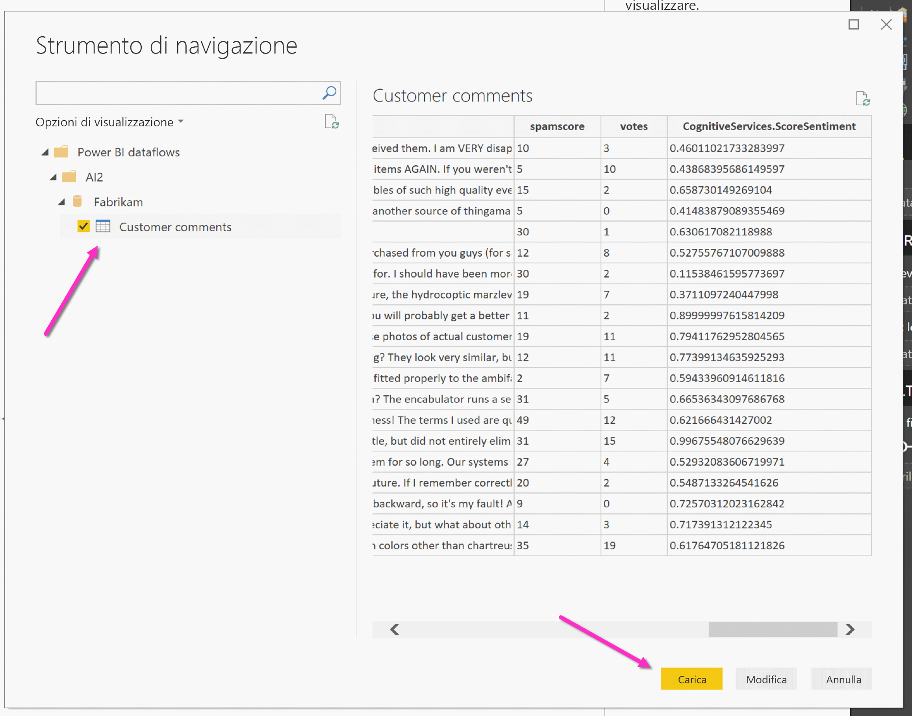

Ora che i dati sono caricati è possibile iniziare a creare un report.

## <a name="image-tagging"></a>Assegnazione di tag alle immagini

Passare a un'area di lavoro di Power BI con capacità Premium. Creare un nuovo flusso di dati usando il pulsante **Crea** nell'angolo superiore destro dello schermo.

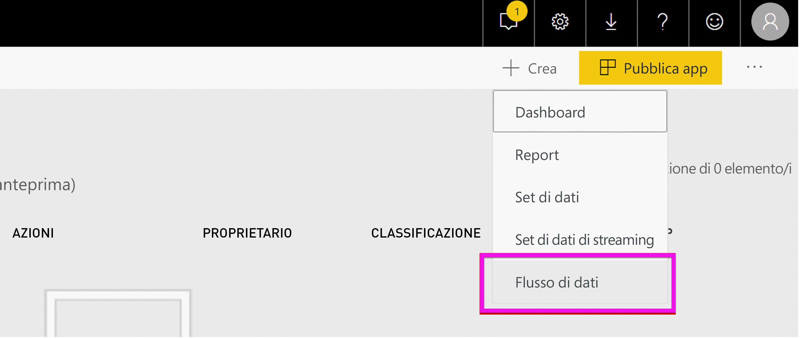

Selezionare **Aggiungi nuove entità**.

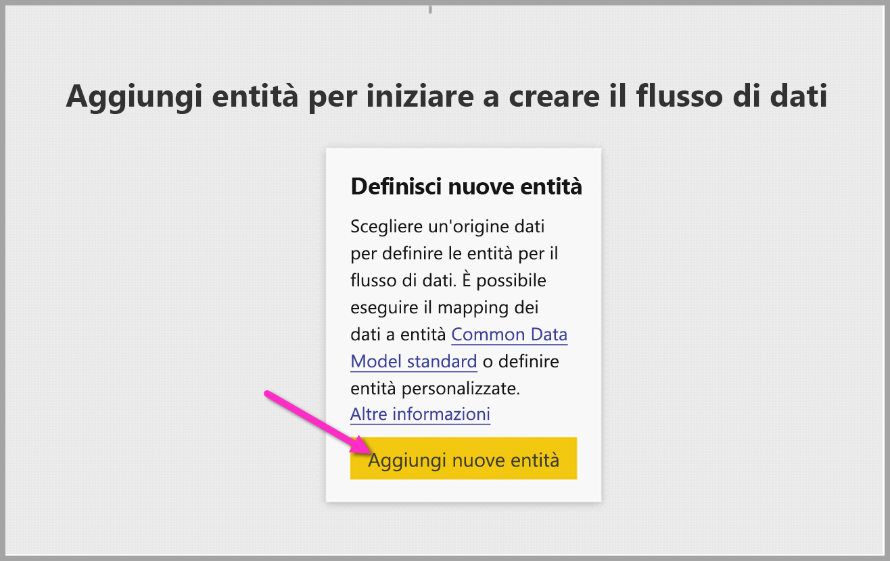

Quando viene chiesto di scegliere un'origine dati, selezionare **Query vuota**.

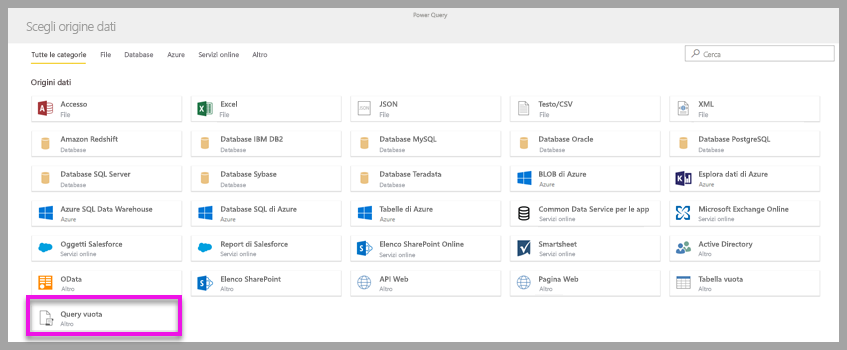

Copiare la query seguente nell'editor di query e fare clic su Avanti. È possibile sostituire i percorsi degli URL seguenti con altre immagini o aggiungere altre righe. La funzione *Web.Contents* importa l'URL immagine in formato binario. Se si ha un'origine dati con immagini archiviate in formato binario, è possibile usarla direttamente.


```python
let
  Source = Table.FromRows({
  { Web.Contents("https://images.pexels.com/photos/87452/flowers-background-butterflies-beautiful-87452.jpeg") },
  { Web.Contents("https://upload.wikimedia.org/wikipedia/commons/5/53/Colosseum_in_Rome%2C_Italy_-_April_2007.jpg") }}, { "Image" })
in
  Source
```

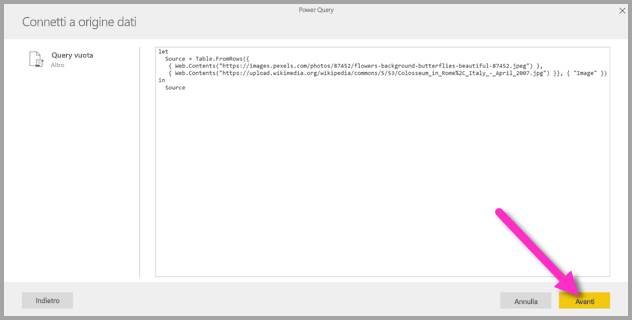

Quando viene chiesto di immettere le credenziali, selezionare *Anonima*.

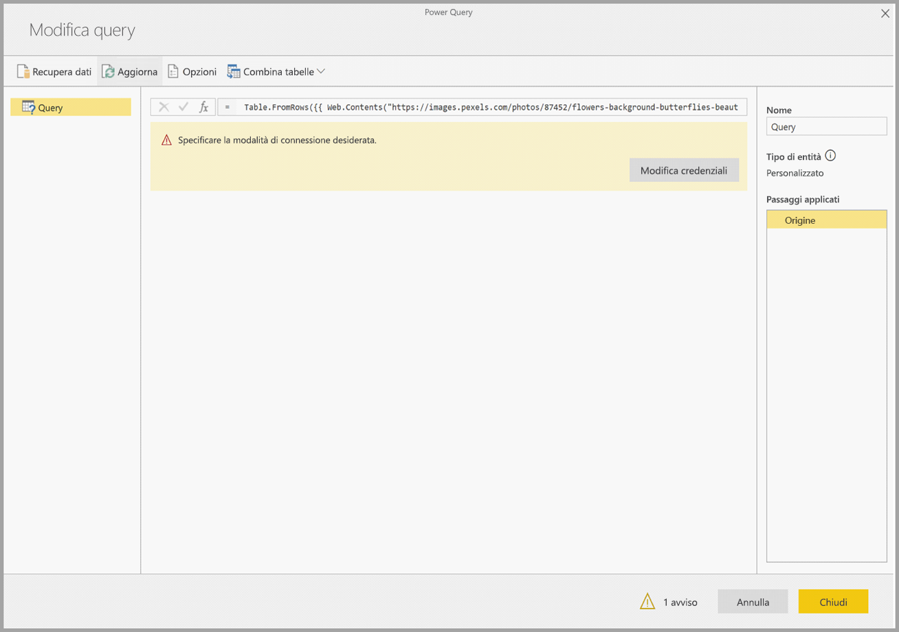

Viene visualizzata l'immagine seguente.

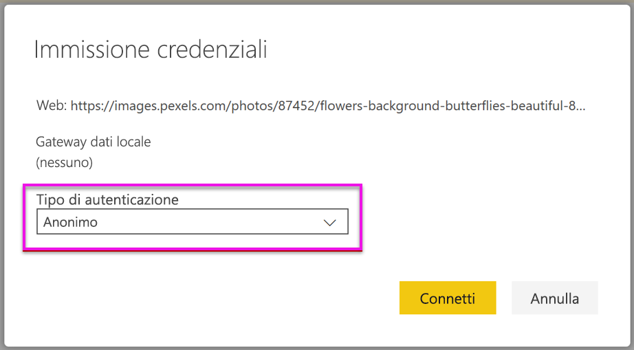

Viene chiesto di immettere le credenziali per ogni singola pagina Web.

Nell'editor di query selezionare **Informazioni dettagliate sull'intelligenza artificiale**.

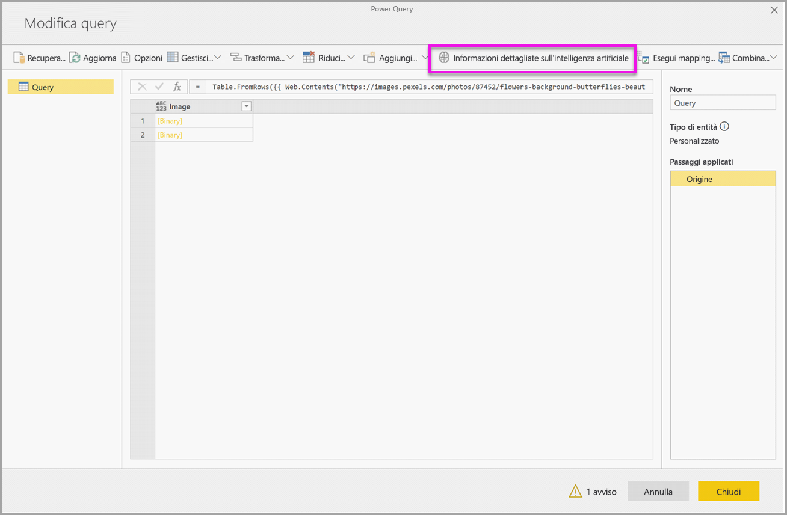

Accedere quindi con l'**account aziendale**.

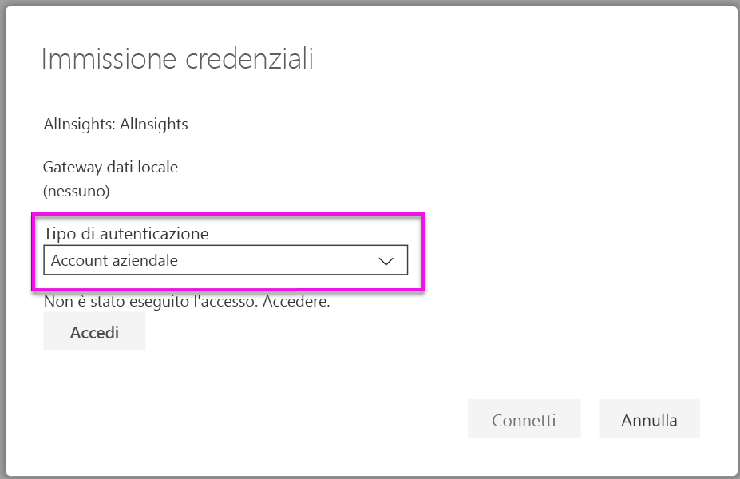

Selezionare la funzione di assegnazione di tag alle immagini, immettere _[Binary]_ nel campo della colonna e _en_ nel campo delle informazioni delle impostazioni cultura. 

> [!NOTE]
> Attualmente non è possibile selezionare una colonna usando un elenco a discesa, ma questo aspetto verrà risolto il più presto possibile durante l'anteprima privata.

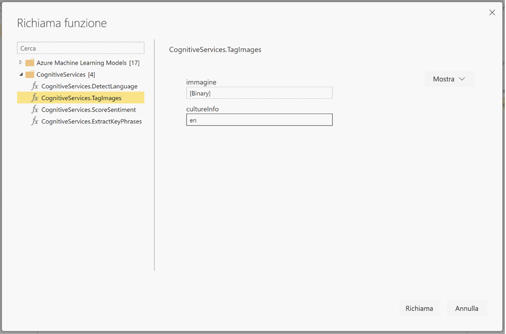

Nell'editor di funzioni rimuovere le virgolette attorno al nome della colonna. 

> [!NOTE]
> La rimozione delle virgolette è una soluzione alternativa temporanea, in attesa della soluzione definitiva durante l'anteprima.

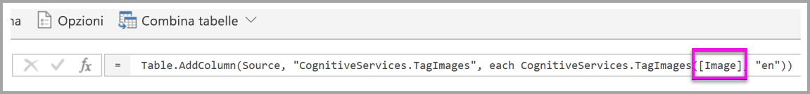

La funzione restituisce un record con i tag sia in formato con valori separati da virgole che come record JSON. Selezionare il pulsante di espansione per aggiungere uno o entrambi i tag come colonne alla tabella.

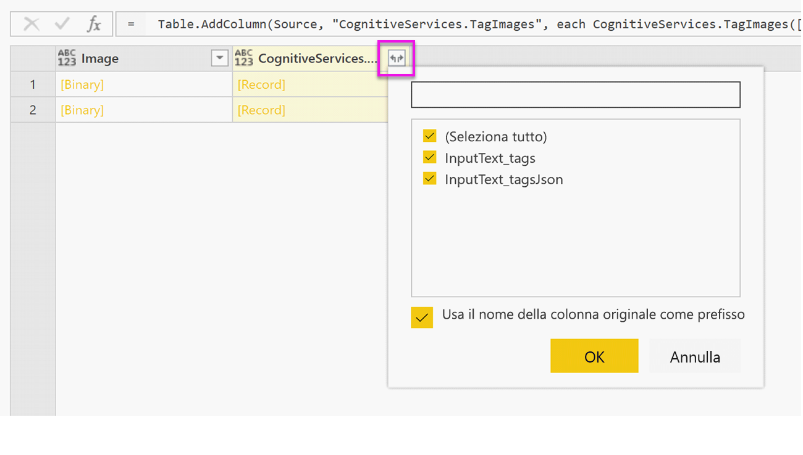

Selezionare **Fine** e salvare il flusso di dati. Una volta aggiornato il flusso di dati, è possibile connettersi a esso da Power BI Desktop usando i connettori di flussi di dati (vedere i passaggi a pagina 5 di questo documento).

## <a name="clean-up-resources"></a>Pulire le risorse

Quando non serve più, eliminare la query facendo clic con il pulsante destro del mouse sul relativo nome nell'editor di Power Query e scegliendo **Elimina**.

## <a name="next-steps"></a>Passaggi successivi

In questa esercitazione sono state applicate le funzioni di assegnazione del punteggio e di assegnazione di tag alle immagini in un flusso di dati di Power BI. Per altre informazioni su Servizi cognitivi in Power BI, leggere gli articoli seguenti.

* [Servizi cognitivi in Azure](https://docs.microsoft.com/azure/cognitive-services/)
* Introduzione alla [preparazione dei dati self-service nei flussi di dati](../transform-model/service-dataflows-overview.md)
* Altre informazioni su [Power BI Premium](https://powerbi.microsoft.com/power-bi-premium/)

Potrebbero essere interessanti anche gli articoli seguenti.

* [Esercitazione: Richiamare un modello di Machine Learning Studio (versione classica) in Power BI (anteprima)](service-tutorial-invoke-machine-learning-model.md)
* [Integrazione di Azure Machine Learning in Power BI (anteprima)](../transform-model/service-machine-learning-integration.md)
* [Servizi cognitivi in Power BI (anteprima)](../transform-model/service-cognitive-services.md)