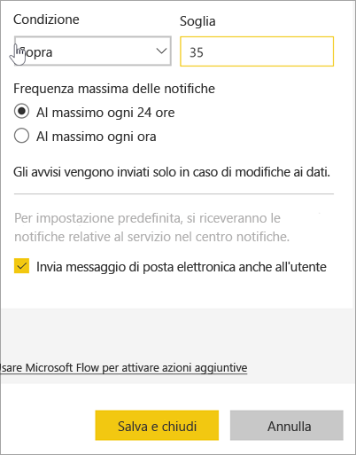
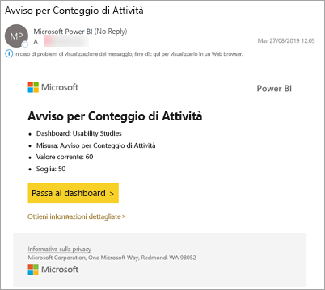

# Esercitazione: Impostare avvisi per i dashboard di Power BI
Impostare gli avvisi per ricevere una notifica quando i dati nei dashboard superano i limiti impostati. Gli avvisi funzionano per misuratori, indicatori KPI e schede. Questa funzionalità è ancora in evoluzione, quindi fare riferimento alla [sezione Suggerimenti e risoluzione dei problemi di seguito](#tips-and-troubleshooting).

Gli avvisi possono essere visualizzati solo da chi li imposta, anche se si condivide il dashboard. Gli avvisi per i dati sono completamente sincronizzati sulle piattaforme. È possibile quindi impostare e visualizzare gli avvisi per i dati [nell'app Power BI per dispositivi mobili](mobile/mobile-set-data-alerts-in-the-mobile-apps.md) e nel servizio Power BI. 

> [!WARNING]
> Questi avvisi forniscono informazioni sui dati. Se il dispositivo sul quale si visualizzano i dati di Power BI viene rubato, è consigliabile disattivare tutti gli avvisi usando il servizio Power BI.
> 

In questa esercitazione vengono trattati gli argomenti seguenti.
> [!div class="checklist"]
> * Chi può impostare gli avvisi
> * Oggetti visivi che supportano gli avvisi
> * Chi può vedere gli avvisi
> * Funzionamento degli avvisi in Power BI Desktop e per dispositivi mobili
> * Come creare un avviso
> * Dove vengono recapitati gli avvisi

Se non si è ancora iscritti a Power BI, [iscriversi per ottenere una versione di prova gratuita](https://app.powerbi.com/signupredirect?pbi_source=web) prima di iniziare.

Questo esempio usa un riquadro di tipo scheda del dashboard dall'app di esempio Sales & Marketing. Questa app è disponibile in [Microsoft AppSource](https://appsource.microsoft.com). Per informazioni su come ottenere l'app, vedere [Installare e usare le app con Power BI](end-user-app-view.md).

1. Selezionare i puntini di sospensione da un riquadro del misuratore, dell'indicatore KPI o della scheda del dashboard.
   
   
2. Selezionare l'icona a forma di campana  o **Gestisci avvisi** per aggiungere uno o più avvisi per **Total stores**.

   

   
1. Nel riquadro **Gestisci avvisi** selezionare **+ Aggiungi regola di avviso**.  Verificare che il dispositivo di scorrimento sia impostato su **Attivo** e assegnare un titolo all'avviso. I titoli consentono di riconoscere facilmente gli avvisi.
   
   
4. Scorrere verso il basso e immettere i dettagli dell'avviso.  In questo esempio verrà creato un avviso che invia una notifica una volta al giorno se la quota di mercato aumenta fino a 35 o più. Gli avvisi vengono visualizzati nel centro notifiche e Power BI invia anche un messaggio di posta elettronica.
   
   
5. Selezionare **Salva e chiudi**.
 
   > [!NOTE]
   > Gli avvisi possono essere usati solo con dati aggiornati. Quando i dati vengono aggiornati, Power BI controlla se è impostato un avviso per tali dati. Se i dati raggiungono una soglia di avviso, viene generato un avviso. 
   > 

## Ricezione di avvisi
Quando i dati rilevati raggiungono una delle soglie impostate, vengono eseguite alcune operazioni. In base all'opzione selezionata, Power BI per prima cosa controlla se è trascorsa più di un'ora o più di 24 ore dall'invio dell'ultimo avviso. Se i dati superano la soglia, viene visualizzato un avviso.

Successivamente, Power BI invia un avviso al centro di notifica e, facoltativamente, alla casella di posta elettronica. Ogni avviso contiene un collegamento diretto ai dati. Selezionare il collegamento per visualizzare il riquadro pertinente.  

1. Se è stato impostato anche l'invio di un messaggio di posta elettronica, nella posta in arrivo viene visualizzato un messaggio simile al seguente. Questo è un avviso impostato per un dashboard diverso. Questo dashboard tiene traccia delle attività completate dal team di usabilità.
   
   
2. Power BI aggiunge un messaggio al **centro notifiche** e una nuova icona di avviso al riquadro applicabile.
   
   
3. Aprire il centro notifiche per visualizzare i dettagli dell'avviso.
   
    
   
  

## Gestione degli avvisi

Sono disponibili molti modi per gestire gli avvisi: Dal riquadro del dashboard, dal menu Impostazioni di Power BI, da un singolo riquadro nell'[app Power BI per dispositivi mobili su iPhone](mobile/mobile-set-data-alerts-in-the-mobile-apps.md) o nell'[app Power BI per dispositivi mobili per Windows 10](mobile/mobile-set-data-alerts-in-the-mobile-apps.md).

### Dal riquadro

1. Per modificare o rimuovere un avviso per un riquadro, aprire nuovamente la finestra **Gestisci avvisi** selezionando l'icona a forma di campana . Vengono visualizzati tutti gli avvisi impostati per questo riquadro.
   
    .
2. Per modificare un avviso, selezionare la freccia a sinistra del nome dell'avviso.
   
    .
3. Per eliminare un avviso, selezionare il cestino a destra del nome dell'avviso.
   
      

### Dal menu Impostazioni di Power BI

1. Selezionare l'icona dell'ingranaggio dalla barra dei menu di Power BI.
   
    .
2. In **Impostazioni** selezionare **Avvisi**.
   
    
3. Da qui è possibile attivare e disattivare gli avvisi, aprire la finestra **Gestisci avvisi** per apportare modifiche o eliminare l'avviso.

## Suggerimenti e risoluzione dei problemi 

* Gli avvisi possono essere impostati solo per misuratori, indicatori KPI e schede.
* Se non è possibile impostare un avviso per un misuratore, un indicatore KPI o una scheda, richiedere assistenza all'amministratore di sistema. A volte gli avvisi vengono disattivati o non sono disponibili per il dashboard o per tipi specifici di riquadri del dashboard.
* Gli avvisi possono essere usati solo con dati aggiornati. Non possono essere usati con dati statici. La maggior parte degli esempi forniti da Microsoft è statica. 

## Pulire le risorse
Le istruzioni per l'eliminazione degli avvisi sono illustrate in precedenza. In breve, selezionare l'icona dell'ingranaggio dalla barra dei menu di Power BI. In **Impostazioni** selezionare **Avvisi** ed eliminare l'avviso.

> [!div class="nextstepaction"]
> [Impostare gli avvisi per i dati nel dispositivo mobile](mobile/mobile-set-data-alerts-in-the-mobile-apps.md)

