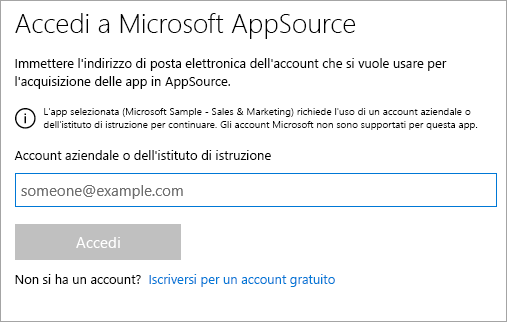
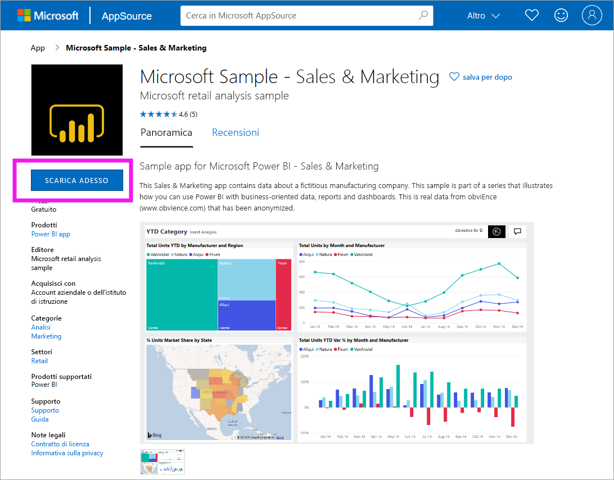
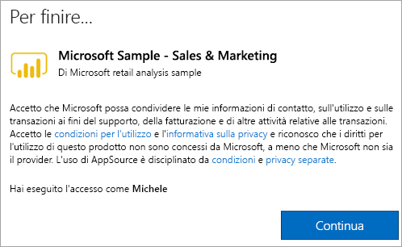
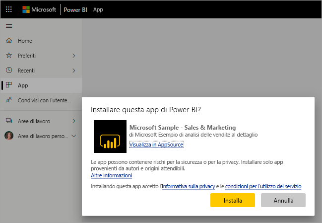
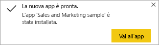
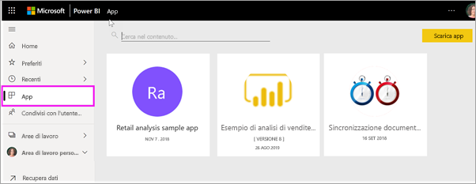
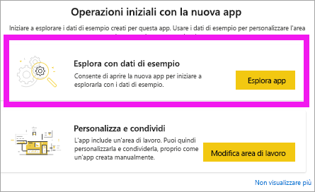
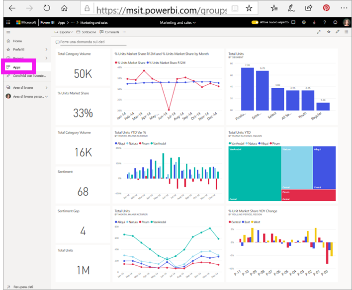

# Installare e usare l'app Sales and Marketing di esempio nel servizio Power BI
Dopo aver acquisito una [conoscenza di base di come ottenere contenuti di Power BI](end-user-app-view.md), scaricare l'app Marketing and Sales da Microsoft AppSource (appsource.com). 

## Microsoft AppSource (appsource.com)
Ecco il collegamento all'app: [App Marketing and sales](https://appsource.microsoft.com/product/power-bi/microsoft-retail-analysis-sample.salesandmarketingsample?tab=Overview). Selezionando questo collegamento, viene visualizzata la pagina di download per l'app in Microsoft AppSource. 

1. È possibile che venga richiesto di eseguire l'accesso prima di poter scaricare l'app. Accedere con lo stesso indirizzo di posta elettronica usato per Power BI. 

    

2. Selezionare **Scarica adesso**. 

    

3. Se è la prima volta che si accede da AppSource, è necessario accettare le condizioni per l'utilizzo. 

    

4. Verrà aperto il servizio Power BI. Confermare che si vuole installare questa app.

    

5. Il servizio Power BI visualizzerà un messaggio di operazione completata dopo l'installazione dell'app. Selezionare **Vai all'app** per aprire l'app. A seconda del modo in cui il progettista ha creato l'app, verrà visualizzato il dashboard dell'app o il report dell'app.

    

    È anche possibile aprire l'app direttamente dall'elenco di contenuti dell'app selezionando **App** e scegliendo **Sales & Marketing**.

    

6. Scegliere se esplorare o personalizzare e condividere la nuova app. Dato che è stata selezionata un'app di esempio Microsoft, si inizierà con l'esplorazione. 

    

7.  La nuova app si apre con un dashboard. Il *progettista* dell'app potrebbe anche avere configurato l'app per l'apertura in un report.  

    

## Interagire con i dashboard e i report nell'app
Dedicare un po' di tempo a esplorare i dati nei dashboard e nei report che compongono l'app. È possibile accedere a tutte le interazioni standard di Power BI, ad esempio i filtri, l'evidenziazione, l'ordinamento e il drill-down.  Se ancora non sono del tutto chiare le differenze tra dashboard e report,  leggere l'[articolo sui dashboard](end-user-dashboards.md) e l'[articolo sui report](end-user-reports.md).  

## Passaggi successivi
* [Tornare alla panoramica delle app](end-user-apps.md)
* [Visualizzare un report di Power BI](end-user-report-open.md)
* [Altri modi per condividere il contenuto](end-user-shared-with-me.md)
