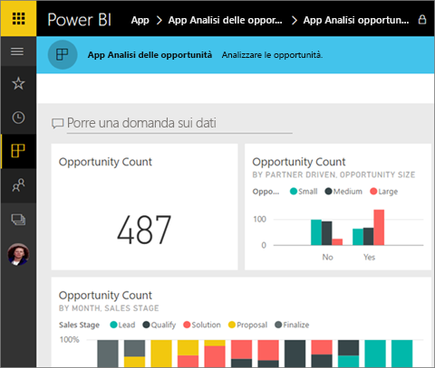
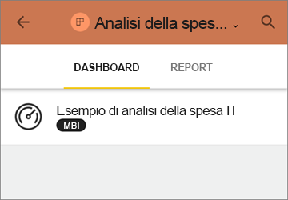
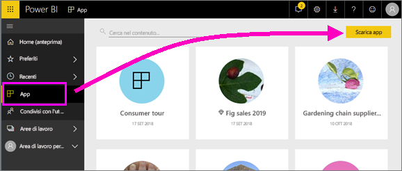
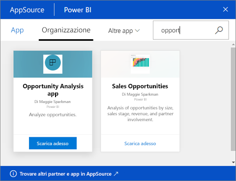
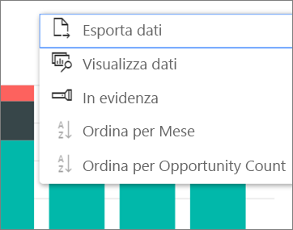

# Installare e usare le app con dashboard e report in Power BI
Dopo aver acquisito [una conoscenza di base delle app](end-user-apps.md), verrà illustrato come aprirle e interagire con esse. 

## Modi per ottenere una nuova app
Tenere presente che esistono diversi modi per ottenere una nuova app. Un collega addetto alla progettazione di report può installare l'app automaticamente nell'account Power BI o inviare un collegamento diretto a un'app. È anche possibile passare ad AppSource e cercare le app disponibili sia all'interno che all'esterno della società. 

In Power BI nel dispositivo mobile è possibile installare un'app solo da un collegamento diretto, non da AppSource. Se l'autore dell'app installa automaticamente l'app, verrà visualizzata nell'elenco delle app.

## Installare un'app da un collegamento diretto
Il modo più semplice per installare una nuova app consiste nell'ottenere un collegamento diretto, tramite posta elettronica, dall'autore dell'app.  

**Nel computer** 

Quando si seleziona il collegamento contenuto nel messaggio di posta elettronica, viene aperto il servizio Power BI ([https://powerbi.com](https://powerbi.com)) in un browser. Confermare che si vuole installare l'app. Power BI aprirà la pagina di destinazione dell'app.

**Nel dispositivo mobile iOS o Android** 

Quando si seleziona il collegamento nel messaggio di posta elettronica nel dispositivo mobile, l'app viene installata automaticamente e viene aperto l'elenco del contenuto dell'app per dispositivi mobili. 

## Ottenere l'app da Microsoft AppSource
È anche possibile trovare e installare le app da Microsoft AppSource. Vengono visualizzate solo le app a cui si ha accesso, ovvero quelle per cui l'autore dell'app ha concesso l'autorizzazione.

1. Selezionare **App**  > **Scarica app**. 
   
     
2. In AppSource in **La mia organizzazione**, è possibile eseguire una ricerca per limitare il numero di risultati e trovare l'app si sta cercando.
   
     
3. Selezionare **Scarica adesso** per aggiungerla all'elenco di contenuti App. 

## Interagire con i dashboard e i report nell'app
È ora possibile esplorare i dati nei dashboard e nei report nell'app. È possibile accedere a tutte le interazioni standard di Power BI, ad esempio i filtri, l'evidenziazione, l'ordinamento e il drill-down. È anche possibile [esportare i dati in Excel ](end-user-export-data.md) da una tabella o da altri oggetti visivi in un report. Vedere [Interagire con i report in Power BI](end-user-reading-view.md). 

## Passaggi successivi
* [App Power BI per dispositivi esterni](end-user-connect-to-services.md)
* Domande? [Provare a rivolgersi alla community di Power BI](http://community.powerbi.com/)

