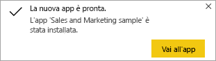
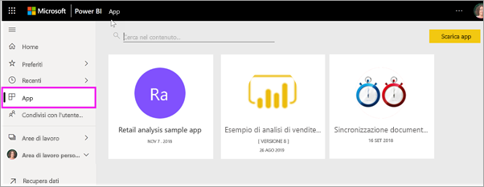
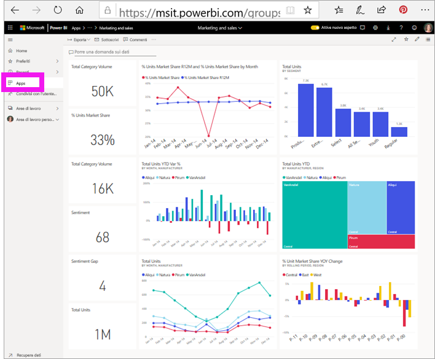

# Installare e usare le app con dashboard e report in Power BI

[!INCLUDE[consumer-appliesto-ynny](../includes/consumer-appliesto-ynny.md)]

[!INCLUDE [power-bi-service-new-look-include](../includes/power-bi-service-new-look-include.md)]

Dopo aver acquisito [una conoscenza di base delle app](end-user-apps.md), verrà illustrato come aprirle e interagire con esse. 

## Modi per ottenere una nuova app
Esistono diversi modi per ottenere una nuova app. Un collega addetto alla progettazione di report può installare l'app automaticamente nell'account Power BI o inviare un collegamento diretto a un'app. È anche possibile passare ad AppSource e cercare le app rese disponibili dai progettisti di app sia all'interno che all'esterno della società. 

In Power BI nel dispositivo mobile è possibile installare un'app solo da un collegamento diretto, non da AppSource. Se il designer dell'app la installa automaticamente, verrà visualizzata nell'elenco delle app.

## App e licenze
Non tutti gli utenti di Power BI possono visualizzare e interagire con le app. 
- Se si ha una licenza gratuita, è possibile aprire app che sono state condivise da altri utenti e sono archiviate in un'area di lavoro nella capacità Premium.
- Se si ha una licenza Pro, è possibile aprire app che sono state condivise da altri utenti.

## Installare un'app da un collegamento diretto
Il modo più semplice per installare una nuova app consiste nell'ottenere un collegamento diretto, tramite posta elettronica, dal progettista dell'app.  

**Nel computer** 

Quando si seleziona il collegamento nel messaggio di posta elettronica, il servizio Power BI ([https://powerbi.com](https://powerbi.com)) apre l'app nel browser. 

**Nel dispositivo mobile iOS o Android** 

Quando si seleziona il collegamento nel messaggio di posta elettronica nel dispositivo mobile, l'app viene installata automaticamente e viene aperta nell'app per dispositivi mobili. Potrebbe essere necessario eseguire prima l'accesso. 

## Ottenere l'app da Microsoft AppSource
È anche possibile trovare e installare le app da Microsoft AppSource. Vengono visualizzate solo le app a cui si ha accesso, ovvero quelle per cui l'autore dell'app ha concesso l'autorizzazione. 

> [!NOTE]
> Se si usa una licenza utente gratuita, è possibile scaricare le app ma non visualizzarle, a meno che non si esegua l'aggiornamento a un account Power BI Pro o che l'app non sia archiviata nella capacità Premium. Per altre informazioni, vedere [Uso del servizio Power BI come utente finale](end-user-license.md).

1. Selezionare **App**  > **Scarica app**. 
   
        
2. In AppSource, in **Organizzazione** eseguire una ricerca per limitare il numero di risultati e trovare l'app che si sta cercando.
   
    
3. Selezionare **Scarica adesso** per aggiungerla all'elenco di contenuti App. 

## Ottenere un'app dal sito Web Microsoft AppSource 

In questo esempio verrà aperta una delle app di esempio Microsoft. In AppSource sono disponibili app per molti dei servizi usati per le attività aziendali,  ad esempio Salesforce, Microsoft Dynamics, Google Analytics, GitHub, Zendesk, Marketo e molti altri. Per altre informazioni, vedere [App per i servizi usati con Power BI](../service-connect-to-services.md). 

1. In un browser aprire [https://appsource.microsoft.com](https://appsource.microsoft.com) e selezionare **App Power BI**.

    

2. Selezionare **Visualizza tutti** per visualizzare l'elenco di tutte le app Power BI attualmente disponibili in AppSource. Scorrere o cercare l'app denominata **Microsoft Sample - Sales & Marketing**.

    

3. Selezionare **Scarica adesso** e accettare le condizioni per l'utilizzo.

    

4. Confermare che si vuole installare questa app.

    

5. Il servizio Power BI visualizzerà un messaggio di operazione completata dopo l'installazione dell'app. Selezionare **Vai all'app** per aprire l'app. A seconda del modo in cui il progettista ha creato l'app, verrà visualizzato il dashboard dell'app o il report dell'app.

    

    > [!NOTE]
    > Se si usa una licenza utente gratuita, è possibile scaricare le app ma non visualizzarle, a meno che non si esegua l'aggiornamento a un account Power BI Pro. 

    È anche possibile aprire l'app direttamente dall'elenco di contenuti dell'app selezionando **App** e scegliendo **Sales & Marketing**.

    

6. Scegliere se esplorare o personalizzare e condividere la nuova app. Dato che è stata selezionata un'app di esempio Microsoft, si inizierà con l'esplorazione. 

    

7.  La nuova app si apre con un dashboard. Il *progettista* dell'app potrebbe anche avere configurato l'app per l'apertura in un report.  

    

## Interagire con i dashboard e i report nell'app
Dedicare un po' di tempo a esplorare i dati nei dashboard e nei report che compongono l'app. È possibile accedere a tutte le interazioni standard di Power BI, ad esempio i filtri, l'evidenziazione, l'ordinamento e il drill-down.  Se ancora non sono del tutto chiare le differenze tra dashboard e report,  leggere l'[articolo sui dashboard](end-user-dashboards.md) e l'[articolo sui report](end-user-reports.md).  

## Aggiornare un'app 

Gli autori di app possono rilasciare periodicamente nuove versioni delle app. Il modo in cui si ottiene la nuova versione dipende dalla modalità di ricezione dell'originale. 

* Se l'app è stata ottenuta dall'organizzazione, l'aggiornamento alla nuova versione è completamente trasparente e non è necessario eseguire alcuna operazione. 

* Se l'app è stata ottenuta da AppSource, alla successiva apertura dell'app verrà visualizzato un banner di notifica. La notifica informa che è disponibile una nuova versione. 

    1. Selezionare **Scarica adesso** per ottenere l'aggiornamento.  

        <!-- -->

    2. Quando viene richiesto di installare l'app aggiornata, selezionare **Installa**. 

         

    3. Dato che è già disponibile una versione di questa app, decidere se sostituire la versione esistente o se installare l'app aggiornata in una nuova area di lavoro.   

         

    > [!NOTE] 
    > L'installazione di una nuova versione sovrascrive tutte le modifiche apportate ai report e ai dashboard. Per conservare i report e i dashboard aggiornati, è possibile salvarli con un nome o un percorso diverso prima dell'installazione. 

    4. Dopo aver installato la versione aggiornata, selezionare **Aggiorna app** per completare il processo di aggiornamento. 

## Passaggi successivi
* [Tornare alla panoramica delle app](end-user-apps.md)
* [Visualizzare un report di Power BI](end-user-report-open.md)
* [Altri modi per condividere il contenuto](end-user-shared-with-me.md)
