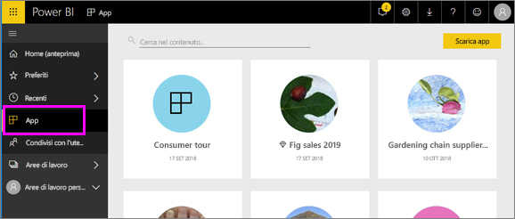

# App in Power BI
## Informazioni sulle app di Power BI
Un'*app* è un tipo di contenuto di Power BI che combina tutti i dashboard e i report correlati in un'unica posizione. Un'app può avere uno o più dashboard e uno o più report, tutti aggregati insieme. Le app vengono create dai *designer* di Power BI che distribuiscono e condividono le app con gli *utenti*. 

Le app vengono organizzate nell'elenco di contenuti **App**.

> [!NOTE]
> Per usare le app è richiesta una licenza Power BI Pro. <!-- add link to how to figure out your license -->

## ***Designer*** di app e ***utenti*** di app
In base al ruolo, potrebbe essere un utente che crea le App (*progettazione*) per uso personale o da condividere con i colleghi. Oppure, potrebbe essere un utente che riceve e scarica le App (*consumatore*) create da altri utenti. Questo articolo può essere utile per gli *utenti* delle app.

## Vantaggi delle app
Le app possono essere facilmente individuate e installate nel servizio Power BI ([https://powerbi.com](https://powerbi.com)) e nel dispositivo mobile. Dopo l'installazione di un'app non è necessario ricordare i nomi di molti dashboard diversi, perché sono tutti riuniti in un'app, nel browser o nel dispositivo mobile.

Ogni volta che l'autore dell'app rilascia aggiornamenti, le modifiche vengono visualizzate automaticamente nelle app. L'autore controlla anche la frequenza con cui è pianificato l'aggiornamento dei dati, dunque non è necessario preoccuparsi di stare al passo. 

<!-- add conceptual art -->
## Ottenere una nuova app
È possibile ottenere le app in diversi modi. 
- L'autore dell'app può installarla automaticamente nell'account Power BI e, all'apertura successiva di Power BI, la nuova app verrà visualizzata nell'elenco di contenuti **App**. 
- L'autore dell'app può inviare tramite posta elettronica un collegamento diretto a un'app. Quando si seleziona il collegamento, l'app viene aperta in Power BI.
- È possibile cercare le app in AppSource, in cui sono visualizzate tutte le app a cui è possibile accedere. AppSource contiene le app pubblicate dai designer di report all'interno e all'esterno della società. È ad esempio possibile trovare un'app in AppSource per un servizio che si usa già, come Google Analytics, GitHub o Microsoft Dynamics. 
- In Power BI nel dispositivo mobile è possibile installare un'app solo da un collegamento diretto, non da AppSource. Se l'autore dell'app installa automaticamente l'app, verrà visualizzata nell'elenco delle app.

## Passaggio successivo
* [Aprire e interagire con un'app](end-user-app-view.md)

