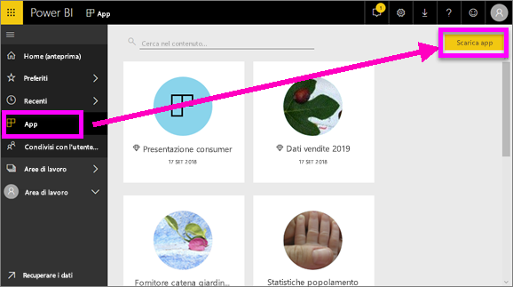
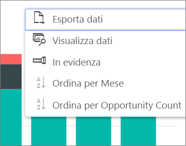

# Installare e usare le app con dashboard e report in Power BI
In Power BI le *app* riuniscono dashboard e report correlati, tutti in un'unica posizione. Gli utenti dell'organizzazione creano e distribuiscono le app con informazioni aziendali essenziali. Anche i [servizi esterni](../service-connect-to-services.md) che probabilmente sono già in uso, ad esempio Google Analytics e Microsoft Dynamics CRM, offrono app di Power BI. 

Le app possono essere facilmente trovate e installate nel servizio Power BI e nel dispositivo mobile. Dopo l'installazione di un'app non è necessario ricordare i nomi di molti dashboard diversi, perché sono tutti riuniti in un'app, nel browser o nel dispositivo mobile.

Ogni volta che l'autore dell'app rilascia aggiornamenti, le modifiche vengono visualizzate automaticamente nelle app. L'autore controlla anche la frequenza con cui è pianificato l'aggiornamento dei dati, dunque non è necessario preoccuparsi di stare al passo. 

## Ottenere una nuova app
È possibile ottenere le app in diversi modi. L'autore dell'app può installare l'app automaticamente nell'account Power BI o inviare un collegamento diretto a un'app, oppure è possibile cercarla in AppSource, in cui sono visualizzate tutte le app a cui è possibile accedere. In Power BI nel dispositivo mobile è possibile installarla solo da un collegamento diretto, non da AppSource. Se l'autore dell'app installa automaticamente l'app, verrà visualizzata nell'elenco delle app.

### Installare un'app da un collegamento diretto
Il modo più semplice per installare una nuova app consiste nell'ottenere un collegamento diretto dall'autore dell'app. Power BI crea un collegamento di installazione, che l'autore può inviare all'utente.

**Nel computer** 

Selezionare il collegamento nel messaggio di posta elettronica per aprire il servizio Power BI ([https://powerbi.com](https://powerbi.com)) in un browser. Confermare che si vuole installare l'app. Verrà aperta la pagina di destinazione dell'app.

**Nel dispositivo mobile iOS o Android** 

Quando si seleziona il collegamento nel messaggio di posta elettronica nel dispositivo mobile, l'app viene installata automaticamente e viene aperto l'elenco del contenuto dell'app per dispositivi mobili. 

### Ottenere l'app da Microsoft AppSource
È anche possibile trovare e installare le app a cui si ha accesso da Microsoft AppSource. 

1. Selezionare **App**  > **Scarica app**. 
   
     
2. In AppSource, in **Organizzazione** eseguire una ricerca per limitare il numero di risultati e trovare l'app che si sta cercando.
   
     
3. Selezionare **Scarica adesso** per aggiungerla alla pagina App. 

## Interagire con i dashboard e i report nell'app
È ora possibile esplorare i dati nei dashboard e nei report nell'app. È possibile accedere a tutte le interazioni standard di Power BI, ad esempio i filtri, l'evidenziazione, l'ordinamento e il drill-down. Vedere [Interagire con i report in Power BI](end-user-reading-view.md). 

## Passaggi successivi
[App Power BI per dispositivi esterni](../service-connect-to-services.md)

