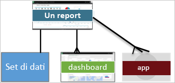
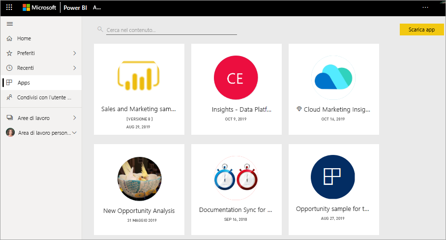

# Concetti di base del servizio Power BI per i consumer

[!INCLUDE[consumer-appliesto-ynnm](../includes/consumer-appliesto-ynnm.md)]

[!INCLUDE [power-bi-service-new-look-include](../includes/power-bi-service-new-look-include.md)]

Questo articolo presuppone che l'utente abbia già letto gli articoli di [panoramica di Power BI](../fundamentals/power-bi-overview.md) e si sia identificato come [ **_utente finale_** di Power BI](end-user-consumer.md). I consumer ricevono il contenuto di Power BI, ad esempio dashboard e report, dai colleghi. I consumer usano il servizio Power BI, ovvero la versione di Power BI basata sul sito Web.

Per ricevere contenuto da altri utenti è necessaria una licenza di Power BI Pro per utente o una licenza di Power BI Premium basata sulla capacità. [Cercare il tipo di licenza](end-user-license.md)

Il termine "Power BI Desktop", o semplicemente "Desktop", indica lo strumento autonomo usato dai *designer* che creano e condividono dashboard e report con gli utenti. È importante sapere che sono disponibili altri strumenti di Power BI, ma che i consumer usano solo il servizio Power BI. Questo articolo riguarda esclusivamente il servizio Power BI.

## Terminologia e concetti

Questo articolo non è un tour visivo di Power BI, né un'esercitazione pratica. È invece un articolo di panoramica che ha lo scopo di illustrare la terminologia e i concetti di Power BI, una sorta di introduzione al gergo specifico del programma. Per una panoramica sul servizio Power BI e su come orientarsi, vedere [Avvio rapido - Navigazione nel servizio Power BI](end-user-experience.md).

## Aprire il servizio Power BI per la prima volta

La maggior parte dei consumer di Power BI ottiene il servizio Power BI perché 1) la società di appartenenza acquista le licenze e 2) un amministratore assegna le licenze a dipendenti come l'utente.

Per iniziare, aprire un browser e immettere **app.powerbi.com**. Quando si apre il servizio Power BI per la prima volta, viene visualizzato un ambiente simile al seguente:

Man mano che si usa Power BI sarà possibile personalizzare gli elementi visualizzati all'apertura del sito Web. Ad esempio, alcuni utenti preferiscono che Power BI venga aperto con la pagina **Home**, mentre altri preferiscono iniziare con un dashboard specifico. Questo articolo illustrerà come personalizzare la propria esperienza.

- [Introduzione a Home di Power BI e ricerca globale](https://powerbi.microsoft.com/blog/introducing-power-bi-home-and-global-search)

- [Dashboard in primo piano nel servizio Power BI](end-user-featured.md)

Prima di procedere, è importante illustrare i blocchi costitutivi del servizio Power BI.

_______________________________________________________

## Contenuto di Power BI

### Introduzione ai blocchi costitutivi

Per un utente finale di Power BI, i cinque blocchi costitutivi sono: **_visualizzazioni_** , **_dashboard_** , **_report_** , **_app_** e **_set di dati_** . Questi elementi sono talvolta definiti **_contenuto_** di *Power BI*. Il *contenuto* è presente nelle **_aree di lavoro_** . Un flusso di lavoro tipico prevede tutti i blocchi: Un *designer* di Power BI (in giallo nel diagramma seguente) raccoglie i dati dai *set di dati*, li inserisce in Power BI per l'analisi, crea *report* con *visualizzazioni* che evidenziano fatti interessanti e informazioni dettagliate, aggiunge le visualizzazioni dai report a un dashboard e condivide report e dashboard con i *consumer* come l'utente (in nero nel diagramma seguente). Il *designer* li condivide sotto forma di *app* o di altri tipi di contenuto condiviso.

Questa è la forma più semplice:

-  Una **_visualizzazione_** (o *oggetto visivo*) è un tipo di grafico creato dai *progettisti* di Power BI. Gli oggetti visivi visualizzano i dati da *report* e *set di dati*. In genere i *designer* creano gli oggetti visivi in Power BI Desktop.

    Per altre informazioni, vedere [Interagire con gli oggetti visivi in report, dashboard e app](end-user-visualizations.md).

-  Un *set di dati* è un contenitore di dati. Ad esempio, può essere un file di Excel dell'Organizzazione mondiale della sanità oppure un database di clienti di proprietà dell'azienda o un file di Salesforce.  

-  Un *dashboard* è una schermata singola con elementi interattivi: oggetti visivi, testo e grafica. Un dashboard riunisce in un'unica schermata le metriche più importanti, per descrivere una situazione o rispondere a una domanda. Il contenuto del dashboard deriva da uno o più report e uno o più set di dati.

    Per altre informazioni, vedere [Dashboard per i consumer del servizio Power BI](end-user-dashboards.md).

-  Un *report* è costituito da una o più pagine di oggetti visivi interattivi, testo e grafica che costituiscono un singolo report. In Power BI un report si basa su un singolo set di dati. Spesso, il servizio organizza le pagine dei report in modo che ognuna riguardi un argomento di interesse o risponda a un'unica domanda.

    Per altre informazioni, vedere [Report in Power BI](end-user-reports.md).

-  Un'*app* è un metodo con cui i *designer* aggregano e condividono dashboard e report correlati in un'unica soluzione. I *consumer* ricevono alcune app automaticamente, ma possono anche cercare altre app create da colleghi o dalla community. Ad esempio, servizi esterni che probabilmente l'utente usa già, come Google Analytics e Microsoft Dynamics CRM, offrono app di Power BI.

Un nuovo utente che accede a Power BI per la prima volta non visualizzerà alcun dashboard, app o report.

_______________________________________________________

## Set di dati

Un *set di dati* è una raccolta di dati che i *designer* importano o alla quale si connettono e che quindi usano per creare report e dashboard. In qualità di consumer, l'utente non interagisce direttamente con i set di dati, ma è comunque utile sapere come questi si integrano nel quadro complessivo.  

Ogni set di dati rappresenta una singola origine dati. Ad esempio, l'origine può essere una cartella di lavoro di Excel in OneDrive, un set di dati in formato tabulare di SQL Server Analysis Services locale o un set di dati di Salesforce. Power BI supporta molte origini dati diverse.

Quando un designer condivide un'app, l'utente può visualizzare i set di dati che il designer ha incluso con l'app.

Un set di dati...

- Può essere usato più volte dal designer di un report per creare dashboard e report

- Può essere usato per creare molti report diversi

- Gli oggetti visivi di uno specifico set di dati possono comparire in molti dashboard diversi

  

L'elemento fondamentale seguente sono le visualizzazioni.

_______________________________________________________

## Visualizzazioni

Le visualizzazioni, note anche come oggetti visivi, mostrano le informazioni dettagliate che Power BI ha individuato nei dati. Le visualizzazioni semplificano l'interpretazione delle informazioni dettagliate, in quanto è più facile interpretare un'immagine che un foglio di calcolo con molte cifre.

Alcune delle visualizzazioni disponibili in Power BI sono: grafico a cascata, grafico a nastri, mappa ad albero, grafico a torta, grafico a imbuto, grafico a schede, grafico a dispersione e misuratore:

   

Vedere l'[elenco completo delle visualizzazioni incluse in Power BI](../power-bi-visualization-types-for-reports-and-q-and-a.md).

Le visualizzazioni chiamate *oggetti visivi personalizzati* vengono rese disponibili anche dalla community. Se si riceve un report con un oggetto visivo che non si riconosce, probabilmente si tratta di un oggetto visivo personalizzato. Se occorre assistenza per interpretare l'oggetto visivo personalizzato, cercare il nome del *designer* del report o del dashboard e contattarlo.

Una visualizzazione in un report...

- Può comparire più volte nello stesso report

- Può comparire in molti dashboard diversi

_______________________________________________________

## Report

Un report di Power BI è costituito da una o più pagine di visualizzazioni, grafica e testo. Tutte le visualizzazioni in un report provengono da un unico set di dati. I *designer* condividono report con i *consumer*, che [interagiscono con i report nella *visualizzazione lettura*](end-user-reading-view.md).

Un report...

- Può essere associato a più dashboard, vale a dire i riquadri aggiunti da un report possono essere visualizzati in più dashboard.

- Può essere creato usando i dati di un solo set di dati.  

- Può far parte di più app.

  

_______________________________________________________

## Dashboard

Un dashboard rappresenta una visualizzazione personalizzata di un subset di uno o più set di dati sottostanti. I *designer* creano i dashboard e li condividono con i *consumer*, individualmente o come parte di un'app. Un dashboard è una singola area di disegno che contiene *riquadri*, grafica e testo.

  

Un riquadro è il rendering di un oggetto visivo che un *progettista* *aggiunge* al dashboard, ad esempio da un report. Ogni riquadro aggiunto contiene una [visualizzazione](end-user-visualizations.md) che un designer ha creato da un set di dati e aggiunto a tale dashboard. Un riquadro può anche contenere un'intera pagina del report oppure dati in streaming live o video. I *designer* possono aggiungere riquadri ai dashboard in molti modi, che non possono essere tuttavia trattati in questo articolo di panoramica. Per altre informazioni, vedere [Riquadri del dashboard in Power BI](end-user-tiles.md).

I consumer non possono modificare i dashboard. Il consumer può tuttavia possibile aggiungere commenti, visualizzare dati correlati, impostare un dashboard come preferito, eseguire la sottoscrizione e così via.

Quali sono le finalità dei dashboard?  Eccone alcune:

- visualizzare a colpo d'occhio tutte le informazioni necessarie per prendere decisioni

- monitorare le informazioni più importanti sull'attività aziendale

- assicurarsi che tutti i collaboratori siano sempre aggiornati e che visualizzino e usino le stesse informazioni

- monitorare lo stato di un'azienda, di un prodotto, di una business unit, di una campagna di marketing e così via

- per creare una visualizzazione personalizzata di un dashboard più esteso, contenente solo le metriche cui si è maggiormente interessati

**UN** dashboard...

- consente di visualizzare visualizzazioni di set di dati diversi

- consente di visualizzare visualizzazioni di report diversi

- consente di visualizzare visualizzazioni aggiunte da altri strumenti (ad esempio Excel)

  

_______________________________________________________

## App

Queste raccolte di dashboard e report organizzano i contenuti correlati in un unico pacchetto. I *designer* di Power BI compilano questi elementi e li condividono con utenti singoli, gruppi, un'intera organizzazione oppure li rendono pubblici. Il consumer ha la certezza di lavorare insieme ai colleghi sugli stessi dati, condivisi e affidabili.

> [!NOTE]
> Per usare le app è necessario avere una licenza di Power BI Pro o Premium. 

Le app possono essere facilmente trovate e installate nel [servizio Power BI](https://powerbi.com) e nel dispositivo mobile. Dopo aver installato un'app, non è necessario ricordare i nomi di molti dashboard diversi. Sono tutti riuniti in un'app, nel browser o nel dispositivo mobile.

Questa app contiene tre dashboard correlati e tre report correlati, che costituiscono un'app singola.

Ogni volta che l'autore dell'app rilascia aggiornamenti, le modifiche vengono visualizzate automaticamente nelle app. L'autore controlla anche la frequenza con cui è pianificato l'aggiornamento dei dati in Power BI. Non è necessario preoccuparsi di mantenersi aggiornati.

È possibile ottenere le app in diversi modi:

- Il designer dell'app può installarla automaticamente nell'account Power BI.

- Il designer dell'app può inviare un collegamento diretto a un'app.

- È possibile cercarla in [Microsoft AppSource](https://appsource.microsoft.com/marketplace/apps?product=power-bi), in cui sono visualizzate tutte le app che si possono usare.

In Power BI nel dispositivo mobile è possibile installare app solo da un collegamento diretto, non da AppSource. Se il designer dell'app la installa automaticamente, verrà visualizzata nell'elenco delle app.

Dopo aver installato l'app, è sufficiente selezionarla nell'elenco App e selezionare il dashboard o il report da aprire ed esaminare per primo.

Questo articolo ha illustrato i blocchi costitutivi del servizio Power BI per i consumer.

## Passaggi successivi

- Visualizzare e impostare un segnalibro sul [Glossario](end-user-glossary.md)

- Visualizzare la [Presentazione del servizio Power BI](end-user-experience.md)

- Vedere la [panoramica di Power BI creata per i consumer](end-user-consumer.md)

- Guardare un video con i concetti di base e una panoramica del servizio Power BI.

    <iframe width="560" height="315" src="https://www.youtube.com/embed/B2vd4MQrz4M" frameborder="0" allowfullscreen></iframe>
