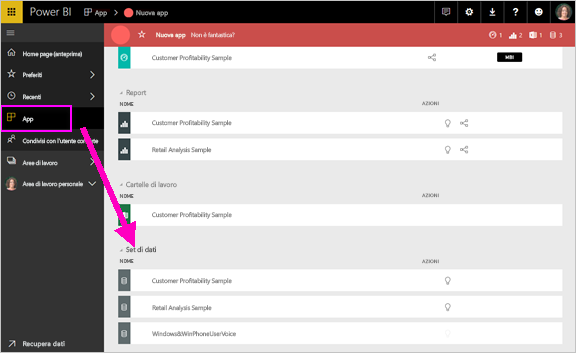
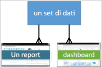
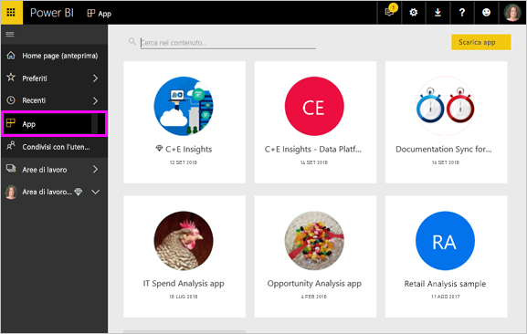

# Concetti di base del servizio Power BI per i ***consumer***

## *Consumer* e *designer* di Power BI
Questo articolo presuppone che l'utente abbia già letto [Panoramica di Power BI](../power-bi-overview.md) e si sia identificato manualmente come ***consumer*** di Power BI. I consumer ricevono il contenuto di Power BI, ad esempio dashboard e report, dai colleghi. I consumer usano il servizio Power BI, ovvero la versione di Power BI basata sul sito Web.

Il termine "Power BI Desktop" o semplicemente "Desktop" indica uno strumento autonomo usato dai *designer*, che compilano i dashboard e i report e li condividono con gli utenti. È importante sapere che sono disponibili altri strumenti di Power BI, ma che il consumer usa solo il servizio Power BI. Questo articolo riguarda esclusivamente il servizio Power BI.

## Terminologia e concetti
Questo articolo non è un tour visivo di Power BI, né un'esercitazione pratica. È invece un articolo di panoramica che ha lo scopo di illustrare la terminologia e i concetti di Power BI. Una sorta di introduzione al gergo specifico del programma. Per una panoramica sul servizio Power BI e sulla navigazione, vedere [Presentazione](end-user-experience.md).

## Aprire il servizio Power BI per la prima volta
La maggior parte dei consumer Power BI ottiene il servizio Power BI perché 1) la società di appartenenza acquista le licenze e 2) un amministratore assegna le licenze a dipendenti come l'utente.

Per iniziare, è sufficiente aprire un browser e digitare **app.powerbi.com**. Quando si apre il servizio Power BI per la prima volta viene visualizzato un ambiente simile al seguente.

Man mano che si usa Power BI sarà possibile personalizzare gli elementi visualizzati all'apertura del sito Web.  Ad esempio, alcuni utenti preferiscono che Power BI venga aperto con la home page, altri preferiscono iniziare con un dashboard specifico. Le tecniche corrispondenti sono illustrate di seguito.
- [Anteprima Home](https://powerbi.microsoft.com/blog/introducing-power-bi-home-and-global-search)    
- [Impostare il contenuto **in primo piano**](end-user-featured.md)

Prima di procedere, è importante illustrare i blocchi costitutivi del servizio Power BI.

## ***Contenuto*** di Power BI
### Introduzione ai blocchi costitutivi
Per un consumer di Power BI i 5 blocchi costitutivi sono: ***visualizzazioni***, ***dashboard***, ***report***, ***app*** e ***set di dati***. Questi elementi sono talvolta detti ***contenuto*** di *Power BI*. Il *contenuto* esiste in un'***area di lavoro***. Un flusso di lavoro tipico prevede tutti i blocchi:  Un *designer* di Power BI (in giallo nel diagramma in basso) raccoglie i dati dai *set di dati*, li inserisce in Power BI per l'analisi, crea *report* con *visualizzazioni* che sottolineano fatti interessanti, blocca visualizzazioni dei report su un dashboard e condivide i report e i dashboard con i *consumer* come l'utente (in nero nel diagramma in basso), sotto forma di *app* o di altri tipi di contenuto condiviso.

Questa è la forma più semplice.
*  Una ***visualizzazione*** (o *oggetto visivo*) è un tipo di grafico creato dai *designer* di Power BI usando i dati contenuti nei *report* e nei *dataset*. In genere i *designer* creano gli oggetti visivi in Power BI Desktop.

    Per altre informazioni, vedere [Visualizzazioni per *consumer* di Power BI](end-user-visualizations.md)

*  Un *set di dati* è un contenitore di dati. Ad esempio può essere un file di Excel della World Health Organization, un database di clienti di proprietà dell'azienda o un file di Salesforce.  

*  Un *dashboard* è una schermata singola con elementi interattivi: oggetti visivi, testo e grafica. Un dashboard riunisce in un'unica schermata le metriche più importanti, per descrivere una situazione o rispondere a una domanda. Il contenuto del dashboard deriva da uno o più report e uno o più set di dati.

    Per altre informazioni, vedere [Dashboard per *consumer* di Power BI](end-user-dashboards.md)

*  Un *report* è costituito da una o più pagine di oggetti visivi interattivi, testo e grafica che illustrano un determinato argomento. I report sono basati su un singolo set di dati. Le pagine dei report sono spesso organizzate in modo che ognuna riguardi un argomento di interesse o risponda a un'unica domanda.

    Per altre informazioni, vedere [Report per *consumer* di Power BI](end-user-reports.md)

*  Un'*app* è un metodo con cui i *designer* aggregano e condividono dashboard e report in un'unica soluzione. I *consumer* ricevono alcune app automaticamente, ma possono anche cercare altre app create da colleghi o dalla community. Ad esempio, servizi esterni che probabilmente l'utente usa già, come Google Analytics e Microsoft Dynamics CRM, offrono app di Power BI.

Un nuovo utente che accede a Power BI per la prima volta non visualizza nessun dashboard, app o report.
_______________________________________________________

## Datasets
Un *set di dati* è una raccolta di dati che i *designer* importano o alla quale si connettono e che quindi usano per creare report e dashboard. In qualità di consumer, l'utente non interagisce direttamente con i set di dati, ma è comunque utile comprendere come questi si integrano nel quadro complessivo.  

Ogni set di dati rappresenta una singola origine dati, ad esempio una cartella di lavoro di Excel in OneDrive, un set di dati in formato tabulare SSAS locale o un set di dati di Salesforce. Sono supportate molte origini dati diverse.

Quando un designer condivide un'app, l'utente può visualizzare i set di dati inclusi con l'app.

**UN** set di dati...

* può essere usato più volte
* può essere usato in report diversi
* Le visualizzazioni di un unico set di dati possono essere usate in dashboard diversi

  

Inoltre, è possibile usare i set di dati di altre aree di lavoro per creare contenuto, ad esempio report o dashboard, nella propria area di lavoro. Questi set di dati vengono visualizzati usando l'icona del set di dati a cui si fa riferimento:

L'elemento fondamentale seguente sono le visualizzazioni.
__________________________________________________________

## Visualizzazioni
Le visualizzazioni, note anche come oggetti visivi, mostrano informazioni dettagliate individuate nei dati. Le visualizzazioni semplificano l'interpretazione delle informazioni dettagliate, in quanto è più facile interpretare un'immagine che un foglio di calcolo con molte cifre.

Alcune delle visualizzazioni disponibili in Power BI sono: grafico a cascata, grafico a nastri, mappa ad albero, grafico a torta, grafico a imbuto, grafico a schede, grafico a dispersione e misuratore. Vedere l'[elenco completo delle visualizzazioni incluse in Power BI](../power-bi-visualization-types-for-reports-and-q-and-a.md).

   

Le visualizzazioni vengono rese disponibili anche dalla community e in questo caso sono dette *oggetti visivi personalizzati*. Se si riceve un report con un oggetto visivo che non si riconosce, probabilmente si tratta di un oggetto visivo personalizzato. Se occorre assistenza per interpretare l'oggetto visivo personalizzato, <!--[look up the name of the report or dashboard *designer*](end-user-owner.md)-->cercare il nome del *designer* del report o del dashboard e contattarlo.

**UNA SOLA** visualizzazione in un report...

* può essere usata più volte nello stesso report tramite copia e incolla.
* può essere usata in molti dashboard diversi.
__________________________________________________
## Report
Un report di Power BI è costituito da una o più pagine di visualizzazioni, grafica e testo. Tutte le visualizzazioni in un report provengono da un unico set di dati. I *designer* condividono report con i *consumer*, che [interagiscono con i report nella *visualizzazione lettura*](end-user-reading-view.md).

**UN** report

* può essere associato a più dashboard, ovvero i riquadri aggiunti da un report possono essere visualizzati in più dashboard.
* può essere creato usando i dati di un solo set di dati.  
* può far parte di più app.

  

________________________________________________

## Dashboard
Un dashboard rappresenta una visualizzazione personalizzata di un subset di uno o più set di dati sottostanti. I *designer* creano i dashboard e li condividono con i *consumer*, individualmente o come parte di un'app. Un dashboard è un canvas singolo che contiene *riquadri*, grafica e testo.

  

Un riquadro è il rendering di un oggetto visivo che un *designer* *aggiunge* al dashboard, ad esempio da un report.  Ogni riquadro aggiunto include una [visualizzazione](end-user-visualizations.md), che è stata creata da un set di dati e aggiunta al dashboard. Un riquadro può anche contenere un'intera pagina del report oppure dati in streaming live o video. I *designer* possono aggiungere riquadri al dashboard in molti modi, che non possono essere tuttavia trattati in questo contesto. Per altre informazioni, vedere [Riquadri del dashboard in Power BI](end-user-tiles.md).

Dal punto di vista del consumer, i dashboard non possono essere modificati. Il consumer può tuttavia possibile aggiungere commenti, visualizzare dati correlati, impostare un dashboard come preferito, eseguire la sottoscrizione e così via.

Quali sono le finalità dei dashboard?  Eccone alcune:

* per visualizzare a colpo d'occhio tutte le informazioni necessarie per prendere decisioni
* per monitorare le informazioni più importanti sull'attività aziendale
* per garantire che tutti i collaboratori accedano alla stessa pagina, nonché visualizzino e usino le stesse informazioni
* per monitorare lo stato di un'azienda, di un prodotto, di una business unit, di una campagna di marketing e così via
* per creare una visualizzazione personalizzata di un dashboard più esteso, contenente solo le metriche cui si è maggiormente interessati

**UN** dashboard...

* consente di visualizzare visualizzazioni di set di dati diversi
* consente di visualizzare visualizzazioni di report diversi
* consente di visualizzare visualizzazioni aggiunte da altri strumenti (ad esempio Excel)

  

________________________________________________

## App
Queste raccolte di dashboard e report organizzano i contenuti correlati in un unico pacchetto. I *designer* di Power BI compilano questi elementi e li condividono con utenti singoli, gruppi, un'intera organizzazione oppure li rendono pubblici. Il consumer ha la certezza di lavorare insieme ai colleghi sugli stessi dati, condivisi e affidabili.

Le app possono essere facilmente individuate e installate nel servizio Power BI (https://powerbi.com) e nel dispositivo mobile). Dopo l'installazione di un'app non è necessario ricordare i nomi di molti dashboard diversi, perché sono tutti riuniti in un'app, nel browser o nel dispositivo mobile.

Questa app contiene tre dashboard correlati e tre report correlati, che costituiscono un'app singola.

Ogni volta che l'autore dell'app rilascia aggiornamenti, le modifiche vengono visualizzate automaticamente nelle app. L'autore controlla anche la frequenza con cui è pianificato l'aggiornamento dei dati, dunque non è necessario preoccuparsi di stare al passo.

È possibile ottenere le app in diversi modi. Il designer dell'app può installare l'app automaticamente nell'account Power BI o inviare un collegamento diretto a un'app, oppure è possibile cercarla in Microsoft AppSource, in cui sono visualizzate tutte le app alle quali è possibile accedere. In Power BI nel dispositivo mobile è possibile installare app solo da un collegamento diretto, non da AppSource. Se il designer dell'app la installa automaticamente, verrà visualizzata nell'elenco delle app.

Dopo aver installato l'app, selezionarla nell'elenco delle app e selezionare il dashboard o il report da aprire ed esaminare per primo.   

Questo articolo ha illustrato i blocchi costitutivi del servizio Power BI per i consumer.

## Passaggi successivi
- Visualizzare e impostare un segnalibro sul [Glossario](end-user-glossary.md)    
- Visualizzare la [Presentazione del servizio Power BI](end-user-experience.md)
- Vedere la [panoramica di Power BI creata per i consumer](end-user-consumer.md)    
- Visualizzare un video con i concetti di base e una panoramica del servizio Power BI. <iframe width="560" height="315" src="https://www.youtube.com/embed/B2vd4MQrz4M" frameborder="0" allowfullscreen></iframe>
