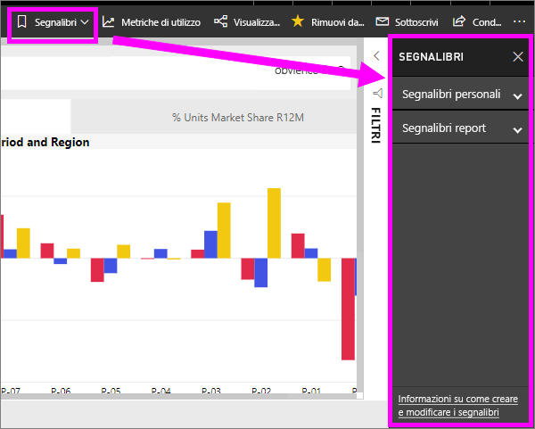
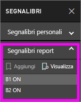
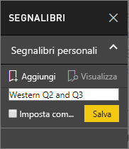
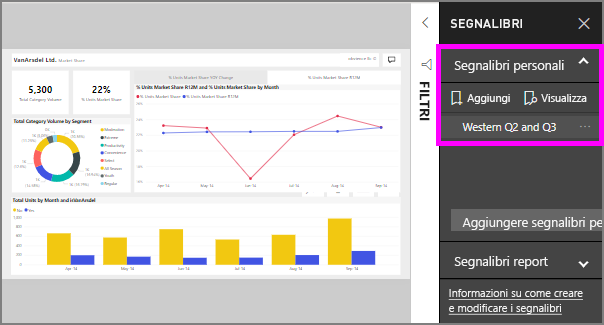

# Quali sono i segnalibri?
Segnalibri di acquisire la visualizzazione attualmente configurata di una pagina del report, inclusi i filtri, filtri dei dati e lo stato degli oggetti visivi. Quando si seleziona un segnalibro, Power BI consente di tornare alla visualizzazione. Esistono due tipi di segnalibri: quelle create personalmente e quelle create dal report *finestre di progettazione*.

## Usare i segnalibri per condividere informazioni dettagliate e creare storie in Power BI 
Esistono molti usi per i segnalibri. Si supponga di individua un'informazione interessante e desidera conservarlo--crea un segnalibro in modo che è possibile tornare più tardi. È necessario lasciare e si desidera conservare il lavoro corrente, creare un segnalibro. È anche possibile rendere un segnalibro a cui restituire la visualizzazione predefinita del report, in modo che ogni volta che si, che la visualizzazione della pagina del report si apre innanzitutto. 

È anche possibile creare una raccolta di segnalibri, disporli nell'ordine desiderato e successivamente passare da un segnalibro a altro in una presentazione per evidenziare una serie di informazioni dettagliate per raccontare una storia.  

## Utilizzo dei segnalibri
Per aprire il riquadro dei segnalibri, selezionare **segnalibri** dalla barra dei menu. Per tornare alla visualizzazione pubblicata originale del report, selezionare **Ripristina impostazioni predefinite**.

### Segnalibri report
Se il report *designer* inclusi segnalibri di report, è possibile trovarli nel **segnalibri del Report** intestazione. 

Selezionare un segnalibro per passare alla visualizzazione report. 

### Segnalibri personali

Quando si crea un segnalibro, insieme al segnalibro stesso vengono salvati gli elementi seguenti:

* Pagina corrente
* Filtri
* Filtri dei dati, inclusi il tipo (ad esempio elenco o menu a discesa) e lo stato del filtro dei dati
* Stato della selezione degli oggetti visivi (ad esempio filtri con evidenziazione incrociata)
* Ordinamento
* Posizione drill
* Visibilità (di un oggetto, usando il riquadro **Selezione**)
* Modalità messa a fuoco o **In evidenza** di qualsiasi oggetto visibile

Configurare una pagina di report nel modo in cui si vuole che venga visualizzata nel segnalibro. Dopo aver disposto la pagina del report e gli oggetti visivi nel modo desiderato, per aggiungere un segnalibro selezionare **Aggiungi** nel riquadro **Segnalibri**. In questo esempio è stato aggiunto alcuni filtri per data e area. 

**Power BI** crea un segnalibro e gli assegna un nome generico o un nome specificato. È possibile *rinominare*, *eliminare*, o *aggiornare* un segnalibro, selezionare i puntini di sospensione accanto al nome del segnalibro e quindi selezionando un'azione dal menu visualizzato.

Dopo aver creato un segnalibro, è possibile visualizzarlo semplicemente selezionando il segnalibro nella **segnalibri** riquadro. 

<!--
## Arranging bookmarks
As you create bookmarks, you might find that the order in which you create them isn't necessarily the same order you'd like to present them to your audience. No problem, you can easily rearrange the order of bookmarks.

In the **Bookmarks** pane, simply drag-and-drop bookmarks to change their order, as shown in the following image. The yellow bar between bookmarks designates where the dragged bookmark will be placed.

The order of your bookmarks can become important when you use the **View** feature of bookmarks, as described in the next section. 

-->

## Segnalibri come presentazione
Per presentare o visualizzare segnalibri, in ordine, selezionare **View** dalle **segnalibri** riquadro per avviare una presentazione.

Quando si passa alla modalità **Visualizzazione**, è necessario tenere conto degli aspetti seguenti:

1. Il nome del segnalibro viene visualizzato nella barra del titolo del segnalibro nella parte inferiore dell'area di disegno.
2. Le frecce disponibili nella barra del titolo del segnalibro consentono di passare al segnalibro precedente o successivo.
3. Per uscire dalla modalità **Visualizzazione**, selezionare **Esci** nel riquadro **Segnalibri** o la **X** nella barra del titolo del segnalibro. 

Nella modalità **Visualizzazione** è possibile chiudere il riquadro **Segnalibri** (facendo clic sulla X nel riquadro stesso) per lasciare più spazio alla presentazione. Sempre nella modalità **Visualizzazione**, tutti gli oggetti visivi sono interattivi e disponibili per l'evidenziazione incrociata, come accade normalmente quando si interagisce con essi. 

<!--
## Visibility - using the Selection pane
With the release of bookmarks, the new **Selection** pane is also introduced. The **Selection** pane provides a list of all objects on the current page and allows you to select the object and specify whether a given object is visible. 

You can select an object using the **Selection** pane. Also, you can toggle whether the object is currently visible by clicking the eye icon to the right of the visual. 

When a bookmark is added, the visible status of each object is also saved based on its setting in the **Selection** pane. 

It's important to note that **slicers** continue to filter a report page, regardless of whether they are visible. As such, you can create many different bookmarks, with different slicer settings, and make a single report page appear very different (and highlight different insights) in various bookmarks.

## Bookmarks for shapes and images
You can also link shapes and images to bookmarks. With this feature, when you click on an object, it will show the bookmark associated with that object. This can be especially useful when working with buttons; you can learn more by reading the article about [using buttons in Power BI](desktop-buttons.md). 

To assign a bookmark to an object, select the object, then expand the **Action** section from the **Format Shape** pane, as shown in the following image.

Once you turn the **Action** slider to **On** you can select whether the object is a back button, a bookmark, or a Q&A command. If you select bookmark, you can then select which of your bookmarks the object is linked to.

There are all sorts of interesting things you can do with object-linked bookmarking. You can create a visual table of contents on your report page, or you can provide different views (such as visual types) of the same information, just by clicking on an object.

When you are in editing mode you can use ctrl+click to follow the link, and when not in edit mode, simply click the object to follow the link. 

## Bookmark groups

Beginning with the August 2018 release of **Power BI Desktop**, you can create and use bookmark groups. A bookmark group is a collection of bookmarks that you specify, which can be shown and organized as a group. 

To create a bookmark group, hold down the CTRL key and select the bookmarks you want to include in the group, then click the ellipses beside any of the selected bookmarks, and select **Group** from the menu that appears.

**Power BI Desktop** automatically names the group *Group 1*. Fortunately, you can just double-click on the name and rename it to whatever you want.

With any bookmark group, clicking on the bookmark group's name only expands or collapses the group of bookmarks, and does not represent a bookmark by itself. 

When using the **View** feature of bookmarks, the following applies:

* If the selected bookmark is in a group when you select **View** from bookmarks, only the bookmarks *in that group* are shown in the viewing session. 

* If the selected bookmark is not in a group, or is on the top level (such as the name of a bookmark group), then all bookmarks for the entire report are played, including bookmarks in any group. 

To ungroup bookmarks, just select any bookmark in a group, click the ellipses, and then select **Ungroup** from the menu that appears. 

Note that selecting **Ungroup** for any bookmark from a group takes all bookmarks out of the group (it deletes the group, but not the bookmarks themselves). So to remove a single bookmark from a group, you need to **Ungroup** any member from that group, which deletes the grouping, then select the members you want in the new group (using CTRL and clicking each bookmark), and select **Group** again. 
-->

## Limitazioni e considerazioni
Per questa versione dei **segnalibri**, tenere presenti alcune limitazioni e considerazioni.

* La maggior parte degli oggetti visivi personalizzati dovrebbero funzionare bene con i segnalibri. Se si verificano problemi con i segnalibri e un oggetto visivo personalizzato, contattare l'autore di tale oggetto visivo personalizzato e richiedere l'aggiunta del supporto dei segnalibri all'oggetto visivo. 
* Se si aggiunge un oggetto visivo in una pagina del report dopo aver creato un segnalibro, l'oggetto visivo verrà visualizzato nel suo stato predefinito. Questo significa anche se si aggiunge un filtro dei dati a una pagina in cui sono stati creati segnalibri in precedenza, il filtro dei dati si comporterà in base allo stato predefinito.
* Se dopo aver creato un segnalibro gli oggetti visivi vengono spostati, le modifiche si rifletteranno nel segnalibro. 
* In generale, i segnalibri non saranno interessati se il rapporto *progettazione* aggiorna o di nuovo il report. Tuttavia, se la finestra di progettazione effettua importanti modifiche al report, ad esempio rimuovere campi usati da un segnalibro, quindi si riceverà un messaggio di errore al successivo che tentativo di aprire il segnalibro. 

<!--
## Next steps
spotlight?
-->
