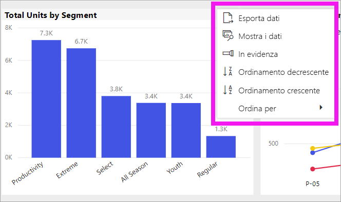
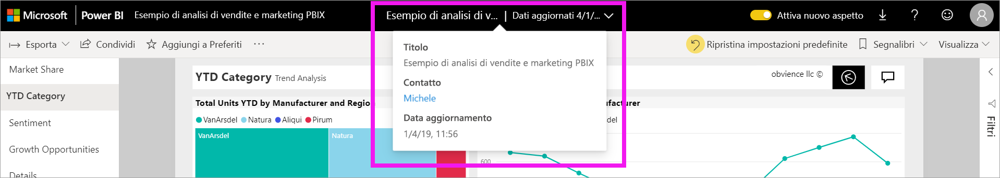

# Modificare l'ordinamento di un grafico in un report di Power BI

[!INCLUDE[consumer-appliesto-ynny](../includes/consumer-appliesto-ynny.md)]

> [!IMPORTANT]
> **Questo articolo è destinato agli utenti di Power BI che non hanno le autorizzazioni di modifica per il report o il set di dati e che lavorano solo nella versione online di Power BI (servizio Power BI). Se si è un *progettista* di report, un *amministratore* o un *proprietario*, è possibile che questo articolo non contenga tutte le informazioni necessarie. Per altre informazioni, leggere [Ordinare per colonna in Power BI Desktop](../desktop-sort-by-column.md)** .

Nel servizio Power BI è possibile modificare l'aspetto di un oggetto visivo ordinandolo in base a campi dati diversi. La modifica dell'ordinamento di un oggetto visivo consente di dare risalto alle informazioni da comunicare. Sia che si usino dati numerici (come cifre di vendita) o dati di tipo testo (come nomi di stati), è possibile ordinare le visualizzazioni in qualsiasi modo. In Power BI sono disponibili funzionalità estremamente flessibili per l'ordinamento, nonché menu rapidi. 

Gli oggetti visivi in un dashboard non possono essere ordinati, ma in un report di Power BI è possibile ordinare la maggior parte delle visualizzazioni 

## Introduzione

Per iniziare, aprire un report che è stato condiviso. Selezionare un oggetto visivo (che può essere ordinato) e scegliere **Altre azioni** (...).  Per l'ordinamento sono disponibili tre opzioni: **Ordinamento decrescente**, **Ordinamento crescente** e **Ordina per**. 
    

### Ordinare alfabeticamente o numericamente

Gli oggetti visivi possono essere ordinati alfabeticamente in base ai nomi testuali delle categorie contenute nell'oggetto visivo oppure in base ai valori numerici di ogni categoria. Ad esempio, questo grafico viene ordinato alfabeticamente in base alla categoria **Name** dell'asse X, indicante il negozio.

È possibile modificare con facilità l'ordinamento da una categoria (nome di un negozio) a un valore (vendite per piede quadrato). Selezionare **Altre azioni** (...) e scegliere **Ordina per**. Selezionare un valore numerico usato nell'oggetto visivo.  In questo esempio è stato selezionato **Sales Per Sq Ft**.

Se necessario, passare dall'ordinamento crescente a quello decrescente.  Selezionare di nuovo **Altre opzioni** (...) e scegliere **Ordinamento decrescente** o **Ordinamento crescente**. Il campo usato per l'ordinamento è in grassetto e ha una barra gialla.

   

> [!NOTE]
> non è possibile ordinare tutti gli oggetti visivi. Non è ad esempio possibile ordinare gli oggetti visivi seguenti: mappa ad albero, mappa, mappa colorata, grafico a dispersione, misuratore, scheda, grafico a cascata.

## Salvataggio delle modifiche all'ordinamento
I report di Power BI mantengono i filtri, i filtri dei dati, l'ordinamento e altre modifiche alla visualizzazione dei dati, anche se si lavora nella [visualizzazione di lettura](end-user-reading-view.md). Di conseguenza, se si esce da un report e lo si visualizza di nuovo, le modifiche apportate all'ordinamento risultano salvate.  Per annullare le modifiche e ripristinare le impostazioni del *progettista* del report, selezionare **Ripristina impostazioni predefinite** dalla barra dei menu superiore. 

Se tuttavia il pulsante **Ripristina impostazioni predefinite** appare disattivato, significa che il *progettista* del report ha disabilitato la possibilità di salvare le modifiche.

## Considerazioni e risoluzione dei problemi

### Ordinamento in base ad altri criteri
In alcuni casi, è necessario ordinare l'oggetto visivo usando un campo diverso, che non è incluso nell'oggetto visivo, o altri criteri.  È ad esempio possibile ordinare per mese in modo sequenziale (e non alfabeticamente) oppure ordinare per numeri interi invece che per cifra (esempio 0, 1, 9, 20 e non 0, 1, 20, 9).  

Solo la persona che ha progettato il report può apportare queste modifiche. Per trovare le informazioni sul contatto del *progettista*, selezionare il nome del report nella barra dell'intestazione.

Se si è un *progettista* e si hanno le autorizzazioni di modifica per il contenuto, leggere [Ordinare per colonna in Power BI Desktop](../desktop-sort-by-column.md) per informazioni su come aggiornare il set di dati e abilitare questo tipo di ordinamento.

## Passaggi successivi
Altre informazioni sulle [visualizzazioni nei report di Power BI](end-user-visualizations.md).

[Power BI - Concetti di base](end-user-basic-concepts.md)
