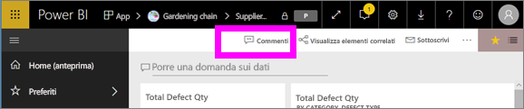
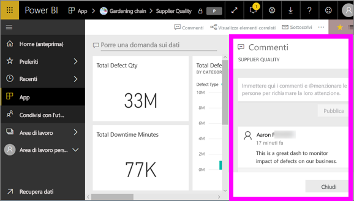
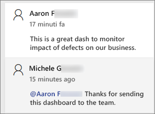
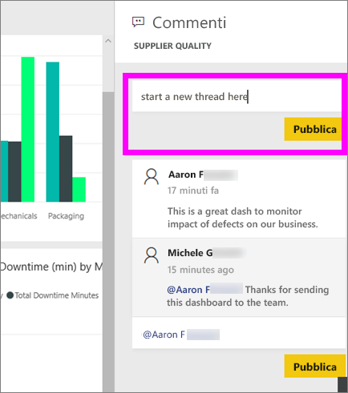
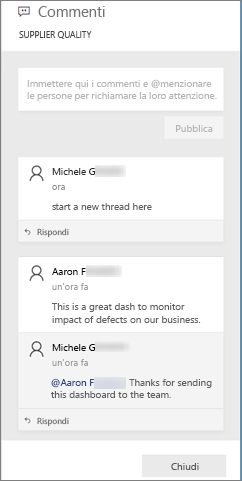
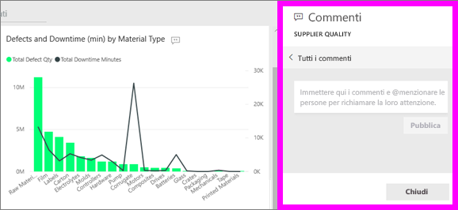
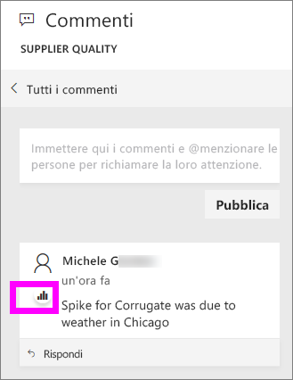
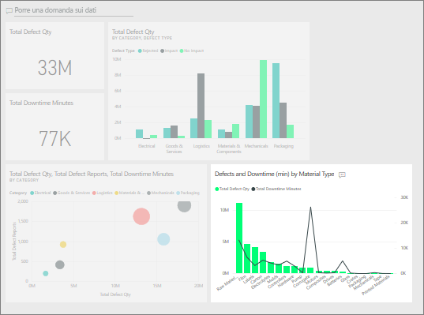

# Aggiungere commenti a un dashboard
Aggiungere un commento personale o avviare una conversazione su un dashboard con i colleghi. La funzionalità di **commento** è solo uno dei modi in cui un *utente* può collaborare con altri. 

## Come usare la funzionalità Commenti
I commenti possono essere aggiunti a un intero dashboard o a singoli oggetti visivi in un dashboard. Aggiungere un commento generale o un commento destinato a colleghi specifici.  

### Aggiungere un commento generale al dashboard
1. Aprire un dashboard di Power BI e selezionare l'icona **Commenti**. Verrà visualizzata la finestra di dialogo Commenti.

    

    Qui si nota che il creatore del dashboard ha già aggiunto un commento generale.  Chiunque abbia accesso a questo dashboard può vedere il commento.

    

2. Per rispondere, selezionare **Rispondi**, digitare la risposta e selezionare **Post**.  

    

    Per impostazione predefinita, Power BI invia la risposta al collega che ha avviato il thread di commenti, in questo caso Aaron F. 

    

 3. Per aggiungere al dashboard un commento che non fa parte di un thread esistente, immettere il commento nel campo di testo superiore.

    

    I commenti per questo dashboard sono ora simili ai seguenti.

    

### Aggiungere un commento a un oggetto visivo del dashboard specifico
1. Passare il puntatore del mouse sull'oggetto visivo e selezionare i puntini di sospensione (...).    
2. Nel menu a discesa selezionare **Aggiungi un commento**.

      

3.  Verrà visualizzata la finestra di dialogo **Commenti**. Questo oggetto visivo non ha ancora commenti. 

      

4. Scrivere un commento e selezionare **Post**.

      

    L'icona del grafico  indica che questo commento è associato a un oggetto visivo specifico. Selezionare l'icona per evidenziare l'oggetto visivo correlato nel dashboard.

    

5. Selezionare **Chiudi** per tornare al dashboard o al report.

### Richiamare l'attenzione dei colleghi usando il simbolo @
Quando si creano commenti nel dashboard o si inseriscono commenti in un particolare oggetto visivo, è possibile richiamare l'attenzione dei colleghi usando il simbolo "\@".  Quando si digita il simbolo "\@", Power BI apre un elenco a discesa in cui è possibile cercare e selezionare i singoli utenti dell'organizzazione. I nomi verificati con il simbolo "\@" come prefisso vengono visualizzati in caratteri di colore blu. 

Ecco una mia conversazione con il *responsabile della progettazione* di visualizzazioni. Usa il simbolo @ per essere certo che io veda il commento. So che questo commento è destinato a me. Quando apro il dashboard dell'app in Power BI, seleziono **Commenti** dall'intestazione. Nel riquadro **Commenti** viene visualizzata la nostra conversazione.

  

## Passaggi successivi
Tornare alle [visualizzazioni per i consumer](end-user-visualizations.md)    
<!--[Select a visualization to open a report](end-user-open-report.md)-->
