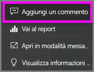
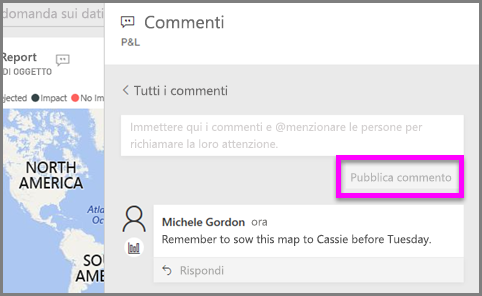
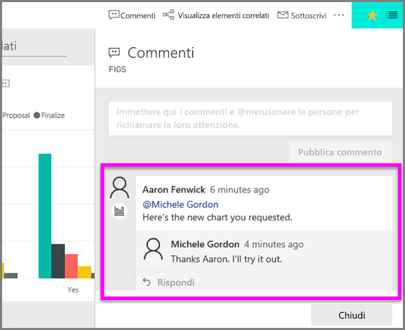

# Aggiungere commenti a una visualizzazione
Aggiungere un commento personale o avviare una conversazione su una visualizzazione con i colleghi. La funzionalità di **commento** è solo uno dei modi in cui un *consumer* può interagire con una visualizzazione. 

## Come usare la funzionalità di commento

1. Passare il puntatore del mouse sulla visualizzazione e selezionare i puntini di sospensione (...).    
2. Nel menu a discesa selezionare **Aggiungi un commento**.

      

3.  Scrivere un commento e selezionare **Pubblica commento**. Questo è un mio commento per uso personale, con un errore di ortografia.

      

4. Ecco una mia conversazione con il *responsabile della progettazione* di visualizzazioni. Usa il simbolo @ per essere certo che io veda il commento. So che questo commento è destinato a me. Quando apro il dashboard dell'app in Power BI, seleziono **Commenti** dall'intestazione. Nel riquadro **Commenti** viene visualizzata la nostra conversazione. 

      

5. Fare clic su **Chiudi** per tornare al dashboard o report.

## Passaggi successivi
Tornare alle [visualizzazioni per i consumer](end-user-visualizations.md)    
<!--[Select a visualization to open a report](end-user-open-report.md)-->