# Aggiungere commenti a un dashboard o un report
Aggiungere un commento personale o avviare una conversazione su un dashboard o un report con i colleghi. La funzionalità di **commento** è solo uno dei modi in cui un *utente* può collaborare con altri. 

## Come usare la funzionalità Commenti
I commenti possono essere aggiunti a un intero dashboard, a singoli oggetti visivi in un dashboard, a una pagina di un report, a un report impaginato e a singoli oggetti visivi in una pagina di un report. Aggiungere un commento generale o un commento mirato destinato a colleghi specifici.  

Quando si aggiunge un commento a un report, Power BI acquisisce i valori di filtro e filtro dei dati correnti. Ciò significa che quando si seleziona un commento o si risponde a esso, la pagina del report o l'oggetto visivo del report può cambiare per visualizzare le selezioni di filtro e filtro dei dati che erano attive quando il commento è stato aggiunto per la prima volta.  

Perché è importante? Si immagini che un collega abbia applicato un filtro che ha rivelato interessanti informazioni dettagliate che vuole condividere con il team. Senza tale filtro selezionato, il commento potrebbe non avere senso.

Se si usa un report impaginato, è possibile lasciare solo un commento generale sul report.  Il supporto per lasciare commenti sui singoli oggetti visivi del report non è disponibile.

### Aggiungere un commento generale a un dashboard o un report
Il processo per l'aggiunta di commenti a un dashboard o a un report è simile.  In questo esempio viene usato un dashboard. 

1. Aprire un dashboard o un report di Power BI e selezionare l'icona **Commenti**. Verrà visualizzata la finestra di dialogo Commenti.

    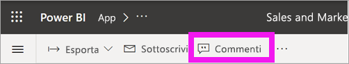

    Qui si nota che il creatore del dashboard ha già aggiunto un commento generale.  Chiunque abbia accesso a questo dashboard può vedere il commento.

    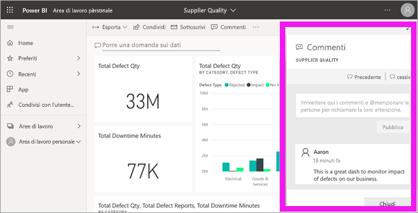

2. Per rispondere, selezionare **Rispondi**, digitare la risposta e selezionare **Post**.  

    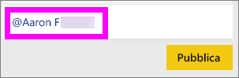

    Per impostazione predefinita, Power BI invia la risposta al collega che ha avviato il thread di commenti, in questo caso Aaron. 

    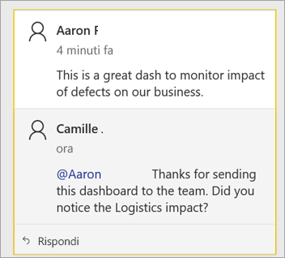

 3. Per aggiungere un commento che non fa parte di un thread esistente, immettere il commento nel campo di testo superiore.

    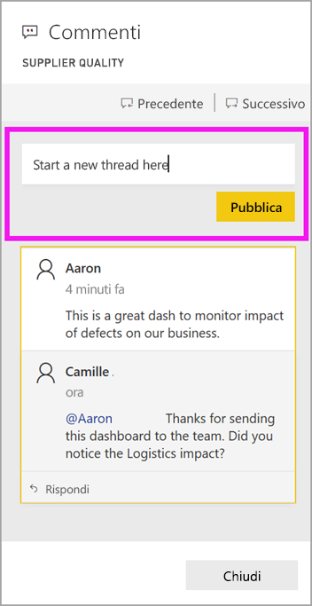

    I commenti per questo dashboard sono ora simili ai seguenti.

    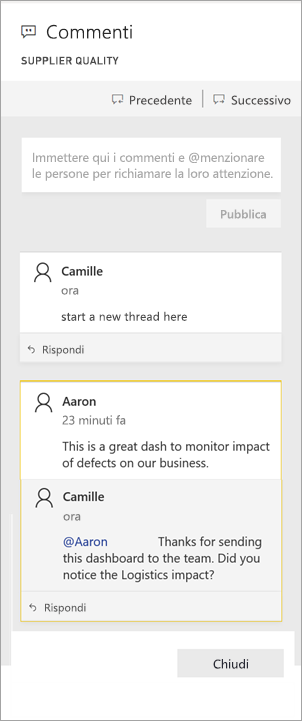

### Aggiungere un commento a un oggetto visivo di un dashboard o di un report specifico
Oltre ad aggiungere commenti a un intero dashboard o a un'intera pagina del report, è possibile aggiungere commenti a singoli riquadri del dashboard e singoli oggetti visivi del report. I processi sono simili e in questo esempio viene usato un report.

1. Passare il puntatore del mouse sull'oggetto visivo e selezionare i puntini di sospensione (...).    
2. Nel menu a discesa selezionare **Apri commenti**.

    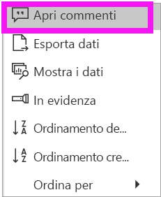  

3.  Verrà visualizzata la finestra di dialogo **Commenti** e gli altri oggetti visivi nella pagina saranno visualizzati in grigio. Questo oggetto visivo non ha ancora commenti. 

    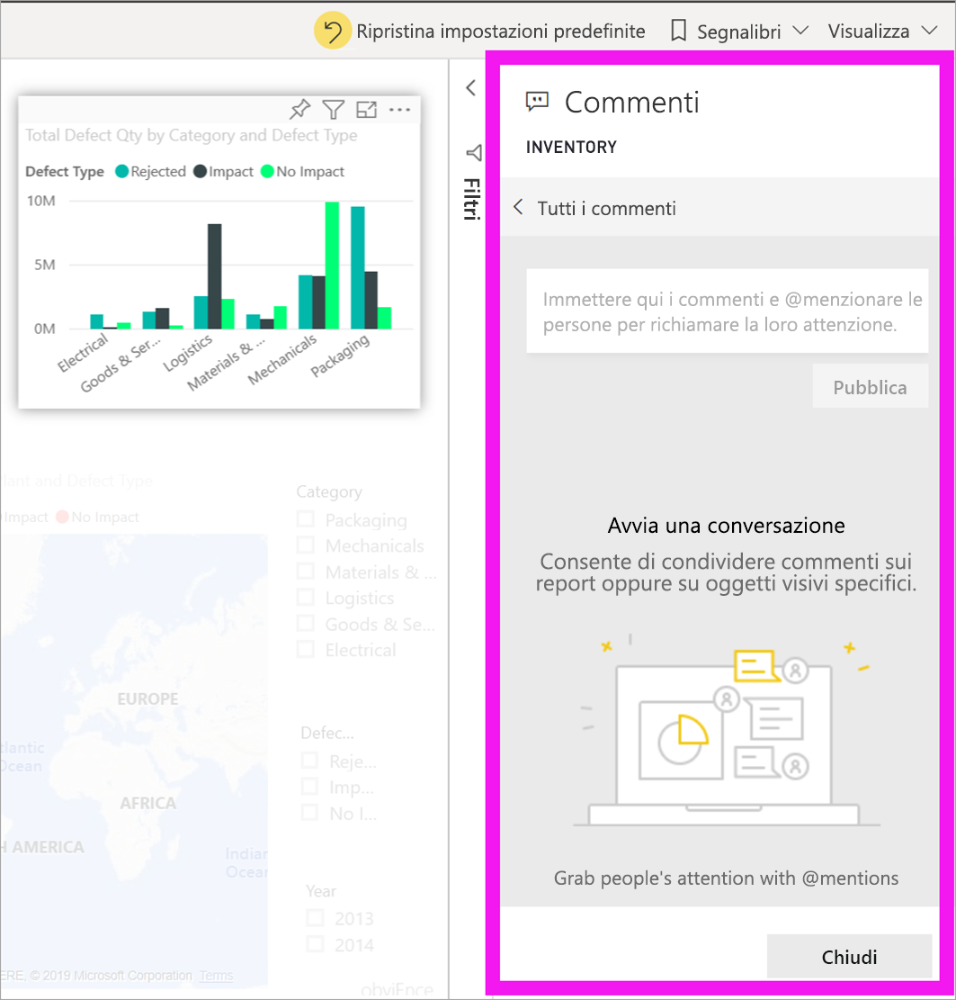  

4. Scrivere un commento e selezionare **Post**.

    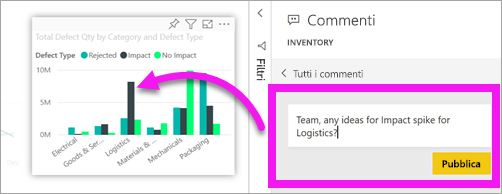  

    - Se in una pagina del report si seleziona un commento creato su un oggetto visivo, tale oggetto visivo viene evidenziato (vedere sopra).

    - In un dashboard l'icona del grafico  indica che un commento è associato a un oggetto visivo specifico. I commenti che si applicano all'intero dashboard non hanno un'icona speciale. Selezionando l'icona del grafico, l'oggetto visivo correlato viene evidenziato nel dashboard.
    

    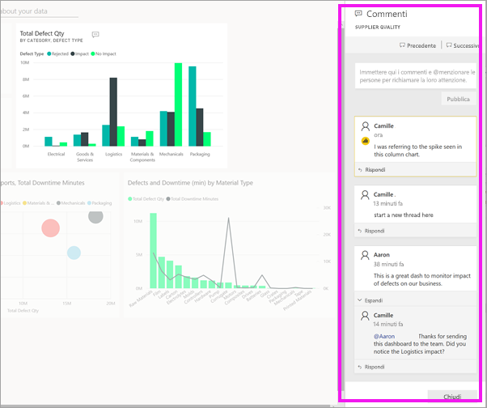

5. Selezionare **Chiudi** per tornare al dashboard o al report.

### Richiamare l'attenzione dei colleghi usando il simbolo @
Quando si creano commenti per un dashboard, un report, un riquadro o un oggetto visivo, è possibile richiamare l'attenzione dei colleghi usando il simbolo "\@".  Quando si digita il simbolo "\@", Power BI apre un elenco a discesa in cui è possibile cercare e selezionare i singoli utenti dell'organizzazione. I nomi verificati con il simbolo "\@" come prefisso vengono visualizzati in caratteri di colore blu. 

Ecco una mia conversazione con il *responsabile della progettazione* di visualizzazioni. Il simbolo @ viene usato per assicurarsi che il commento venga visto dall'interessato. So che questo commento è destinato a me. Quando apro il dashboard dell'app in Power BI, seleziono **Commenti** dall'intestazione. Nel riquadro **Commenti** viene visualizzata la nostra conversazione.

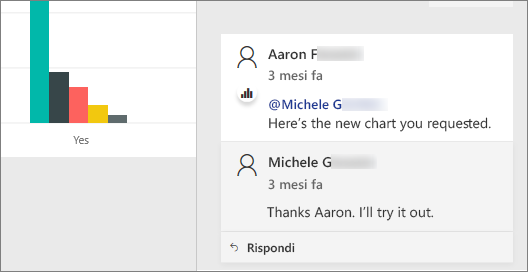  

## Passaggi successivi
Tornare alle [visualizzazioni per i consumer](end-user-visualizations.md)    
<!--[Select a visualization to open a report](end-user-open-report.md)-->
