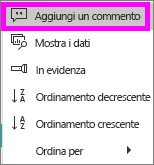
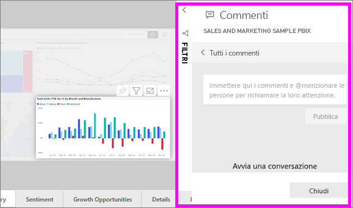
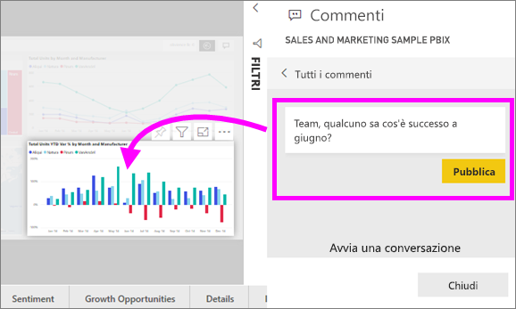
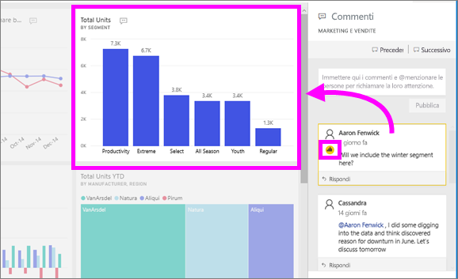

# Aggiungere commenti a un dashboard o report
Aggiungere un commento personale o avviare una conversazione su un dashboard o report con i colleghi. La funzionalità di **commento** è solo uno dei modi in cui un *utente* può collaborare con altri. 

## Come usare la funzionalità Commenti
I commenti possono essere aggiunti a un dashboard intero, per singoli oggetti visivi in un dashboard, a una pagina del report e per singoli oggetti visivi in una pagina del report. Aggiungere un commento generale o in un commento destinate ai colleghi specifici.  

Quando si aggiunge un commento a un report, Power BI consente di acquisire i valori di filtro e filtro dei dati correnti. Ciò significa che quando si seleziona o rispondere a un commento, la pagina del report o oggetto visivo del report possono cambiare in modo da mostrare il filtro e le selezioni filtro dei dati che erano attive quando il commento è stato inizialmente aggiunto.  

Perché è importante? Ad esempio che un collega applicato un filtro che rivelata un'informazione interessante che desidera condividere con il team. Senza il filtro selezionato, il commento non avrebbe senso. 

### Aggiungere un commento generale a un dashboard o report
I processi per l'aggiunta di commenti a un dashboard o report sono simili. In questo esempio, utilizziamo un dashboard. 

1. Aprire un dashboard di Power BI o un report e selezionare il **commenti** icona. Verrà visualizzata la finestra di dialogo Commenti.

    

    Qui si nota che il creatore del dashboard ha già aggiunto un commento generale.  Chiunque abbia accesso a questo dashboard può vedere il commento.

    

2. Per rispondere, selezionare **Rispondi**, digitare la risposta e selezionare **Post**.  

    

    Per impostazione predefinita, Power BI invia la risposta al collega che ha avviato il thread di commenti, in questo caso Aaron F. 

    

 3. Se si desidera aggiungere un commento che non fa parte di un thread esistente, immettere il commento nel campo di testo superiore.

    

    I commenti per questo dashboard sono ora simili ai seguenti.

    

### Aggiungere un commento a un dashboard specifico o un oggetto visivo del report
Oltre ad aggiungere commenti a un dashboard intero o a un'intera pagina del report, è possibile aggiungere commenti per i riquadri del dashboard singoli e gli oggetti visivi singoli del report. I processi sono simili e in questo esempio viene usato un report.

1. Passare il puntatore del mouse sull'oggetto visivo e selezionare i puntini di sospensione (...).    
2. Nel menu a discesa selezionare **Aggiungi un commento**.

      

3.  Il **commenti** verrà visualizzata la finestra di dialogo e gli altri oggetti visivi nella pagina sono disabilitati. Questo oggetto visivo non ha ancora commenti. 

      

4. Scrivere un commento e selezionare **Post**.

      

    - In un report selezionando un commento che è stato effettuato su un oggetto visivo, pagina Evidenzia (vedere sopra).

    - In un dashboard, l'icona del grafico  ci consente di sapere che un commento è associato a un oggetto visivo specifico. I commenti che riguardano l'intero dashboard non è un'icona speciale. Selezionando l'icona del grafico evidenzia l'oggetto visivo nel dashboard correlato.

        

5. Selezionare **Chiudi** per tornare al dashboard o al report.

### Richiamare l'attenzione dei colleghi usando il simbolo @
Se stai creando un dashboard, report, riquadro o commento visual, i quadratini di ridimensionamento attenzione dei colleghi tramite il "\@" simbolo.  Quando si digita il "\@" simbolo, Power BI viene aperto un elenco a discesa in cui è possibile cercare e selezionare singoli utenti dell'organizzazione. I nomi verificati con il simbolo "\@" come prefisso vengono visualizzati in caratteri di colore blu. 

Ecco una mia conversazione con il *responsabile della progettazione* di visualizzazioni. Usa il simbolo @ per essere certo che io veda il commento. So che questo commento è destinato a me. Quando apro il dashboard dell'app in Power BI, seleziono **Commenti** dall'intestazione. Nel riquadro **Commenti** viene visualizzata la nostra conversazione.

  

## Passaggi successivi
Tornare alle [visualizzazioni per i consumer](end-user-visualizations.md)    
<!--[Select a visualization to open a report](end-user-open-report.md)-->
