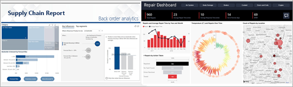

# Servizio Power BI per i consumer

[!INCLUDE[consumer-appliesto-ynny](../includes/consumer-appliesto-ynny.md)]

La cultura attuale prevede che le decisioni aziendali siano basate sui fatti e non sulle opinioni. Per prendere queste decisioni sono necessari dati, e si ricevono dati in qualsiasi formato:     
 
report, fogli di calcolo, messaggi di posta elettronica con grafici e anche stampe. Quando i dati si accumulano, diventa sempre più difficile trovare le informazioni necessarie in modo rapido e si corre il rischio di non riuscire a usare le informazioni più aggiornate.  
 

## Servizio Power BI per i *consumer*

Con Power BI il processo è più semplice e più efficace allo stesso tempo. Tutti i dati diventano diagrammi e grafici che consentono di visualizzare i dati. Anziché lunghi elenchi o tabelle di numeri e parole, le informazioni dettagliate sui dati hanno un aspetto efficace, ***grazie a oggetti visivi*** colorati e accattivanti, che raccontano storie sulle informazioni approfondite nei dati. 

 
È sufficiente aprire il servizio Power BI, in un browser o in un dispositivo mobile. Tutti gli utenti possono lavorare basandosi sugli stessi dashboard e report attendibili, che vengono aggiornati automaticamente, in modo da offrire sempre il contenuto più aggiornato.   

Dato che il contenuto non è statico, è possibile approfondire e cercare tendenze, informazioni cognitive dettagliate e altri dati di business intelligence, nonché filtrare e sezionare il contenuto o persino porre domande usando parole proprie. È anche possibile sfruttare le funzionalità automatiche di individuazione di informazioni interessanti dai dati, invio di avvisi per le modifiche dei dati e invio dei report tramite posta elettronica in base a una pianificazione impostata. Tutti i dati sono a disposizione in qualsiasi momento, nel cloud o in locale, da qualsiasi dispositivo. Questi sono solo alcuni esempi delle potenzialità di Power BI. 

## Caratteristiche dei *consumer* di Power BI

La modalità di interazione con Power BI dipende dal ruolo. Gli utenti finali o *consumer* sono le persone che ricevono contenuto (dashboard, report e app) dai colleghi. Questi utenti usano la versione online o per dispositivi mobili di Power BI, denominata servizio Power BI, per esaminare il contenuto, interagire e prendere decisioni aziendali. 
   
I consumer non hanno accesso a tutte le funzionalità di Power BI e ciò è corretto, perché non è compito dei consumer creare dashboard e report. I consumer useranno il servizio Power BI per attività di analisi, monitoraggio, esplorazione e decisionali. 

Il termine "Power BI Desktop" o semplicemente "Desktop" indica uno strumento autonomo usato dai *progettisti*, che creano i dashboard e i report e li condividono con gli utenti.  È importante sapere che sono disponibili altri strumenti di Power BI, ma che il consumer usa solo il servizio Power BI. 

Poiché si sta lavorando con contenuto *condiviso*, è sufficiente avere una licenza **gratuita** perché si è all'interno di un'organizzazione che usa la capacità **Premium**. [Quali licenze sono disponibili?](end-user-license.md)

## Interagire in modo sicuro con i contenuti 
L'applicazione di filtri, la sottoscrizione e l'esportazione non hanno effetto sul set di dati sottostante o sui contenuti originali condivisi (dashboard, report e app).  

Non esiste il pericolo di danneggiare i dati.  Power BI è un ambiente ideale in cui esplorare e sperimentare senza il timore di danneggiare qualcosa.  
 
Ciò non significa che non è possibile salvare le modifiche apportate. Le modifiche, tuttavia, hanno effetto solo sulla propria visualizzazione dei contenuti. Il ripristino della visualizzazione predefinita originale è un'operazione estremamente semplice.  

## Passaggi successivi

[Visualizzare la presentazione del servizio Power BI per i consumer](end-user-reading-view.md)    
[Formazione per il servizio Power BI per i consumer](https://docs.microsoft.com/learn/paths/consume-data-with-power-bi/)    
[Terminologia e concetti per i *consumer* di Power BI](end-user-basic-concepts.md)    

