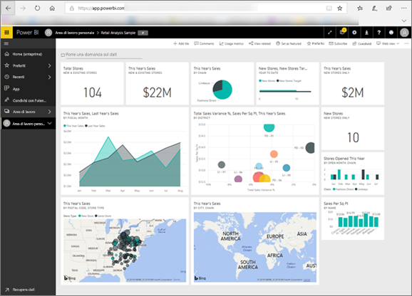

# Power BI per i consumer
La modalità di interazione con Power BI dipende dal ruolo. Gli *utenti finali* o *consumer* ricevono dashboard, report e app dai colleghi e tramite il ***servizio Power BI*** esaminano il contenuto e interagiscono con questo per poter prendere decisioni rilevanti per l'azienda.

Se non si ha familiarità con Power BI, è consigliabile leggere prima di tutto [Panoramica di Power BI](../power-bi-overview.md), in cui sono presenti informazioni sul set di strumenti che compongono Power BI.

I consumer non hanno accesso a tutte le funzionalità di Power BI. Questo è corretto, perché ai consumer non viene richiesto di creare dashboard e report. Il compito dei consumer consiste nell'usare Power BI per l'analisi, il monitoraggio, l'esplorazione e il processo decisionale.

Leggendo gli articoli destinati ai consumer, si apprenderà la terminologia, si vedrà una panoramica del servizio Power BI, si scoprirà come esplorare il contenuto e quindi si scoprirà come interagire con quest'ultimo.  È possibile iniziare subito.

