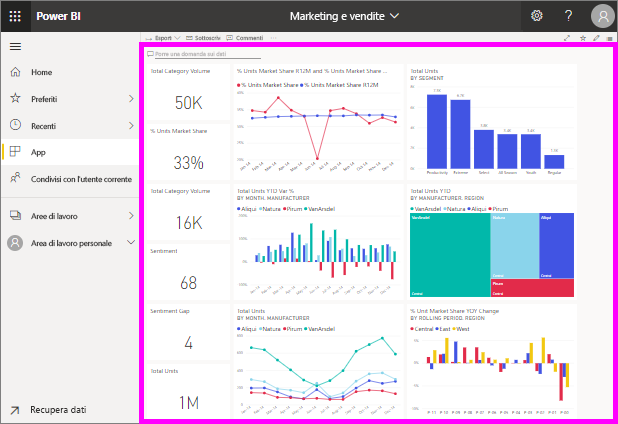

# Visualizzare un dashboard

[!INCLUDE[consumer-appliesto-ynny](../includes/consumer-appliesto-ynny.md)]

[!INCLUDE [power-bi-service-new-look-include](../includes/power-bi-service-new-look-include.md)]

I *consumer* di Power BI dedicano molto tempo a visualizzare i dashboard. I dashboard sono progettati per evidenziare informazioni specifiche dai report e dai set di dati sottostanti. E i consumer di Power BI usano tali informazioni per attività di rilevamento, monitoraggio e test, per rispondere a domande e altro ancora, per poter prendere decisioni aziendali basate sui dati.

Per condividere un dashboard e visualizzare un dashboard condiviso è necessaria una licenza di Power BI Pro o Premium. [Quali licenze sono disponibili?](end-user-license.md) 

## Aprire un dashboard

|              |         |
|------------|--------------------------------|
|      |I dashboard possono essere aperti da molte posizioni nel servizio Power BI.   Cercare semplicemente questa icona del dashboard. Dopo aver identificato un  dashboard, aprirlo è semplice: è sufficiente selezionarlo e il dashboard riempie l'area di disegno di Power BI. |
|                    |          |

È possibile trovare dashboard in tutti i contenitori nel riquadro di spostamento. 

- **Home** 
- **Preferiti**: se è stato [impostato un dashboard come preferito](end-user-favorite.md)
- **Recenti**: se è stato visitato di recente un dashboard
- **App**: la maggior parte delle app contiene sia dashboard che report
- **Condivisi con l'utente corrente**: se un collega ha [condiviso un dashboard](end-user-shared-with-me.md)
- **Area di lavoro personale**: se sono stati scaricati [esempi di Power BI](../sample-datasets.md)

## Passaggi successivi
* Per acquisire familiarità con i dashboard, consultare la presentazione di uno dei [dashboard di esempio](../sample-tutorial-connect-to-the-samples.md).    
* Informazioni sui [riquadri del dashboard](end-user-tiles.md) e cosa succede quando se ne seleziona uno.