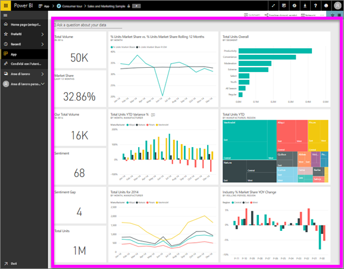

# Visualizzare un dashboard
I consumer di Power BI dedicano molto tempo a visualizzare i dashboard. I dashboard sono progettati per evidenziare informazioni specifiche dai report e dai set di dati sottostanti. E i consumer di Power BI usano tali informazioni per attività di rilevamento, monitoraggio e test, per rispondere a domande e altro ancora, per poter prendere decisioni aziendali basate sui dati.

Power BI Pro è necessario per condividere un dashboard e visualizzare un dashboard condiviso.

## Aprire un dashboard
I dashboard possono essere aperti da molte posizioni nel servizio Power BI.  La chiave sta nel comprendere quale contenuto è idoneo per un dashboard, rispetto a un report, ad esempio. Dopo aver identificato un dashboard, aprirlo è semplice: è sufficiente fare clic e il dashboard riempie l'area di disegno di Power BI.

|              |         |
|------------|--------------------------------|
|      |Il modo più semplice per identificare un dashboard consiste nel cercare questa  icona di dashboard. Dopo aver individuato il contenuto con questa icona, selezionarla per aprire il dashboard. |
|                    |          |

 

<!--insert aGIF-->

È possibile trovare dashboard in tutti i contenitori nella barra di spostamento a sinistra. 
- **Home** (anteprima)
- **Preferiti**: se è stato [impostato un dashboard come preferito](end-user-favorite.md)
- **Recenti**: se è stato visitato di recente un dashboard
- **App**: la maggior parte delle app contiene sia dashboard che report
- **Condivisi con l'utente corrente**: se un collega ha [condiviso un dashboard](end-user-shared-with-me.md)
- **Area di lavoro personale**: se sono stati scaricati [esempi di Power BI](../sample-datasets.md)

## Passaggi successivi
* Per acquisire familiarità con i dashboard, consultare la presentazione di uno dei [dashboard di esempio](../sample-tutorial-connect-to-the-samples.md).
* Informazioni sui [riquadri del dashboard](end-user-tiles.md) e cosa succede quando se ne seleziona uno.
* Si desidera monitorare un singolo riquadro del dashboard e ricevere un'e-mail quando raggiunge una certa soglia? [Creare avvisi sui riquadri](end-user-alerts.md).
* È possibile porre liberamente le domande al dashboard. Informazioni su come usare lo strumento [Domande e risposte di Power BI](end-user-q-and-a.md) per porre una domanda sui dati e ottenere una risposta sotto forma di visualizzazione. 