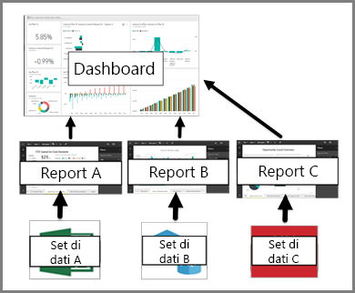

# Dashboard per i consumer del servizio Power BI

Un ***dashboard*** Power BI è una singola pagina, spesso denominata area di disegno, che usa le visualizzazioni per raccontare una storia. Essendo limitato a una pagina, un dashboard ben progettato contiene solo gli elementi più importanti per tale storia.

Le visualizzazioni mostrate nel dashboard vengono chiamate *riquadri* e vengono *aggiunte* al dashboard dai *progettisti* dei report. Nella maggio parte dei casi, selezionando un riquadro viene aperta la pagina del report in cui è stata creata la visualizzazione. Se non si ha familiarità con Power BI, è possibile imparare le nozioni di base utili leggendo [Concetti di base di Power BI](end-user-basic-concepts.md).

> [!NOTE]
> I dashboard possono essere [visualizzati e condivisi nei dispositivi mobili](mobile/mobile-apps-view-dashboard.md).
>
> Power BI Pro è necessario per la visualizzazione di un dashboard condiviso da un altro utente.
> 

Le visualizzazioni in un dashboard provengono dai report e ogni report è basato su un set di dati. Infatti, un dashboard può essere inteso come una via d'accesso ai report e ai set di dati sottostanti. Selezionando una visualizzazione si accede al report (e al set di dati) usato per crearla.

## Vantaggi dei dashboard
I dashboard sono uno strumento eccezionale per monitorare l'attività aziendale, per cercare le risposte e per esaminare tutte le metriche più importanti al primo colpo. Le visualizzazioni in un dashboard potrebbero provenire da uno o più set di dati e report sottostanti. Un dashboard può combinare i dati locali e quelli del cloud, offrendo una visualizzazione consolidata indipendentemente dalla posizione dei dati.

Un dashboard non è solo un'immagine accattivante: è interattivo e i riquadri si aggiornano al variare dei dati sottostanti.

## Differenze tra dashboard e report per i ***consumer*** di Power BI
I report sono spesso confusi con i dashboard poiché sono composti da troppe aree di contenuto con le visualizzazioni. Tuttavia, ci sono alcune importanti differenze dal punto di vista di un *consumer* di Power BI.

| **Capacità** | **Dashboard** | **Report** |
| --- | --- | --- |
| Pagine |Una pagina |Una o più pagine |
| Origini dati |Uno o più report e uno o più set di dati per dashboard |Un singolo set di dati per report |
| Applicazione di filtri |Non è possibile filtrare o sezionare |Molti modi diversi di filtrare, evidenziare e sezionare |
| Impostazione di avvisi |Permette di creare avvisi per e-mail quando vengono soddisfatte determinate condizioni |No |
| In primo piano |Permette di impostare un dashboard come dashboard "in primo piano" |Non permette di creare un report in primo piano |
| Permette di visualizzare i campi e le tabelle del set di dati sottostante |No. Consente di esportare i dati ma le tabelle e i campi nel dashboard stesso non sono visibili. |Sì. È possibile visualizzare le tabelle, i campi e valori del set di dati. |

## Sviluppatori di dashboard e utenti di dashboard
L'***utente*** di Power BI riceve i dashboard dagli *sviluppatori*. Altre informazioni sui dashboard sono disponibili in questi argomenti:

* [Visualizzare un dashboard](end-user-dashboard-open.md)
* Informazioni sui [riquadri del dashboard](end-user-tiles.md) e cosa succede quando se ne seleziona uno.
* Si desidera monitorare un singolo riquadro del dashboard e ricevere un'e-mail quando raggiunge una certa soglia? [Creare avvisi sui riquadri](end-user-alerts.md).
* È possibile porre liberamente le domande al dashboard. Informazioni su come usare lo strumento [Domande e risposte di Power BI](end-user-q-and-a.md) per porre una domanda sui dati e ottenere una risposta sotto forma di visualizzazione.

> [!TIP]
> Se nell'articolo non si è trovato ciò che si stava cercando, fare ricorso al sommario a sinistra.
> 

## Passaggi successivi
[Visualizzare un dashboard](end-user-dashboard-open.md) 