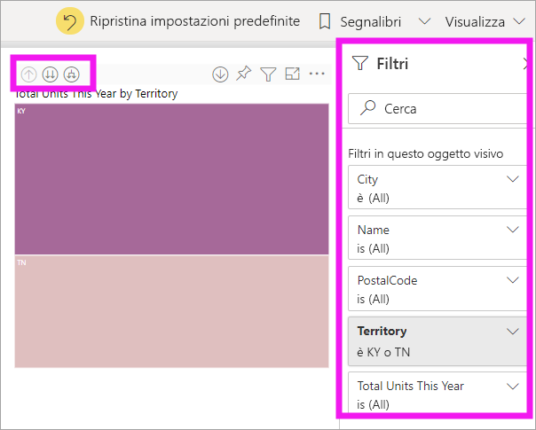
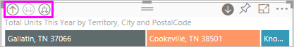
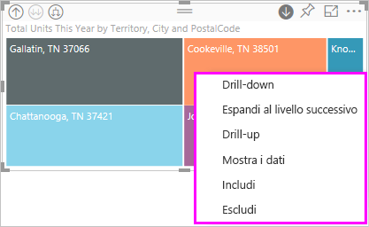
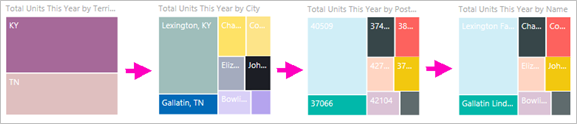
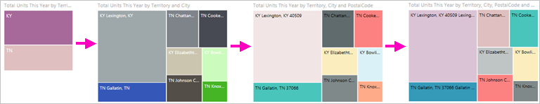
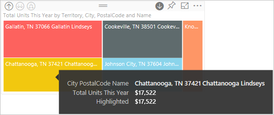
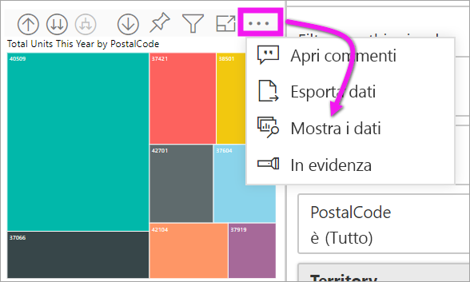

# Modalità di espansione in un oggetto visivo in Power BI

Questo articolo illustra come eseguire il drill-down in un oggetto visivo nel servizio Microsoft Power BI. Usando il drill-down e il drill-up nei punti dati, è possibile analizzare le informazioni dettagliate disponibili sui dati. 

## L'espansione richiede una gerarchia

Quando un oggetto visivo ha una gerarchia, è possibile eseguire il drill-down per rivelare dettagli aggiuntivi. Ad esempio, potrebbe esserci un oggetto visivo che calcola il numero di medaglie olimpiche in base a una gerarchia composta da sport, disciplina ed eventi. Per impostazione predefinita, l'oggetto visivo indicherà il numero di medaglie per sport: ginnastica, sci, sport acquatici e così via, ma, poiché contiene una gerarchia, selezionando uno degli oggetti visivi (ad esempio una barra, una riga o una bolla), potrebbe essere visualizzata un'immagine sempre più dettagliata. Selezionando l'elemento **aquatics**, verranno visualizzati i dati relativi a nuoto, tuffi e pallanuoto.  Selezionando l'elemento **diving**. verranno visualizzati i dettagli relativi a trampolino, piattaforma e tuffi sincronizzati.

Le date sono un tipo univoco di gerarchia.  I progettisti di report spesso aggiungono gerarchie di date agli oggetti visivi. Una delle comuni gerarchie di date contiene anno, trimestre, mese e giorno. 

## Trovare gli oggetti visivi di cui è possibile eseguire il drill
Se non si è certi di quali oggetti visivi di Power BI contengano una gerarchia, passare il mouse sopra un oggetto visivo. Se nella parte superiore viene visualizzata una combinazione di questi controlli di drill, significa che l'oggetto visivo ha una gerarchia.

  

## Informazioni su come eseguire il drill-down e il drill-up

In questo esempio si userà una mappa ad albero con una gerarchia costituita da territorio, città, codice postale e nome del negozio. La mappa ad albero, prima del drill, visualizza le unità totali vendute durante l'anno per territorio. 

  

### Due modi per accedere alle funzionalità di drill

Sono disponibili due modi per l'accesso alle funzionalità di drill-down, drill-up ed espansione per gli oggetti visivi con gerarchie. Provarli entrambi e usare quello preferito.

- Primo modo: passare il mouse su un oggetto visivo per visualizzare e usare le icone.  

    

- Secondo modo: fare clic con il pulsante destro del mouse su un oggetto visivo per visualizzare e usare il menu.

    

## Percorsi di drill-down

### Drill-down di tutti i campi contemporaneamente

Sono disponibili diversi modi per eseguire il drill-down nell'oggetto visivo. Selezionando l'icona di drill-down, è possibile passare al livello successivo della gerarchia. Se si sta esaminando il livello **Territory** per Kentucky e Tennessee, è possibile eseguire il drill-down fino al livello di città per entrambi gli stati, quindi al livello di codice postale per entrambi gli stati e infine al livello di nome del negozio per entrambi gli stati. Ogni passaggio del percorso visualizza nuove informazioni.

Selezionare l'icona di drill-up  fino a tornare a "Total units this year by territory".

### Espandere tutti i campi contemporaneamente

**Espandi** aggiunge un altro livello della gerarchia alla visualizzazione corrente. Di conseguenza, dal livello **Territory** (Territorio) è possibile espandere e aggiungere città, codice postale e nome alla mappa ad albero. Ogni passaggio nel percorso visualizza le stesse informazioni e aggiunge un livello di nuove informazioni.

È anche possibile scegliere di eseguire il drill-down o di espandere un campo alla volta.

### Drill-down di un campo

1. Selezionare l'icona di drill-down per attivarla .

    È ora possibile eseguire il drill-down di **un campo alla volta** selezionando un elemento visivo. Esempi di elementi visivi sono: barra, bolla e foglia.

    

    Se non si attiva il drill-down, la selezione di un elemento visivo (come una barra, una bolla o una foglia) non eseguirà il drill-down, ma filtrerà in modo incrociato gli altri grafici nella pagina del report.

1. Selezionare la foglia per **TN**. La mappa ad albero mostra ora tutte le città e i territori del Tennessee con un negozio.

    

1. A questo punto, è possibile:

    1. Continuare a eseguire il drill-down per il Tennessee.

    1. Eseguire il drill-down per una città del Tennessee specifica.

    1. Eseguire l'espansione.

    Continuare a eseguire il drill-down di un campo alla volta.  Selezionare **Knoxville, TN**. La mappa ad albero mostra ora il codice postale del negozio di Knoxville.

    

    Si noti che il titolo viene modificato durante il drill-down e il drill-up.

### Espandere tutti i campi ed espandere un campo alla volta

La visualizzazione di una mappa ad albero che mostra solo un codice postale non è informativa.  *Espandere* di un livello verso il basso nella gerarchia.  

1. Con la mappa ad albero attiva, selezionare l'icona di *espansione verso il basso* . La mappa ad albero mostra ora due livelli della gerarchia: codice postale e nome del negozio.

    

1. Per visualizzare tutti e quattro i livelli di gerarchia dei dati per il Tennessee, selezionare la freccia di drill-up fino a raggiungere il secondo livello, **Total units this year by territory and city** (Unità totali di quest'anno per territorio e città), della mappa ad albero.

    

1. Assicurarsi che il drill-down sia ancora attivato  e selezionare l'icona di *espansione verso il basso* . La mappa ad albero ora mostra lo stesso numero di foglie (caselle), ma ogni foglia presenta dettagli aggiuntivi. Invece di mostrare solo città e stato, la mappa mostra anche il codice postale.

    

1. Selezionare l'icona di *espansione verso il basso* ancora una volta per visualizzare tutti e quattro i livelli di dettaglio della gerarchia per il Tennessee nella mappa ad albero. Passare il mouse su una foglia per visualizzare altri dettagli.

    

## Visualizzare i dati durante il drill
Usare **Mostra i dati** per vedere che cosa accade in background. Ogni volta che si esegue il drill o l'espansione, **Mostra i dati** visualizza i dati che vengono usati per compilare l'oggetto visivo. Questo può essere utile per comprendere come le gerarchie, il drill e l'espansione interagiscono per compilare gli oggetti visivi. 

Nell'angolo in alto a destra selezionare i puntini di sospensione (...) e quindi selezionare **Mostra i dati**. 

La tabella seguente illustra i risultati del drill-down di tutti i campi contemporaneamente dal territorio al nome del negozio.  

Si noti che i totali sono gli stessi per **City**, **PostalCode** e **Name**, ma non sarà sempre così.  Per questi dati, tuttavia, è presente un solo negozio per ogni codice postale e per ogni città.  

## Considerazioni e limitazioni
Per impostazione predefinita, il drill-down non filtra altri oggetti visivi in un report. Il progettista del report, tuttavia, può modificare questo comportamento predefinito. Quando si esegue il drill, verificare se agli altri oggetti visivi nella pagina viene applicato il filtro incrociato o l'evidenziazione incrociata.

## Passaggi successivi

[Oggetti visivi nei report di Power BI](../visuals/power-bi-report-visualizations.md)

[Report di Power BI](end-user-reports.md)

[Power BI - Concetti di base](end-user-basic-concepts.md)

Altre domande? [Provare la community di Power BI](http://community.powerbi.com/)
