# Guida introduttiva: navigazione nel servizio Power BI

Dopo aver appreso le nozioni di base di Power BI, è possibile esplorare il **servizio Power BI**. Come accennato in precedenza, c'è chi nel team dedica tutto il suo tempo a **Power BI Desktop**, combinando dati e creando report necessari ad altri membri del team. C'è chi invece dedica tutto il suo tempo al servizio Power BI, visualizzando e interagendo con il contenuto creato da altri membri del team (esperienza di **utilizzo**). In questa guida introduttiva saranno importati dati di esempio che saranno poi usati per esplorare il servizio Power BI. 
 
## Prerequisiti

- Se non si è ancora iscritti a Power BI, [iscriversi per ottenere una versione di prova gratuita](https://app.powerbi.com/signupredirect?pbi_source=web) prima di iniziare.

- Leggere [Power BI - Concetti di base per il servizio Power BI](end-user-basic-concepts.md)

## Aprire il servizio Power BI e ottenere alcuni dati
Per esplorare il servizio Power BI, saranno usati alcuni dati di esempio. Per l'esplorazione, sono disponibili tutti i tipi di dati di esempio. In questo caso saranno usati i dati relativi alle vendite al dettaglio.    
1. Aprire app.powerbi.com e selezionare il collegamento **Esempi**. 

    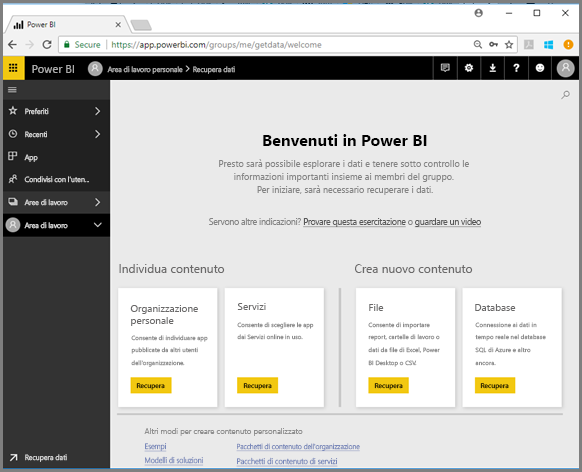

2. Selezionare **Esempio di analisi delle vendite al dettaglio > Connetti**.

    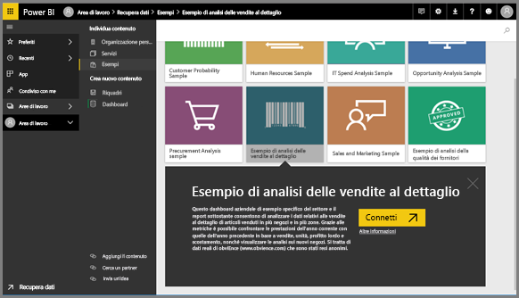

    Il servizio Power BI Importa l'esempio e visualizza il dashboard. I dashboard differenziano il servizio Power BI da Power BI Desktop. L'esempio include anche un report e un set di dati, che saranno esaminati più avanti.

    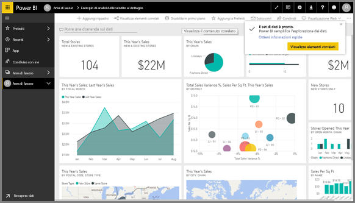

Amanda presenta una panoramica della navigazione nel servizio Power BI.  Seguire quindi tutte le istruzioni riportate sotto il video per esplorare da soli.

<iframe width="560" height="315" src="https://www.youtube.com/embed/G26dr2PsEpk" frameborder="0" allowfullscreen></iframe>

## Visualizzazione del contenuto (dashboard, report, cartelle di lavoro, set di dati, aree di lavoro, app)
Per iniziare, verrà esaminata l'organizzazione del contenuto di base, ovvero dashboard, report, set di dati e cartelle di lavoro. Il contenuto viene visualizzato all'interno del contesto di un'area di lavoro. A questo punto, viene visualizzata una sola area di lavoro denominata **Area di lavoro personale**. In genere gli utenti non necessitano e non usano altre aree di lavoro. In Area di lavoro personale viene archiviato tutto il contenuto di cui si è proprietari. È possibile considerarla come un sandbox personale o un'area di lavoro per il proprio contenuto. L'area di lavoro personale è la posizione in cui viene salvato l'esempio di analisi delle vendite al dettaglio appena scaricato. 

All'interno dell'area di lavoro personale, il contenuto è organizzato in 4 schede: Dashboard, Report, Cartelle di lavoro e Set di dati.

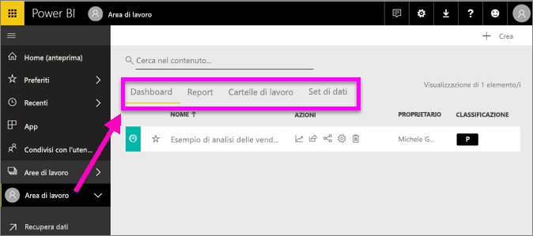

Selezionare un'area di lavoro nel riquadro di spostamento a sinistra: le schede relative al contenuto associato (dashboard, report, cartelle di lavoro, set di dati) vengono visualizzate nell'area di disegno di Power BI a destra.

Se si è un nuovo utente, verrà visualizzata una sola area di lavoro, ovvero **Area di lavoro personale**.

In tali schede, note anche come *visualizzazioni contenuto*, sono disponibili le informazioni sul contenuto, nonché le azioni che è possibile eseguire con tale contenuto.  Ad esempio, dalla scheda Dashboard è possibile aprire un dashboard, eseguire una ricerca, implementare un ordinamento e molto altro ancora.

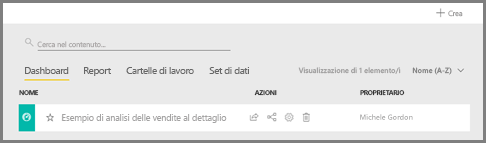

Aprire il dashboard selezionando il nome del dashboard.

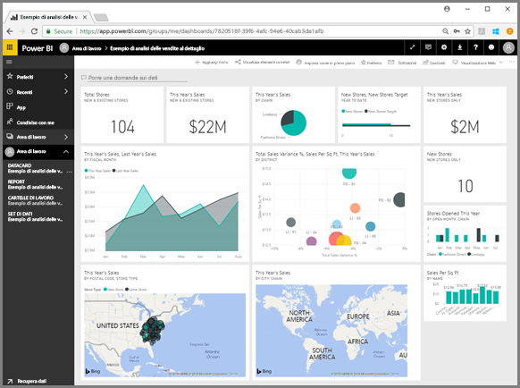

## Aggiungere un dashboard e un report a Preferiti
L'opzione **Preferiti** consente di accedere rapidamente ai contenuti più importanti.  

1. Con il dashboard aperto, selezionare **Aggiungi a Preferiti** nell'angolo in alto a destra.
   
   
   
   **Aggiungi a Preferiti** diventa **Rimuovi da Preferiti** e l'icona a stella diventa gialla.
   
   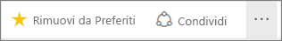

2. Per visualizzare l'elenco di tutti i contenuti aggiunti a Preferiti, nel riquadro di spostamento a sinistra selezionare la freccia a destra di **Preferiti**. Il riquadro di spostamento a sinistra è una funzionalità permanente del servizio Power BI, pertanto è possibile accedere a questo elenco da qualsiasi punto del servizio Power BI.
   
    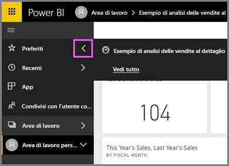
   
    Per ora è disponibile un solo preferito. Possono essere aggiunti ai preferiti dashboard, report o app.  

1. È anche possibile aggiungere un dashboard o un report a Preferiti dalla scheda **Dashboard** o **Report** della scheda di visualizzazione contenuto.  Aprire la scheda **Report** e selezionare l'icona a forma di stella a sinistra del nome del report.
   
   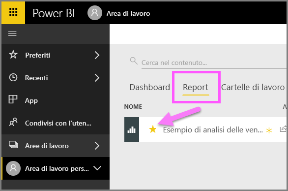

3. Aprire il *riquadro* **Preferiti**, selezionando **Aggiungi a Preferiti** nel riquadro di spostamento di sinistra o selezionando l'icona a forma di stella .
   
   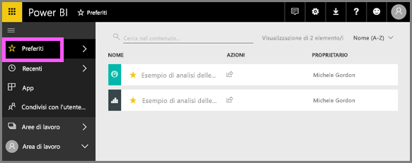
   
   A questo punto i preferiti sono due, un dashboard e un report. Da qui è possibile aprire, cercare, rimuovere da Preferiti o condividere il contenuto con i colleghi.

4. Selezionare il nome del report per aprirlo nell'editore del report.

    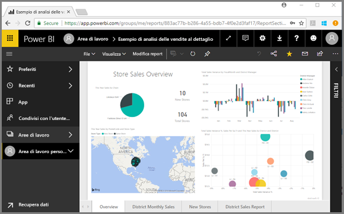

Per altre informazioni, vedere [Preferiti](end-user-favorite.md).

## Individuare il contenuto più recente

1. Come per Preferiti, è possibile visualizzare rapidamente il contenuto al quale è stato eseguito l'accesso più di recente da qualsiasi punto del servizio Power BI selezionando la freccia accanto a **Recenti** nel riquadro di spostamento di sinistra.

   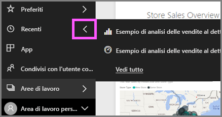

    Dal riquadro a comparsa, selezionare il contenuto per aprirlo.

2. Talvolta non si vuole semplicemente aprire il contenuto recente, ma si vuole anche visualizzare informazioni o eseguire altre azioni, ad esempio visualizzare Insights oppure esportare in Excel. In questi casi, aprire il riquadro **Recenti** selezionando **Recenti** o la relativa icona nel riquadro di spostamento di sinistra. Se si aveva più di un'area di lavoro, questo elenco includerà il contenuto di tutte le aree di lavoro.

   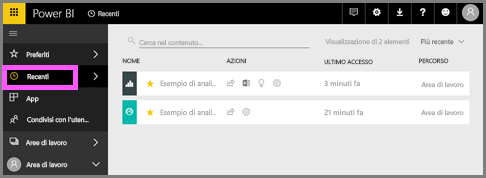

Per altre informazioni, vedere [Recenti in Power BI](end-user-recent.md).

### Cercare e ordinare il contenuto
La visualizzazione contenuto rende più semplice cercare, filtrare e ordinare il contenuto. Per cercare un dashboard, un report o una cartella di lavoro, digitare nell'area di ricerca. Power BI filtra solo il contenuto il cui nome include la stringa di ricerca.

Poiché l'esempio è uno, la ricerca e l'ordinamento non sono necessari.  Quando però si hanno lunghi elenchi di dashboard, report, cartelle di lavoro e set di dati, le funzionalità di ricerca e ordinamento risulteranno estremamente utili.

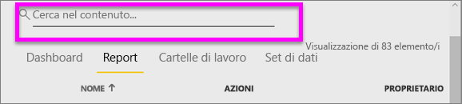

È anche possibile ordinare il contenuto in base al nome o al proprietario. Osservare la freccia a destra di **Nome**. Attualmente si sta applicando a 83 elementi l'ordinamento alfabetico crescente in base al nome. Per impostare l'ordinamento decrescente, selezionare **Nome**. La Freccia SU diventa Freccia GIÙ.

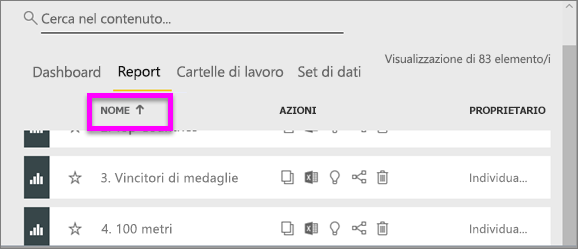

Non tutte le colonne possono essere ordinate. Passare il mouse sulle intestazioni colonna per individuare le colonne che possono essere ordinate.

Per altre informazioni, vedere [Power BI navigation: search and sort](end-user-search-sort.md) (Navigazione in Power BI: ricerca e ordinamento).

## Pulire le risorse
Dopo aver completato questa Guida rapida, se si vuole è possibile eliminare il dashboard, il report e il set di dati dell'esempio di analisi delle vendite al dettaglio.

1. Aprire il servizio Power BI (app.powerbi.com) ed eseguire l'accesso.    
2. Nel riquadro di spostamento a sinistra, selezionare **Aree di lavoro > Area di lavoro personale**.  
    La stella gialla indica che si tratta di un'opzione preferita.    
3. Nella scheda **Dashboard** selezionare l'icona **Elimina** a forma di bidone della spazzatura accanto al dashboard di analisi delle vendite al dettaglio.    

    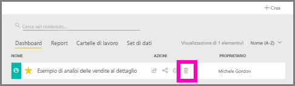

4. Selezionare la scheda **Report** e scegliere lo stesso per il report di analisi delle vendite al dettaglio.
1. Selezionare la scheda **Set di dati** e scegliere lo stesso per il set di dati di analisi delle vendite al dettaglio.

## Passaggi successivi

> [!div class="nextstepaction"]
> [Visualizzazione di lettura nel servizio Power BI](end-user-reading-view.md)