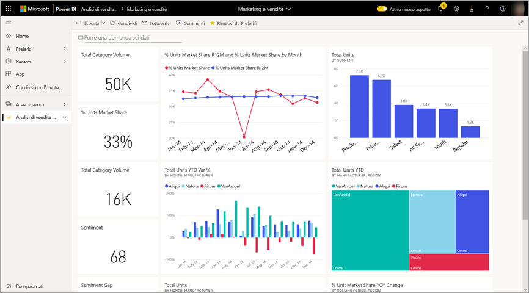
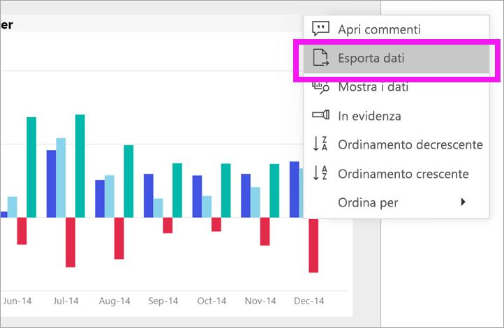
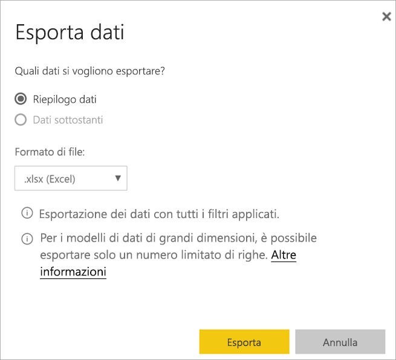
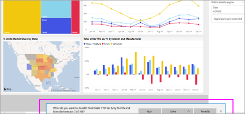

# Esportare dati da un oggetto visivo

[!INCLUDE [power-bi-service-new-look-include](../includes/power-bi-service-new-look-include.md)]

I dati usati per creare un oggetto visivo [possono essere visualizzati in Power BI](end-user-show-data.md) oppure possono essere esportati in Excel. L'opzione per esportare i dati richiede un certo tipo o una licenza e le autorizzazioni di modifica per il contenuto. Se non è possibile eseguire l'esportazione, contattare l'amministratore di Power BI. 

## Da un oggetto visivo in un dashboard di Power BI

1. Iniziare con un dashboard di Power BI. In questo caso viene usato il dashboard dell'app ***Marketing and sales sample***. È possibile [scaricare questa app da AppSource.com](https://appsource.microsoft.com/en-us/product/power-bi/microsoft-retail-analysis-sample.salesandmarketingsample-preview?flightCodes=e2b06c7a-a438-4d99-9eb6-4324ce87f282).

    

2. Passare il puntatore del mouse su un oggetto visivo per visualizzare i puntini di sospensione (...) e fare clic per visualizzare il menu di azione.

    

3. Selezionare **Esporta in Excel**.

4. Il risultato varia a seconda del browser in uso. Nella parte inferiore del browser potrebbe essere richiesto di salvare il file o di visualizzare un collegamento al file esportato. 

    

5. Aprire il file in Excel.  

    

## Da un oggetto visivo in un report
È possibile esportare i dati da un oggetto visivo in un report usando il formato CSV o xlsx (Excel). 

1. Nel dashboard selezionare un riquadro per aprire il report sottostante.  In questo esempio viene selezionato lo stesso oggetto visivo usato in precedenza, vale a dire *Total Units YTD var%.* 

    

    Il riquadro è stato creato dal report *Sales and Marketing Sample*. Si aprirà quindi questo report e sarà visualizzata la pagina contenente l'oggetto visivo del riquadro selezionato. 

2. Selezionare il riquadro nel report. Si noti il riquadro **Filtri** sulla destra. All'oggetto visivo sono applicati filtri. Per altre informazioni sui filtri, vedere [Usare i filtri in un report](end-user-report-filter.md).

    

3. Selezionare i puntini di sospensione nell'angolo superiore destro della visualizzazione. Scegliere **Esporta dati**.

    

4. Verranno visualizzate le opzioni per esportare il Riepilogo dati o i Dati sottostanti. Se si usa l'app *Sales and marketing sample*, i **Dati sottostanti** saranno disabiliti. È tuttavia possibile trovare report in cui entrambe le opzioni sono abilitate. Di seguito viene illustrata la differenza.

    **Riepilogo dati**: selezionare questa opzione se si vogliono esportare i dati di ciò che viene visualizzato nell'oggetto visivo.  Questo tipo di esportazione consente di visualizzare solo i dati usati per creare l'oggetto visivo. Se all'oggetto visivo sono applicati filtri, anche i dati esportati saranno filtrati. Ad esempio, per questo oggetto visivo l'esportazione includerà solo i dati del 2014, l'area centrale e solo i dati relativi a quattro dei produttori, vale a dire VanArsdel, Natura, Aliqui e Pirum.
  

    **Dati sottostanti**: selezionare questa opzione se si vogliono esportare i dati di ciò che viene visualizzato nell'oggetto visivo **oltre a** dati aggiuntivi provenienti dal set di dati sottostante.  Possono quindi essere inclusi dati che sono contenuti nel set di dati, ma che non sono usati nell'oggetto visivo. 

    

5. Il risultato varia a seconda del browser in uso. Nella parte inferiore del browser potrebbe essere richiesto di salvare il file o di visualizzare un collegamento al file esportato. 

    

6. Aprire il file in Excel. Confrontare la quantità di dati esportati con i dati esportati dallo stesso oggetto visivo nel dashboard. La differenza è che questo tipo di esportazione include i **dati sottostanti**. 

    

## Passaggi successivi

[Visualizzare i dati usati per creare un oggetto visivo](end-user-show-data.md)