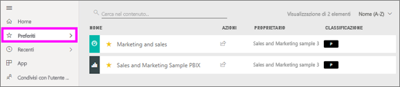
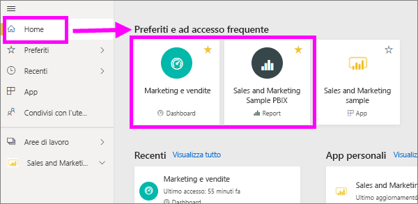
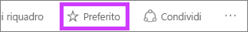
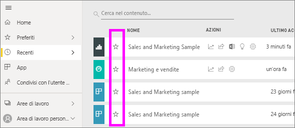
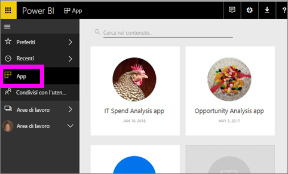
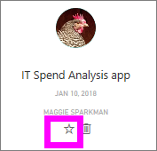
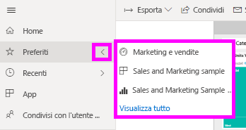
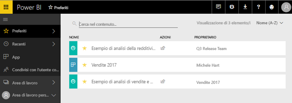
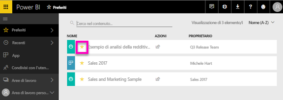

# Aggiungere a Preferiti dashboard, report e app nel servizio Power BI
Quando si aggiunge contenuto un *preferito*, sarà possibile accedervi rapidamente dal **Preferiti** elenco di contenuto e dalla **Power BI Home**  >   **Preferiti e ad accesso frequente**.  I Preferiti sono in genere contenuti che accede più spesso e vengono identificati con un asterisco giallo.

   

   

È anche possibile selezionare un singolo dashboard come un [dashboard in primo piano](end-user-featured.md) nel servizio Power BI.

## Aggiungere un dashboard o un report a *Preferiti*

1. Aprire un dashboard o un report usato di frequente. È possibile aggiungere a *Preferiti* anche contenuti condivisi da altri utenti.

2. Dalla barra multifunzione superiore del servizio Power BI, selezionare **preferite** o la stella  icona.
   
   
   
   È possibile anche aggiungere a Preferiti un dashboard o report ovunque viene visualizzata l'icona a stella, come home page, recenti, le App e condiviso con l'utente corrente. 
   
   

## Aggiungere un'app a *Preferiti*

1. Nel riquadro di spostamento, selezionare **app**.

   

2. Portare il puntatore del mouse su un'app per visualizzare altri dettagli.  Selezionare l'icona a forma di stella   per aggiungere l'app a Preferiti.
   
   

## Uso dei *Preferiti*
1. Per accedere ai Preferiti, selezionare sulla freccia a destra del riquadro a comparsa **Preferiti**.  Da qui è possibile selezionare un elemento di Preferiti per aprirlo. L'elenco include solo cinque dashboard aggiunti ai Preferiti in ordine alfabetico. Se si dispone di più di cinque, selezionare **Vedi tutto** per aprire i contenuto di Preferiti elenco (vedere #2 di seguito). 
   
   
2. Per visualizzare **tutte** il contenuto che sono stati aggiunti ai Preferiti, nel riquadro di spostamento, selezionare **Preferiti** o Preferiti  icona.  
   
    
   
   Da qui è possibile eseguire varie operazioni: aprire l'elemento, identificarne i proprietari o condividerlo con i colleghi.

## Rimuovere contenuti da Preferiti
Se un report viene usato di rado,  è possibile rimuoverlo dai Preferiti. Un contenuto rimosso dall'elenco Preferiti non viene rimosso da Power BI.

1. Nel riquadro di spostamento a sinistra selezionare **Preferiti** per aprire la schermata **Preferiti**.
   
   
2. Selezionare la stella gialla accanto al contenuto per rimuoverlo da Preferiti.

> [!NOTE]
> è possibile rimuovere dai Preferiti un dashboard, un report o anche un'app. È sufficiente aprire l'elemento e deselezionare l'icona gialla.   
> 
> 
## Limitazioni e considerazioni
Al momento, è possibile preferito di un'app e questa automaticamente tutti i report Preferiti e i dashboard per l'app. Non è possibile per i dashboard o report Preferiti singole app. 

## Passaggi successivi
[Power BI - Concetti di base](end-user-basic-concepts.md)

Altre domande? [Provare la community di Power BI](http://community.powerbi.com/)

