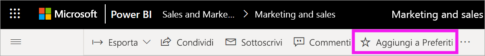
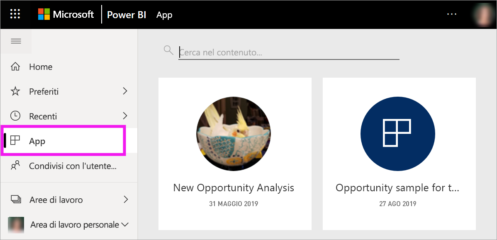
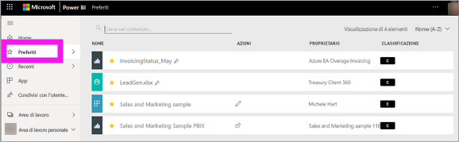
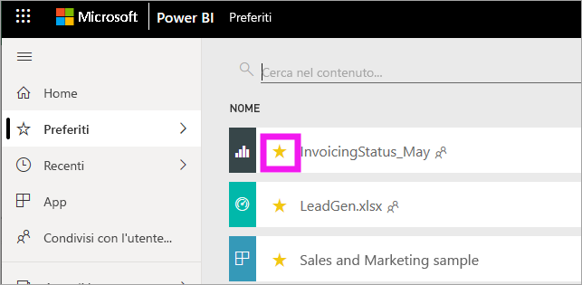

# Aggiungere a Preferiti dashboard, report e app nel servizio Power BI
Quando si imposta un contenuto come *preferito*, sarà possibile accedervi rapidamente dall'elenco di contenuti **Preferiti** e da **Home di Power BI** > **Preferiti e ad accesso frequente**.  I preferiti sono in genere i contenuti che si visitano più spesso e sono identificati con una stella gialla.

   

   

È anche possibile selezionare un singolo dashboard come [dashboard in primo piano](end-user-featured.md) nel servizio Power BI.

## Aggiungere un dashboard o un report a *Preferiti*

1. Aprire un dashboard o un report usato di frequente. È possibile aggiungere a *Preferiti* anche contenuti condivisi da altri utenti.

2. Nella barra dei menu superiore del servizio Power BI selezionare **Aggiungi a Preferiti** o l'icona a forma di stella .
   
   
   
   È anche possibile aggiungere un dashboard o un report ai Preferiti ovunque venga visualizzata l'icona a forma di stella, ad esempio in Home, Recenti, App e Condivisi con l'utente corrente. 
   
   

## Aggiungere un'app a *Preferiti*

1. Nel riquadro di spostamento selezionare **App**.

   

2. Portare il puntatore del mouse su un'app per visualizzare altri dettagli.  Selezionare l'icona a forma di stella   per aggiungere l'app a Preferiti.
   
   

## Uso dei *Preferiti*
1. Per accedere ai Preferiti, selezionare la freccia del riquadro a comparsa a destra di **Preferiti**.  Da qui è possibile selezionare un elemento di Preferiti per aprirlo. L'elenco include al massimo cinque elementi aggiunti ai Preferiti in ordine alfabetico. Se sono presenti più di cinque elementi, selezionare **Visualizza tutto** per aprire l'elenco di contenuti Preferiti (vedere il punto 2 di seguito). 
   
   
2. Per visualizzare **tutti** i contenuti che sono stati aggiunti ai Preferiti, nel riquadro di spostamento selezionare **Preferiti** oppure l'icona Preferiti .  
   
    
   
   Da qui è possibile eseguire varie operazioni: aprire l'elemento, identificarne i proprietari o condividerlo con i colleghi.

## Rimuovere contenuti da Preferiti
Se un report viene usato di rado,  è possibile rimuoverlo dai Preferiti. Un contenuto rimosso dall'elenco Preferiti non viene rimosso da Power BI.

1. Nel riquadro di spostamento a sinistra selezionare **Preferiti** per aprire la schermata **Preferiti**.
   
   
2. Selezionare la stella gialla accanto al contenuto per rimuoverlo da Preferiti.

> [!NOTE]
> è possibile rimuovere dai Preferiti un dashboard, un report o anche un'app. È sufficiente aprire l'elemento e deselezionare l'icona gialla.   
> 
> 
## Limitazioni e considerazioni
Per il momento, è possibile aggiungere a un'app ai Preferiti e questa operazione aggiunge automaticamente ai Preferiti tutti i report e i dashboard di tale app. Non è possibile aggiungere ai Preferiti singoli dashboard o report dell'app. 

## Passaggi successivi
[Power BI - Concetti di base](end-user-basic-concepts.md)

Altre domande? [Provare la community di Power BI](http://community.powerbi.com/)

