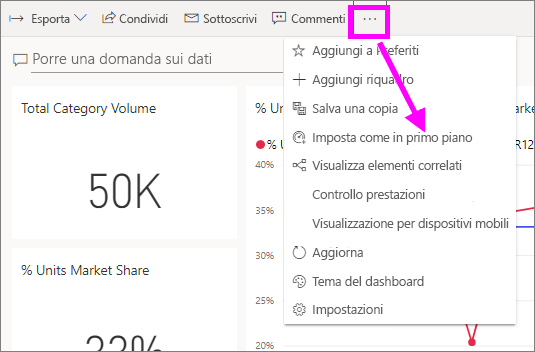
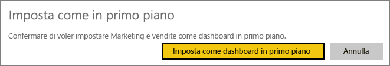
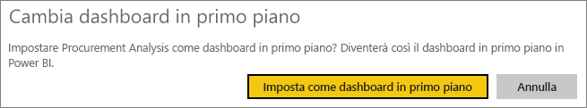
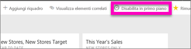

# Dashboard in primo piano nel servizio Power BI

[!INCLUDE [power-bi-service-new-look-include](../includes/power-bi-service-new-look-include.md)]

Molti hanno un dashboard a cui accedono con maggiore frequenza rispetto ad altri. Potrebbe trattarsi del dashboard usato per gestire la propria attività oppure di un dashboard che contiene un'aggregazione di riquadri provenienti da molti dashboard e report diversi.

## Creare un dashboard in primo piano
Quando si seleziona un dashboard *in primo piano*, questo viene visualizzato ogni volta che si apre il servizio Power BI. 

È anche possibile selezionare alcuni dashboard e impostarli come Preferiti. Vedere [Dashboard preferiti](end-user-favorite.md).

Se non è stato impostato un dashboard in primo piano, Power BI viene aperto con l'ultimo dashboard usato o con **Home** di Power BI. 

### Impostare un dashboard in primo piano

1. Aprire il dashboard da impostare come dashboard in primo piano. 
2. Nella barra dei menu in alto selezionare **Altre opzioni** (...) e selezionare **Imposta come in primo piano**. 
   
    
3. Confermare la selezione.
   
    

## Cambiare il dashboard in primo piano
Se in seguito si cambia idea, è possibile impostare un nuovo dashboard come dashboard in primo piano.

1. Seguire i passaggi 1 e 2 precedenti.
   
2. Selezionare **Imposta come dashboard in primo piano**. Quando si annulla l'impostazione in primo piano per un dashboard, il dashboard non viene rimosso da Power BI. 
   
    

## Rimuovere il dashboard in primo piano
Se non si vuole più usare dashboard in primo piano, ecco come fare per disabilitare l'impostazione in primo piano per un dashboard.

1. Aprire il dashboard attualmente impostato come in primo piano.
2. Nella barra dei menu in alto selezionare **Altre opzioni** (...) e selezionare **Disabilita in primo piano**.

    
   
## Passaggi successivi
- [Aggiungere un dashboard ai Preferiti](end-user-favorite.md)    
- Altre domande? Provare la [Community di Power BI](https://community.powerbi.com/).

