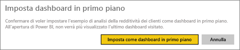
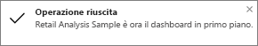
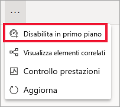

# Dashboard in primo piano nel servizio Power BI
## Creare un dashboard in primo piano
Molti hanno un dashboard a cui accedono con maggiore frequenza rispetto ad altri.  Potrebbe trattarsi del dashboard usato per gestire la propria attività oppure di un dashboard che contiene un'aggregazione di riquadri provenienti da molti dashboard e report diversi.

Quando si seleziona un dashboard *in primo piano*, questo verrà visualizzato ogni volta che si apre il servizio Power BI.  

È anche possibile selezionare alcuni dashboard e impostarli come *Preferiti*. Vedere [Dashboard preferiti](end-user-favorite.md).

> [!NOTE] 
>Questo argomento si applica al servizio Power BI e non a Power BI Desktop.

Se non è stato impostato un dashboard in primo piano, Power BI verrà aperto con l'ultimo dashboard usato.  

### Per impostare un dashboard **in primo piano**
Il video seguente mostra come creare un dashboard in primo piano. Seguire quindi le istruzioni successive per fare una prova in prima persona.

<iframe width="560" height="315" src="https://www.youtube.com/embed/G26dr2PsEpk" frameborder="0" allowfullscreen></iframe>

1. Aprire il dashboard da impostare come dashboard *in primo piano*. 
2. Nella barra dei menu superiore è visualizzata l'opzione **Imposta come in primo piano** o solo l'icona In primo piano . Selezionare una delle due.
   
    
3. Confermare la selezione.
   
    

## Cambiare il dashboard in primo piano
Naturalmente, se in seguito si cambia idea, è possibile impostare un nuovo dashboard come dashboard in primo piano.

1. Seguire i passaggi 1 e 2 illustrati sopra.
   
    
2. Selezionare **Imposta come in primo piano**. Quando si annulla il dashboard in primo piano, il dashboard non viene rimosso dall'area di lavoro.  
   
    

## Rimuovere il dashboard in primo piano
Se non si vuole più usare dashboard in primo piano, ecco come fare per rimuovere un dashboard in primo piano.

1. Aprire il dashboard attualmente impostato come in primo piano.
2. Nella barra dei menu superiore selezionare **Disabilita in primo piano**.
   
    

In Power BI verrà ora aperto l'ultimo dashboard usato.  

## Passaggi successivi
[Aggiungere un dashboard ai Preferiti](end-user-favorite.md)

Altre domande? [Provare la community di Power BI](http://community.powerbi.com/)

