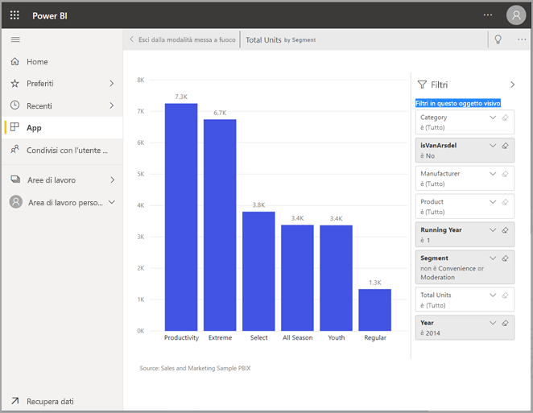

# Visualizzare il contenuto in modo più dettagliato: modalità messa a fuoco e modalità schermo intero

<iframe width="560" height="315" src="https://www.youtube.com/embed/dtdLul6otYE" frameborder="0" allowfullscreen></iframe>

La modalità schermo intero e la modalità messa a fuoco sono due modi diversi per visualizzare più in dettaglio oggetti visivi, report e dashboard.  La differenza principale è che la modalità schermo intero rimuove tutti i riquadri che circondano il contenuto, mentre la modalità messa a fuoco consente di continuare a interagire con gli oggetti visivi. Verranno ora esaminate più a fondo le analogie e le differenze.  

|Contenuto    | Modalità messa a fuoco  |Modalità schermo intero  |
|---------|---------|----------------------|
|Dashboard     |   Non consentita     | sì |
|Pagina del report   | Non consentita  | sì|
|Oggetto visivo del report | sì    | sì |
|Riquadro del dashboard | sì    | sì |
|Windows 10 Mobile | Non consentita | Sì |

## Che cos'è la modalità schermo intero

È possibile visualizzare i contenuti del servizio Power BI (dashboard, pagine di report, riquadri e oggetti visivi) senza la distrazione di menu e barre di spostamento.  Si ottiene una visualizzazione completa e immediata dei contenuti, in qualsiasi momento. È anche detta modalità TV.   

Per aprire la modalità **schermo intero**, selezionare l'icona di tale modalità  dalla barra dei menu del servizio Power BI sopra il dashboard, il report, il riquadro o l'oggetto visivo in modalità messa a fuoco.  Il contenuto selezionato occupa l'intero schermo.
Se si usa Power BI per dispositivi mobili, la modalità [schermo intero è disponibile per le app per dispositivi mobili Windows 10](./mobile/mobile-windows-10-app-presentation-mode.md). 

Alcuni usi della modalità schermo intero sono:

* presentazione del dashboard, riquadro, oggetto visivo o report in una riunione o conferenza
* visualizzazione in un ufficio su schermi di grandi dimensioni o proiettori dedicati
* visualizzazione su schermi di piccole dimensioni
* revisione in modalità di blocco - possibilità di toccare la schermata o passare il mouse sui riquadri senza aprire il dashboard o il report sottostante

## Che cos'è la modalità messa a fuoco?

La modalità ***messa a fuoco*** consente di espandere (aprire in una nuova finestra) un oggetto visivo o un riquadro per visualizzare più dettagli.  Se un dashboard o un report contiene molti elementi, potrebbe essere necessario fare zoom avanti su un solo oggetto visivo.  Si tratta di un uso ideale della modalità messa a fuoco.  

In modalità messa a fuoco un *utente* di Power BI può interagire con tutti i filtri applicati al momento della creazione dell'oggetto visivo.  Nel servizio Power BI è possibile usare la modalità messa a fuoco su un riquadro del dashboard o un oggetto visivo del report.

## Uso della modalità schermo intero

Per aprire un dashboard o una pagina del report in modalità schermo intero, selezionare l'icona di tale modalità  dalla barra di spostamento superiore. In modalità schermo intero, spostando il mouse o il cursore, viene visualizzato un menu di scelta rapida. Poiché la modalità schermo intero è disponibile per un'ampia gamma di contenuti, le opzioni del menu di scelta rapida possono variare leggermente, ma sono facilmente comprensibili.  È sufficiente passare il puntatore del mouse su un'icona per visualizzare una definizione.

Menu per i dashboard    
    

Menu per le pagine di report    
    

  *     
  Usare il pulsante **Indietro** per passare alla pagina precedente nel browser. Se la pagina precedente è una pagina di Power BI, anche tale pagina verrà visualizzata in modalità schermo intero.  La modalità schermo intero viene disattivata solo alla chiusura dell'applicazione.

  *     
  Usare questo pulsante per stampare il dashboard o la pagina del report in modalità schermo intero.

  *     
    Usare il pulsante **Adatta allo schermo** per visualizzare il dashboard con le dimensioni maggiori possibili senza che siano necessarie le barre di scorrimento.  

    

  *        
    Talvolta le barre di scorrimento non interessano, ma si vuole che il dashboard riempia l'intera larghezza dello spazio disponibile. Selezionare il pulsante **Adatta in larghezza**.    

    

  *        
    Nei report a schermo intero usare queste frecce per spostarsi tra le pagine del report.    
  *      
  Per uscire dalla modalità schermo intero, selezionare l'icona **Esci dalla modalità schermo intero**.

      

## Uso della modalità messa a fuoco

Esistono due modi per aprire la modalità messa a fuoco: uno per i riquadri del dashboard e un altro per gli oggetti visivi del report.

### Modalità messa a fuoco nei dashboard

1. Aprire un dashboard nel servizio Power BI.

2. Passare il puntatore del mouse su un riquadro del dashboard o un oggetto visivo del report, selezionare i puntini di sospensione (...) e scegliere **Apri in modalità messa a fuoco**.

    .

2. Il riquadro si apre e riempie l'intera area di disegno report. Si noti che è ancora presente un riquadro **Filtri** che è possibile usare per interagire con l'oggetto visivo. Il riquadro **Filtri** può essere compresso. 

   

4. Per esplorare ulteriormente, [modificare i filtri](end-user-report-filter.md) e cercare informazioni interessanti nei dati.  

5. Chiudere la modalità messa a fuoco e tornare al dashboard selezionando **Esci dalla modalità messa a fuoco** (nell'angolo in alto a sinistra dell'oggetto visivo).

        

## Modalità messa a fuoco per gli oggetti visivi dei report

1. Aprire un report nel servizio Power BI.  In questo esempio verrà illustrato l'uso dell'esempio Sales and Marketing.

1. Dopo l'apertura del report selezionare la scheda **YTD Category**.

2. Passare il puntatore del mouse sulla mappa ad albero nell'angolo in alto a sinistra e selezionare l'icona della **modalità messa a fuoco** .  

   
2. L'oggetto visivo si apre e riempie l'intera area di disegno.

   

3. Usare facoltativamente il riquadro **Filtri** per interagire con i filtri applicati a questo oggetto visivo. Analizzare i dati alla ricerca di nuove informazioni e risposte alle domande. I *consumer* non possono aggiungere nuovi filtri, modificare i campi usati negli oggetti visivi o creare nuovi oggetti visivi.  Tuttavia, eventuali modifiche apportate ai filtri esistenti vengono salvate quando si esce da Power BI. Se non si vogliono memorizzare le modifiche in Power BI, selezionare **Ripristina impostazioni predefinite**.   

5. Chiudere la modalità messa a fuoco e tornare al report selezionando **Torna al report** (nell'angolo in alto a sinistra dell'oggetto visivo).

      

## Considerazioni e risoluzione dei problemi

* Quando si usa la modalità messa a fuoco con un oggetto visivo in un report, sarà possibile visualizzare e interagire con tutti i filtri: livello oggetto visivo, livello pagina, drill-through e livello report.    
* Quando si usa la modalità messa a fuoco con un oggetto visivo o un dashboard, sarà possibile visualizzare e interagire solo con il filtro a livello di oggetto visivo.

## Passaggi successivi

[Visualizzare le impostazioni per i report](end-user-report-view.md)