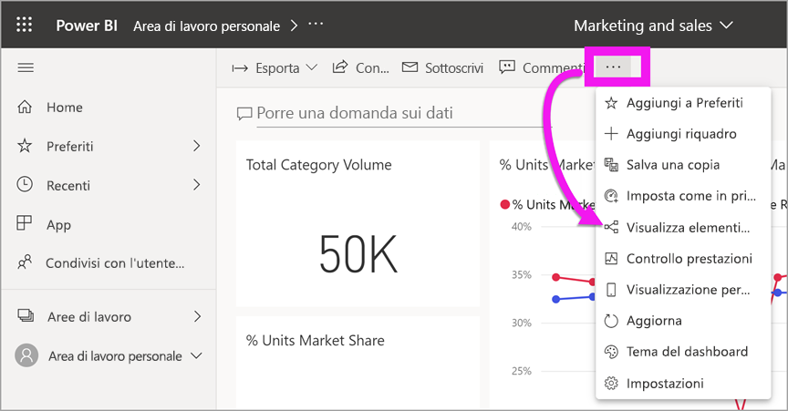

# Contenuto aggiornato

[!INCLUDE[consumer-appliesto-ynny](../includes/consumer-appliesto-ynny.md)]

[!INCLUDE [power-bi-service-new-look-include](../includes/power-bi-service-new-look-include.md)]

Gli *utenti* interagiscono con il contenuto creato dagli *sviluppatori* e condiviso. È possibile che l'utente voglia verificare se il contenuto è aggiornato oppure voglia solo conoscere la data dell'ultimo aggiornamento. La certezza di usare un contenuto aggiornato garantisce fiducia.  
 

La sicurezza di avere a disposizione i dati più recenti è spesso di importanza fondamentale nel processo decisionale. Come è possibile assicurarsi di usare il contenuto più recente? In molti casi non è necessario eseguire alcuna operazione. Le app condivise vengono aggiornate automaticamente in base a una pianificazione impostata dallo sviluppatore di app. Lo stesso avviene per i dashboard e i report condivisi: lo sviluppatore esegue l'aggiornamento del contenuto manualmente o tramite una pianificazione degli aggiornamenti automatizzata.  

Per domande sull'aggiornamento dei dati, contattare lo sviluppatore.

## Come individuare il nome dello sviluppatore o del proprietario

### Dashboard o report

Il nome del proprietario è disponibile nella barra del titolo di dashboard e report. Selezionare il nome del report o del dashboard per visualizzare ulteriori dettagli, incluso il **Proprietario**.

### App

La schermata dell'app visualizza il nome dello sviluppatore e la data dell'ultimo aggiornamento dell'app.  

1. Nel riquadro di spostamento selezionare **App**.

    

2. Passare il puntatore del mouse sull'app per visualizzare il titolo, la data di aggiornamento e il nome dello sviluppatore. 

    

### Condivisi con l'utente corrente
La schermata **Condivisi con l'utente corrente** visualizza il nome del proprietario del contenuto e la data dell'ultima condivisione del contenuto.

 

## Come cercare la data dell'ultimo aggiornamento
Se necessario, è possibile cercare la data dell'ultimo aggiornamento per la maggior parte del contenuto. 

### I riquadri del dashboard
Per i riquadri del dashboard, visualizzare il riquadro nella modalità messa a fuoco per visualizzare la data dell'ultimo aggiornamento.

1. In un riquadro del dashboard selezionare **Altre opzioni** (...) e scegliere **Apri in modalità messa a fuoco**.

    

2. Nell'angolo superiore destro viene visualizzata la data dell'ultimo aggiornamento. Se la data non è visibile, espandere il browser per aumentarne la larghezza. 

    

### Dashboard e report
Un altro modo per cercare la data dell'ultimo aggiornamento consiste nell'usare **Visualizza elementi correlati**.  **Visualizza elementi correlati** è disponibile selezionando **Altre opzioni** (...) nella barra dei menu superiore di Power BI.

Il riquadro **Contenuto correlato** visualizza le informazioni sull'ultimo aggiornamento per il set di dati sottostante del dashboard o del report.

## Cosa accade se un'app viene eliminata dallo sviluppatore

Se uno sviluppatore elimina un'app, anche i dashboard e i report associati all'app vengono rimossi automaticamente dall'area di lavoro di Power BI. I dashboard e i report non saranno più disponibili e l'app non verrà visualizzata nel contenitore App o in un'altra posizione nel riquadro di spostamento.

## Eseguire la sottoscrizione per visualizzare le modifiche
Un altro modo per rimanere sempre aggiornati consiste nell'eseguire una sottoscrizione a un report o un dashboard. Anziché accedere e aprire un report o un dashboard, si imposta Power BI per l'invio di uno snapshot in base a una pianificazione impostata.  Per altre informazioni, vedere [Sottoscrivere un report o un dashboard](end-user-subscribe.md).

## Impostare gli avvisi per i dati
Se si vuole ricevere una notifica quando i dati vengono modificati oltre un limite impostato, [creare un avviso dati](end-user-alerts.md).  Usando gli avvisi dati è facile mantenersi aggiornati. Gli avvisi dati consentono di configurare Power BI in modo che venga inviato un messaggio di posta elettronica se un valore in un report supera una soglia specifica.  Ad esempio, se l'inventario scende sotto le 25 unità o se le vendite superano gli obiettivi.  

## Passaggi successivi
[Creare un avviso dati](end-user-alerts.md)    
[Sottoscrivere un report o un dashboard](end-user-subscribe.md)    
[Visualizzare il contenuto correlato](end-user-related.md)    
