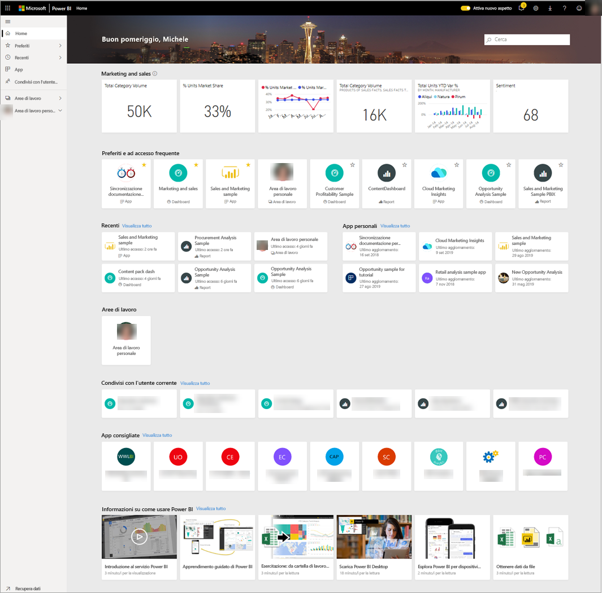
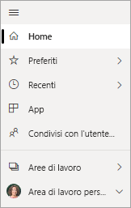
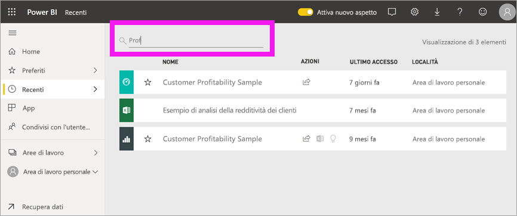

# Trovare i dashboard, i report e le app
In Power BI il termine *contenuto* si riferisce ad app, dashboard e report. Il contenuto viene creato dai *progettisti* di Power BI, che lo condividono con i colleghi. Il contenuto è accessibile e visualizzabile nel servizio Power BI e il punto di partenza migliore per lavorare in Power BI è la pagina di destinazione principale.

## Esplorare l'area Home di Power BI
Quando si accede, Power BI si apre e visualizza l'area Home, come illustrato nella figura seguente.
 

Home di Power BI consente di individuare e visualizzare il contenuto in tre modi diversi. Tutti e tre permettono di accedere allo stesso pool di contenuti, sono semplicemente modi diversi per ottenere tale contenuto. In alcuni casi, la ricerca sarà il modo più semplice e rapido per trovare qualcosa, in altri invece l'opzione migliore consisterà nel selezionare una *scheda* nell'area Home.

- L'area Home visualizza e organizza i contenuti preferiti e più recenti, oltre ai contenuti consigliati e alle risorse per l'apprendimento. Ogni parte del contenuto viene visualizzata come *scheda*, con un titolo e un'icona. Selezionando una scheda si apre il contenuto.
- Lungo il lato sinistro si trova un riquadro di spostamento, denominato barra di spostamento. In questo riquadro lo stesso contenuto è organizzato in modo leggermente diverso, in Preferiti, Recenti, App e Condivisi con l'utente corrente. Da qui è possibile visualizzare gli elenchi di contenuto e selezionare quello da aprire.
- Nell'angolo superiore destro la casella di ricerca globale consente di cercare il contenuto in base al titolo, al nome o alla parola chiave.

Negli argomenti seguenti vengono esaminate tutte le opzioni disponibili per la ricerca e la visualizzazione del contenuto.

## Area Home
Nell'area Home è possibile visualizzare tutti i contenuti che si è autorizzati a usare. È possibile che inizialmente i contenuti dell'area Home siano limitati (vedere l'immagine precedente), ma il loro numero aumenterà non appena si inizia a usare Power BI con i propri colleghi.

L'area Home viene aggiornata anche con i contenuti consigliati e le risorse per l'apprendimento. 
 
Quando si lavora nel servizio Power BI, si riceveranno dashboard, report e app dai colleghi e quindi la home page finirà per riempirsi. Nel corso del tempo, potrebbe essere simile alla home page seguente.

 
Gli argomenti successivi esaminano più da vicino questa home page, dall'alto verso il basso.

## Contenuti più importanti a portata di mano

### Preferiti e ad accesso frequente
Questa sezione superiore contiene i collegamenti ai contenuti che si visitano più spesso o che sono stati contrassegnati come [in primo piano o preferiti](end-user-favorite.md). Si noti che alcune schede hanno le stelle gialle. Quelle due app e quel dashboard sono stati contrassegnati come preferiti.
 
### Recenti e App personali
Nella sezione successiva viene visualizzato il contenuto visitato più di recente. Si noti il timestamp di ogni scheda. La sezione **App personali** elenca le app condivise o [scaricate da AppSource](end-user-apps.md). Le app più recenti sono elencate qui. È possibile selezionare **Visualizza tutto** per visualizzare un elenco di tutte le app condivise con l'utente.

### Aree di lavoro
I *consumer* di Power BI hanno in genere solo un'area di lavoro, ovvero **Area di lavoro personale**. 

### Condivisi con l'utente corrente
I colleghi condividono le app, ma possono anche condividere singoli dashboard e report. Nella sezione **Condivisi con l'utente corrente** si possono notare tre dashboard e tre report condivisi dai colleghi.

### App consigliate
In base all'attività e alle impostazioni dell'account, Power BI visualizza un set di app consigliate. Selezionando la scheda di un'app, si apre l'app.
 
### Risorse per l'apprendimento
Nella parte inferiore dell'area Home è presente un set di risorse per l'apprendimento. Le risorse esatte visualizzate dipendono dall'attività e dalle impostazioni e dall'amministratore di Power BI. 
 
## Esplorare il riquadro di spostamento (barra di spostamento)

Usare il riquadro di spostamento (barra di spostamento) a sinistra per individuare e spostarsi tra dashboard, report e app. In alcuni casi, l'uso della barra di spostamento sarà il modo più rapido per ottenere il contenuto.
La barra di spostamento viene visualizzata quando si apre la pagina di destinazione Home e rimane statica mentre si aprono altre aree del servizio Power BI.
  
La barra di spostamento organizza il contenuto in contenitori simili a quelli già visti nell'area Home: Preferiti, Recenti, App e Condivisi con l'utente corrente. Usando i riquadri a comparsa, è possibile visualizzare solo il contenuto più recente in ognuno di questi contenitori oppure è possibile passare agli elenchi di contenuto per visualizzare tutto il contenuto per ogni categoria di contenitore.
 
- Per aprire una di queste sezioni di contenuto e visualizzare un elenco di tutti gli elementi, selezionare l'intestazione.
- Per visualizzare gli elementi più recenti in ogni contenitore, selezionare il riquadro a comparsa ( **>** ).

    

 
La barra di spostamento è un altro modo per trovare rapidamente il contenuto desiderato. Il contenuto è organizzato in modo simile all'area Home, ma viene visualizzato in elenchi invece che in schede. 

## Cercare tutto il contenuto
In alcuni casi, il modo più rapido per trovare il contenuto è cercarlo. Si supponga, ad esempio, di essersi accorti che un dashboard che non viene usato da un po' non è visualizzato nell'area Home o magari si ricorda che il collega Aaron lo ha condiviso, ma non si ricorda come lo ha chiamato o che tipo di contenuto ha condiviso, indipendentemente dal fatto che fosse un dashboard o un report.
 
È possibile immettere il nome completo o parziale del dashboard e cercarlo. È anche possibile immettere il nome del collega e cercare il contenuto che ha condiviso. L'ambito della ricerca è limitato alle corrispondenze in tutto il contenuto di cui si è proprietari o a cui si ha accesso.

## Passaggi successivi
Panoramica dei [concetti di base di Power BI](end-user-basic-concepts.md)
