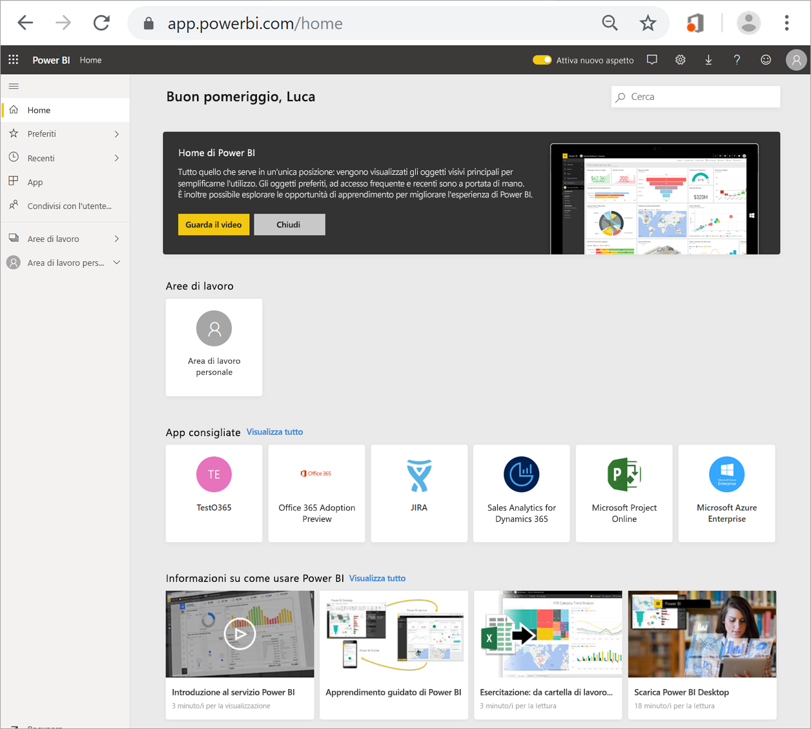

# Trovare i dashboard, i report e le app

[!INCLUDE[consumer-appliesto-yynn](../includes/consumer-appliesto-yynn.md)]
In Power BI il termine *contenuto* si riferisce ad app, dashboard e report. Il contenuto viene creato dai *progettisti* di Power BI, che lo condividono con i colleghi. Il contenuto è accessibile e visualizzabile nel servizio Power BI e il punto di partenza migliore per lavorare in Power BI è l'area **Home** di Power BI.

## Esplorare l'area Home di Power BI
Dopo aver eseguito l'accesso al servizio Power BI, selezionare **Home** nel riquadro di spostamento. 

Power BI visualizza l'area Home, come illustrato nella figura seguente.
 

Home di Power BI consente di individuare e visualizzare il contenuto in tre modi diversi. Tutti e tre consentono di accedere allo stesso pool di contenuti e sono semplicemente modi diversi per ottenere tale contenuto. In alcuni casi, la ricerca sarà il modo più semplice e rapido per trovare qualcosa, in altri invece l'opzione migliore consisterà nel selezionare una *scheda* nell'area Home.

- L'area Home visualizza e organizza i contenuti preferiti e più recenti, oltre ai contenuti consigliati e alle risorse per l'apprendimento. Ogni parte del contenuto viene visualizzata come *scheda*, con un titolo e un'icona. Selezionando una scheda si apre il contenuto.
- Lungo il lato sinistro si trova un riquadro di spostamento. In questo riquadro lo stesso contenuto è organizzato in modo leggermente diverso, in Preferiti, Recenti, App e Condivisi con l'utente corrente. Da qui è possibile visualizzare gli elenchi di contenuto e selezionare quello da aprire.
- Nell'angolo superiore destro la casella di ricerca globale consente di cercare il contenuto in base al titolo, al nome o alla parola chiave.

Negli argomenti seguenti vengono esaminate tutte le opzioni disponibili per la ricerca e la visualizzazione del contenuto.

## Area Home
Nell'area Home è possibile visualizzare tutti i contenuti che si è autorizzati a usare. È possibile che inizialmente i contenuti dell'area Home siano limitati (vedere l'immagine precedente), ma il loro numero aumenterà non appena si inizia a usare Power BI con i propri colleghi.

L'area Home viene aggiornata anche con i contenuti consigliati e le risorse per l'apprendimento. 
 
Quando si lavora nel servizio Power BI si ricevono dashboard, report e app dai colleghi fino a quando l'area Home di Power BI risulta piena. Nel corso del tempo, potrebbe essere simile all'area seguente.

 
Gli argomenti successivi esaminano l'area Home nel dettaglio, dall'alto verso il basso.

## Contenuti più importanti a portata di mano

### Preferiti e ad accesso frequente
Questa sezione superiore contiene collegamenti ai contenuti che si visitano più spesso o che sono stati contrassegnati come [in primo piano o preferiti](end-user-favorite.md). Si noti che alcune schede hanno le stelle gialle. Quelle due app e quel dashboard sono stati contrassegnati come preferiti. 

È anche possibile contrassegnare il contenuto come [in primo piano](end-user-featured.md). Scegliere un dashboard o un report che si prevede di visualizzare più spesso e impostarlo come contenuto *in primo piano*. Ogni volta che si apre il servizio Power BI, viene visualizzato per primo il dashboard in primo piano. 

### Recenti e App personali
Nella sezione successiva viene visualizzato il contenuto visitato più di recente. Si noti il timestamp di ogni scheda. La sezione **App personali** elenca le app condivise o [scaricate da AppSource](end-user-apps.md). Le app più recenti sono elencate qui. È possibile selezionare **Visualizza tutto** per visualizzare un elenco di tutte le app condivise con l'utente.

### Aree di lavoro
Ogni utente del servizio Power BI ha un'**Area di lavoro personale**. L'**Area di lavoro personale** includerà contenuto solo se sono stati scaricati esempi di Microsoft o sono stati creati dashboard, report o app personali. Per molti *utenti*, l'**Area di lavoro personale** sarà vuota e rimarrà vuota.  

Ogni volta che si [scarica un'app](end-user-app-marketing.md) o un'app [viene condivisa con l'utente](end-user-apps.md), viene creata una nuova area di lavoro.  Per aprire l'*area di lavoro di un'app*, selezionarla nell'area Home. 

L'app viene visualizzata nell'area di disegno ed è possibile visualizzare il nome dell'area di lavoro nel riquadro di spostamento. All'interno delle aree di lavoro, il servizio Power BI separa il contenuto in base al tipo: dashboard e report. In alcuni casi, sono presenti anche cartelle di lavoro e set di dati. Alla selezione di un'area di lavoro, verrà visualizzata questa organizzazione. In questo esempio l'area di lavoro **Gardening chain** contiene quattro dashboard e due report.

### Condivisi con l'utente corrente
I colleghi condividono le app, ma possono anche condividere singoli dashboard e report. Nella sezione **Condivisi con l'utente corrente** si possono notare tre dashboard e tre report condivisi dai colleghi.

### App consigliate
In base all'attività e alle impostazioni dell'account, Power BI visualizza un set di app consigliate. Selezionando la scheda di un'app, si apre l'app.
 
### Risorse per l'apprendimento
Nella parte inferiore dell'area Home è presente un set di risorse per l'apprendimento. Le risorse visualizzate variano a seconda dell'attività, delle impostazioni e dell'amministratore di Power BI. 
 
## Esplorare il riquadro di spostamento

Il riquadro di spostamento classifica il contenuto e consente di trovare le informazioni necessarie in modo semplice e rapido.  

Usare il riquadro di spostamento per individuare e spostarsi tra dashboard, report e app. In alcuni casi, l'uso del riquadro di spostamento è il modo più rapido per accedere al contenuto. Il riquadro di spostamento viene visualizzato quando si apre la pagina di destinazione Home e rimane visualizzato mentre si aprono altre aree del servizio Power BI. Può essere compresso selezionando l'icona Nascondi  .
  
Il riquadro di spostamento organizza il contenuto in contenitori simili a quelli già visti nell'area Home: Preferiti, Recenti, App, Condivisi con l'utente corrente e aree di lavoro. Usando i riquadri a comparsa, è possibile visualizzare solo il contenuto più recente in ognuno di questi contenitori oppure è possibile passare agli elenchi di contenuto per visualizzare tutto il contenuto per ogni categoria di contenitore.
 
- Per aprire una di queste sezioni di contenuto e visualizzare un elenco di tutti gli elementi, selezionare l'intestazione.
- Per visualizzare gli elementi più recenti in ogni contenitore, selezionare il riquadro a comparsa ( **>** ).

    

 
Il riquadro di spostamento offre un altro modo per trovare rapidamente il contenuto desiderato. Il contenuto è organizzato in modo simile all'area Home, ma viene visualizzato in elenchi invece che in schede. 

## Cercare tutto il contenuto
In alcuni casi, il modo più rapido per trovare il contenuto è cercarlo. Si supponga ad esempio di aver notato che un dashboard non usato da qualche tempo non è visualizzato nell'area Home, oppure di ricordare che il collega Aaron ha condiviso un contenuto, ma di non ricordare come lo ha chiamato o che tipo di contenuto ha condiviso (un dashboard o un report). Oppure di avere un contenuto di grandi dimensioni in cui è più semplice la ricerca rispetto allo scorrimento o all'ordinamento. 
 
Il campo di ricerca si trova nella sezione superiore destra della barra dei menu dell'area Home. È possibile immettere il nome completo o parziale del dashboard e cercarlo. È anche possibile immettere il nome del collega e cercare il contenuto che ha condiviso. L'ambito della ricerca è limitato alle corrispondenze in tutto il contenuto di cui si è proprietari o a cui si ha accesso.

## Passaggi successivi
Panoramica dei [concetti di base di Power BI](end-user-basic-concepts.md)
