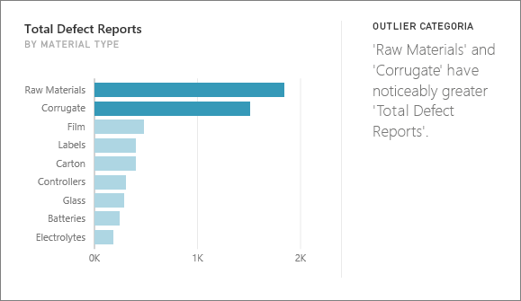
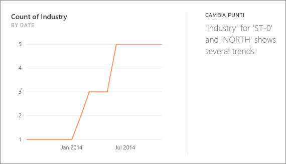
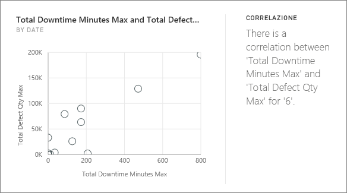
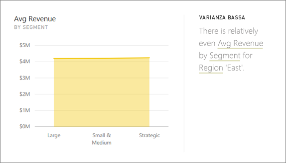
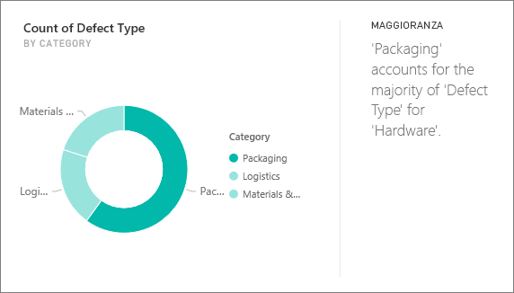
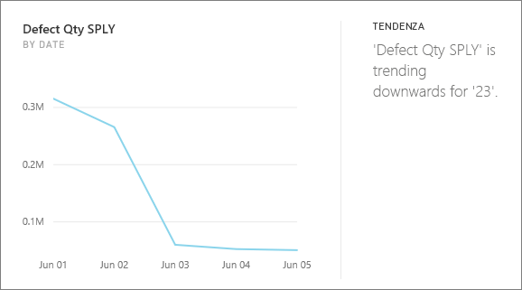
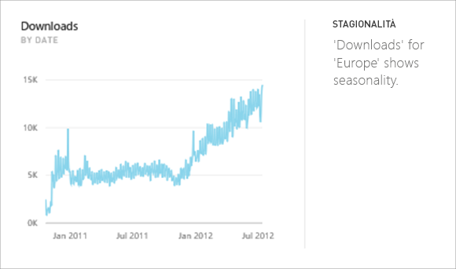
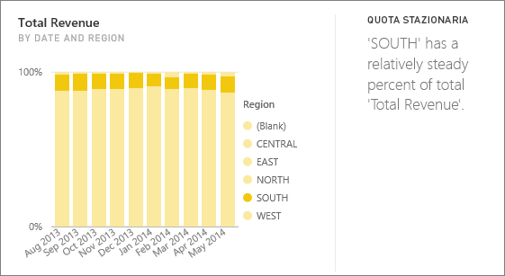
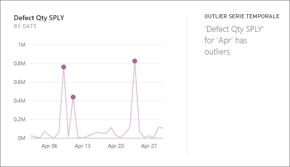

# Tipi di informazioni dettagliate supportate da Power BI

È possibile richiedere a Power BI di esaminare i dati e individuare tendenze e modelli interessanti. Queste tendenze e modelli vengono presentati sotto forma di oggetti visivi denominati *Informazioni dettagliate*. 

Per informazioni su come usare le informazioni dettagliate, vedere [Informazioni dettagliate con Power BI](end-user-insights.md)

## Funzionamento delle informazioni dettagliate
Power BI cerca rapidamente diversi subset del set di dati. Durante la ricerca, Power BI applica un set di algoritmi sofisticati per individuare informazioni potenzialmente interessanti. Gli *utenti finali* di Power BI possono eseguire informazioni dettagliate sui riquadri del dashboard.

## Terminologia
Power BI usa algoritmi statistici per individuare le informazioni dettagliate. Gli algoritmi sono elencati e descritti nella sezione successiva di questo articolo. Prima di passare alla presentazione degli algoritmi, di seguito sono riportate le definizioni per alcuni termini che potrebbero non essere noti. 

* **Misura** - una misura è un campo quantitativo (numerico) che può essere usato per eseguire calcoli. I calcoli comuni sono somma, media e minimo. Ad esempio, per un'azienda che produce e vende skateboard, le misure potrebbero essere il numero di skateboard venduti e il profitto medio annuale.  
* **Dimensione** - le dimensioni sono dati categorici (testo). Una dimensione descrive una persona, un oggetto, un elemento, i prodotti, la posizione e il tempo. In un set di dati, le dimensioni rappresentano un modo per raggruppare *misure* in categorie utili. Per l'azienda che produce skateboard dell'esempio, alcune dimensioni potrebbero includere l'analisi delle vendite (una misura) in base a modello, colore, paese o campagna pubblicitaria.   
* **Correlazione** - una correlazione indica il modo in cui è correlato il comportamento degli elementi.  Se i modelli di aumento e riduzione sono simili, esiste una correlazione positiva. Se i modelli sono opposti, la correlazione è negativa. Ad esempio, se vendite dello skateboard rosso aumentano ogni volta che si conduce una campagna pubblicitaria in TV, le vendite dello skateboard rosso e la campagna TV sono correlate in modo positivo.
* **Serie temporale** - una serie temporale è un modo per visualizzare il tempo in forma di punti dati successivi. Questi punti dati possono essere incrementi, ad esempio secondi, ore, mesi o anni.  
* **Variabile continua** - una variabile continua può essere qualsiasi valore compreso tra i limiti minimo e massimo. In caso contrario, è una variabile discreta. Alcuni esempi sono la temperatura, il peso, l'età e il tempo. Le variabili continue possono includere frazioni o parti del valore. Il numero totale di skateboard blu venduti è una variabile discreta perché non è possibile vendere metà di uno skateboard.  

## Tipi di informazioni dettagliati che è possibile trovare
Questi sono gli algoritmi usati da Power BI. 

### Category outlier (dall'alto al basso)
Evidenzia i casi in cui una o due categorie hanno valori molto più grandi rispetto ad altre categorie.  

### Punti di modifica in una serie temporale
Evidenzia quando vi sono modifiche significative nelle tendenze in una serie temporale di dati.

### Correlation
Rileva i casi in cui più misure mostrano un modello o una tendenza simile quando vengono tracciati in base a una categoria o a un valore nel set di dati.

### Varianza bassa
Consente di rilevare i casi in cui i punti dati non sono distanti dalla media.

### Maggioranza (fattori principali)
Consente di trovare casi in cui la maggior parte di un valore totale può essere attribuita a un fattore singolo quando ripartito da un'altra dimensione.  

### Tendenze generali nella serie temporale
Rileva le tendenze verso l'alto o verso il basso nei dati della serie temporale.

### Stagionalità nella serie temporale
Trova modelli periodici nei dati della serie temporale, ad esempio stagionalità settimanale, mensile o annuale.

### Condivisione stabile
Evidenzia i casi in cui è presente una correlazione padre-figlio tra la condivisione di un valore figlio in relazione al valore complessivo dell'elemento padre in una variabile continua.

### Outlier della serie temporale
Per i dati in una serie temporale, viene rilevato quando sono presenti date o orari specifichi con valori sostanzialmente diversi da quella di altri valori di data/ora.

## Passaggi successivi
[Informazioni dettagliate di Power BI](end-user-insights.md)

Altre domande? [Provare la community di Power BI](https://community.powerbi.com/)

