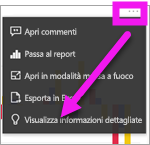

# Visualizzare informazioni dettagliate sui dati per i riquadri del dashboard con Power BI

[!INCLUDE[consumer-appliesto-yyny](../includes/consumer-appliesto-yyny.md)]

Ogni [riquadro](end-user-tiles.md) di oggetto visivo nel dashboard è una porta di accesso per l'esplorazione dei dati. Quando si seleziona un riquadro, viene aperto un report o [viene aperto Domande e risposte](end-user-q-and-a.md) in cui è possibile filtrare e ordinare il set di dati del report oppure esaminare i dati in maggiore dettaglio. E quando si eseguono informazioni dettagliate, Power BI esegue automaticamente l'esplorazione dei dati.

Usare la funzionalità Informazioni dettagliate per generare oggetti interattivi interessanti basati sui dati. Le informazioni dettagliate possono essere eseguite su un riquadro del dashboard specifico ed è anche possibile eseguire informazioni dettagliate su altre informazioni dettagliate.

La funzionalità Informazioni dettagliate si basa su un [set di algoritmi analitici avanzati](end-user-insight-types.md) sviluppati in collaborazione con Microsoft Research, che consentono a più utenti di trovare informazioni dettagliate nei propri dati in modi nuovi e intuitivi.

## Eseguire informazioni dettagliate su un riquadro del dashboard
Quando si eseguono informazioni dettagliate su un riquadro del dashboard, Power BI cerca solo i dati usati per creare tale riquadro specifico. 

1. [Aprire un dashboard](end-user-dashboards.md).
2. Passare il mouse su un riquadro. Selezionare **Altre opzioni** (...) e scegliere **Visualizza informazioni dettagliate**. 

    

3. Il riquadro verrà aperto in [modalità messa a fuoco](end-user-focus.md) con le schede delle informazioni dettagliate visualizzate sul lato destro.    
   
        
4. Se un approfondimento attira l’interesse, selezionare la scheda di informazioni dettagliate per un approfondimento. Le informazioni dettagliate selezionate vengono visualizzate a sinistra, mentre le nuove schede di informazioni, basate esclusivamente sui dati presenti in tali informazioni dettagliate specifiche, vengono visualizzate a destra.    

 ## Interagire con le schede di informazioni dettagliate
Dopo aver aperto le informazioni dettagliate, continuare l'esplorazione.

   * Filtrare l'oggetto visivo nell'area di disegno.  Per visualizzare i filtri, nell'angolo in alto a destra selezionare la freccia per espandere il riquadro Filtri.

      
   
   * Eseguire informazioni dettagliate sulla scheda delle informazioni dettagliate stessa. Questa modalità d'uso è nota anche come **informazioni dettagliate correlate**. Selezionare una scheda di informazioni dettagliate per renderla attiva. Verrà visualizzata nell'area di disegno report.
   
      
   
   * Nell'angolo superiore destro selezionare l'icona a forma di lampadina  oppure **Ottieni informazioni dettagliate**. Le informazioni dettagliate vengono visualizzate a sinistra, mentre le nuove schede, basate esclusivamente sui dati presenti in tali informazioni dettagliate specifiche, vengono visualizzate a destra.
     
     
     
Per tornare al report, nell'angolo superiore sinistro selezionare **Esci dalla modalità messa a fuoco**.

## Considerazioni e risoluzione dei problemi
- **Visualizza informazioni dettagliate** non funziona con tutti i tipi di riquadri del dashboard. Non è ad esempio disponibile per gli oggetti visivi di Power BI.<!--[Power BI visuals](end-user-custom-visuals.md)-->

## Passaggi successivi
Altre informazioni sui [tipi di informazioni rapide disponibili](end-user-insight-types.md)

