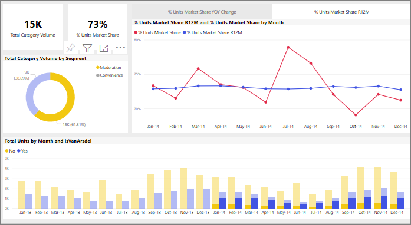

# Filtro incrociato per gli oggetti visivi in un report di Power BI
Una delle funzionalità interessanti di Power BI è il modo in cui sono interconnessi tutti gli oggetti visivi in una pagina del report. Se si seleziona un punto dati in uno degli oggetti visivi, tutti gli altri oggetti visivi nella pagina che contengono tali dati cambiano in base alla selezione. 

Per impostazione predefinita, selezionando un punto dati in una visualizzazione in una pagina del report, viene applicato un filtro incrociato o un'evidenziazione incrociata e viene eseguito il drill nelle altre visualizzazioni nella pagina. 

Questo può essere utile per identificare in che modo un valore nei dati contribuisce a un altro. Se ad esempio si seleziona il segmento Moderation nel grafico ad anello, viene evidenziato il contributo da tale segmento a ogni colonna del grafico Total units by Month e viene filtrato il grafico a linee sulla destra.

Vedere [Informazioni su filtri ed evidenziazione](../power-bi-reports-filters-and-highlighting.md). 

Il modo esatto in cui interagiscono gli oggetti visivi in una pagina viene impostato dal *progettista* del report. I progettisti hanno la possibilità di attivare e disattivare la interazioni tra gli oggetti visivi e di modificare il comportamento predefinito per filtro incrociato, evidenziazione incrociata e drill. 
  
> [!NOTE]
> I termini *filtro incrociato* ed *evidenziazione incrociata* vengono usati per distinguere il comportamento qui descritto da ciò che accade quando si usa il riquadro **Filtri** per filtrare ed evidenziare le visualizzazioni.  

## Considerazioni e risoluzione dei problemi
- Se il report ha una visualizzazione che supporta il [drill](../power-bi-visualization-drill-down.md) per impostazione predefinita, l'esecuzione del drill in una visualizzazione non ha alcun impatto sulle altre visualizzazioni nella pagina del report.     
- Se si usa visualA per interagire con visualB, i filtri a livello di oggetto visivo da visualA verranno applicati a visualB.

## Passaggi successivi
[Come usare i filtri dei report](../power-bi-how-to-report-filter.md)
