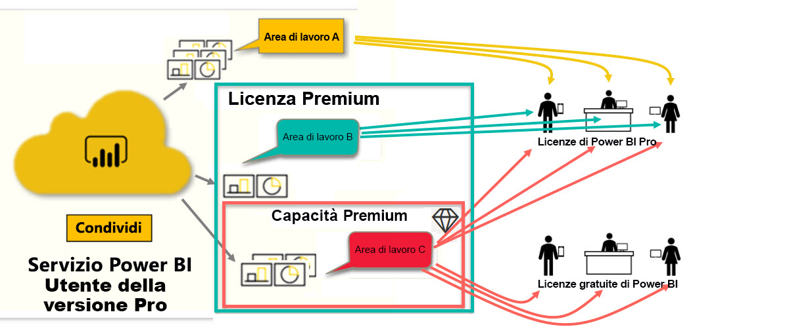

# Tipi di licenze di Power BI
In qualità di *utente finale*, è possibile usare il servizio Power BI per esplorare i report e i dashboard e prendere così decisioni consapevoli a livello aziendale. Se si usa Power BI da un po' di tempo o si è parlato con colleghi *progettisti*, si è probabilmente riscontrato che alcune funzionalità sono attive solo se si ha un determinato tipo di licenza. 

Questo articolo illustra le differenze tra i tipi di licenze e le diverse combinazioni: gratuita, Pro, Premium e con capacità Premium. Si apprende anche come determinare quale combinazione di licenze si sta usando.  

Si inizieranno a esaminare le due categorie di licenze, ovvero le licenze per utente e le licenze per organizzazione. Il punto di partenza è costituito dalle funzionalità predefinite disponibili con le licenze. Si esaminerà quindi come l'amministratore di Power BI e i proprietari del contenuto possono usare ruoli e autorizzazioni per modificare le funzionalità predefinite della licenza. 

Ad esempio, anche se la licenza lo consente, l'amministratore può limitare la possibilità di eseguire operazioni come l'esportazione dei dati, l'uso di query in linguaggio naturale per domande e risposte o la pubblicazione sul Web. Quando un *progettista* di report assegna contenuto a un'area di lavoro, può assegnare l'utente a un ruolo dell'area di lavoro. I ruoli determinano ciò che l'utente può e non può fare all'interno di tale area di lavoro. Il *progettista* può modificare ulteriormente i limiti della licenza usando le impostazioni di autorizzazione. Evidentemente lo scenario è abbastanza complesso. Questo articolo dovrebbe eliminare la maggior parte dei dubbi in merito.

## Licenze per utente
Il primo tipo di licenza è la licenza **per utente**. Ogni utente del servizio Power BI dispone di una licenza gratuita o di una licenza Pro. Alcune funzionalità sono riservate agli utenti con licenze Pro.  

- Una **licenza Power BI Pro** consente a un utente di collaborare con altri utenti Pro creando e condividendo contenuto. Solo gli utenti con licenza Pro possono pubblicare report, sottoscrivere dashboard e report e collaborare con i colleghi nelle aree di lavoro. 

    

    Power BI Pro è una licenza per singolo utente che consente agli utenti di leggere e interagire con i report e i dashboard pubblicati da altri utenti nel servizio Power BI. Gli utenti con questo tipo di licenza possono condividere il contenuto e collaborare con altri utenti di Power BI Pro. Solo gli utenti di Power BI Pro possono pubblicare o condividere contenuto con altri utenti o usare contenuto creato da altri utenti. L'eccezione è rappresentata dal contenuto ospitato nella [capacità Power BI Premium](#understanding-premium-and-premium-capacity). Le licenze Pro vengono in genere usate da *progettisti* e sviluppatori di report. Per altre informazioni, vedere [Capacità Power BI Premium](#understanding-premium-and-premium-capacity) più avanti.

- Una **licenza di Power BI autonoma gratuita**, anche se dotata di molte funzionalità, è destinata agli utenti che iniziano a usare Power BI o che creano contenuti per scopi personali. [Iscriversi al servizio Power BI come utente singolo](../service-self-service-signup-for-power-bi.md). Una licenza autonoma gratuita non è associata a una licenza dell'organizzazione. 

    Una licenza utente autonoma gratuita è la soluzione ideale per chi usa gli esempi Microsoft per apprendere Power BI. Gli utenti con licenze autonome gratuite non possono visualizzare contenuto condiviso da altri utenti o condividere il proprio contenuto con altri utenti di Power BI. 

    

Finora tutto chiaro?  OK. A questo punto si può introdurre un ulteriore livello, la **capacità Premium**.

## Informazioni sulla licenza Premium e sulla capacità Premium
La licenza Premium è destinata alle **organizzazioni**. È possibile considerarla come l'aggiunta di un livello di caratteristiche e funzionalità a tutte le licenze **per utente** di Power BI in un'organizzazione. 

Quando un'organizzazione acquista una licenza Premium, in genere l'amministratore assegna licenze Pro ai dipendenti che dovranno creare e condividere contenuto e licenze gratuite a tutti gli utenti che utilizzeranno tale contenuto. Gli utenti Pro creano [aree di lavoro](end-user-workspaces.md) e aggiungono contenuto (dashboard, report, app) a tali aree di lavoro. Per consentire ad altri utenti di collaborare in tali aree di lavoro, gli utenti Pro usano una combinazione di *capacità*, autorizzazioni e ruoli. 

Quando un'organizzazione acquista una licenza Premium, la capacità che riceve per il servizio Power BI è allocata in modo esclusivo all'organizzazione. Non è condivisa. La capacità è supportata da hardware dedicato completamente gestito da Microsoft. Le organizzazioni possono scegliere di applicare la propria capacità dedicata in modo esteso, oppure di allocarla ad aree di lavoro specifiche. Un'area di lavoro in una capacità Premium è uno spazio in cui gli utenti Pro possono condividere contenuti e collaborare con gli utenti con licenza gratuita, senza che questi debbano avere account Pro.  

Nella capacità Premium le licenze Pro sono comunque necessarie per i progettisti del contenuto. I progettisti si connettono alle origini dati, modellano i dati e creano report e dashboard che vengono offerti come app dell'area di lavoro. Gli utenti che non hanno una licenza Pro possono comunque accedere a un'area di lavoro in Power BI Premium, a condizione che il contenuto sia incluso nella *capacità* Premium e che il proprietario dell'area di lavoro conceda loro le autorizzazioni necessarie.

Nel diagramma seguente il lato sinistro rappresenta gli utenti Pro che creano e condividono contenuto nelle aree di lavoro.  
- **Workspace A** (Area di lavoro A) è stata creata in un'organizzazione che non ha una licenza Premium. 

- **Workspace B** (Area di lavoro B) è stata creata in un'organizzazione che ha una licenza Premium, anche se questa particolare area di lavoro non è stata salvata nella capacità Premium. Accanto al nome dell'area di lavoro non è presente l'icona a forma di rombo.

- **Workspace C** (Area di lavoro C) è stata creata in un'organizzazione che ha una licenza Premium ed è stata salvata nella capacità Premium. Accanto a quest'area di lavoro è visualizzata l'icona a forma di rombo.  

Il *progettista* di Power BI Pro può condividere contenuti e collaborare con altri utenti Pro usando una delle tre aree di lavoro. Questo a condizione che il progettista condivida l'area di lavoro con l'intera organizzazione o che assegni i ruoli dell'area di lavoro agli utenti Pro. 

Il *progettista* di Power BI Pro può condividere contenuti e collaborare solo con utenti della versione gratuita usando l'area di lavoro C. Per consentire agli utenti con licenza gratuita di accedere all'area di lavoro, è necessario che l'area sia assegnata alla capacità Premium. All'interno dell'area di lavoro il progettista assegna ruoli ai collaboratori: *Amministratore*, *Membro*, *Collaboratore* o *Visualizzatore*. Il ruolo determina le azioni che il collaboratore può eseguire nell'area di lavoro. In genere agli utenti *consumer* di Power BI viene assegnato il ruolo *Visualizzatore*. Per altre informazioni, vedere [Aree di lavoro per consumer di Power BI](end-user-workspaces.md).

## Individuare la licenza in uso
Esistono diversi modi per cercare le informazioni sulla licenza di Power BI in uso. 

Prima di tutto, determinare la licenza per **utente** a propria disposizione.

- Alcune versioni di Microsoft Office includono una licenza di Power BI Pro.  Per verificare se la versione di Office include Power BI, visitare il [portale di Office](https://portal.office.com/account) e selezionare **Sottoscrizioni**.

    Il primo utente (Pradtanna) dispone di Office 365 E5, che include una licenza di Power BI Pro.

    

    Il secondo utente (Zalan) dispone di una licenza di Power BI gratuita. 

    

Ora verificare se il proprio account ha anche una licenza Premium. Entrambi gli utenti precedenti (con licenza Pro o gratuita) possono appartenere a un'organizzazione con licenza Premium.  Si prenda in considerazione il secondo utente.  

- Nel servizio Power BI selezionare **Area di lavoro personale** e quindi selezionare l'icona dell'ingranaggio nell'angolo superiore destro. Scegliere **Gestisci archivio personale**.

    

    Le licenze **per utente**, Pro o gratuite, offrono 10 GB di spazio di archiviazione nel cloud, che possono essere usati per ospitare report di Power BI o cartelle di lavoro di Excel. Se sono disponibili più di 10 GB, l'utente è membro di un account aziendale che dispone di una licenza Premium.

    

    Tenere presente che nella pagina del portale di Office, l'utente Zalan disponeva di una sottoscrizione per Power BI (gratuito). Tuttavia, dato che la sua organizzazione ha acquistato una licenza Premium, nel servizio Power BI l'utente Zalan non è limitato a 10 GB di spazio di archiviazione, ma dispone di 100 GB. Come *consumer* in un'organizzazione con una licenza Premium, a condizione che il *progettista* includa l'area di lavoro nella capacità Premium, Zalan è in grado di visualizzare contenuti condivisi, collaborare con i colleghi, usare le app e altro ancora. L'estensione delle autorizzazioni disponibili viene impostata dall'amministratore di Power BI e dal progettista dei contenuti. Osservare che un utente Pro ha già condiviso un'area di lavoro con Zalan. L'icona a forma di rombo gli segnala che questa area di lavoro è archiviata nella capacità Premium. 

   
## Informazioni sui ruoli dell'area di lavoro
Fino a qui sono state esaminate le licenze per utente, le licenze Premium e la capacità Premium. Ora si esamineranno i *ruoli* dell'area di lavoro.

Dato che questo articolo è destinato ai *consumer* di Power BI, è presente lo scenario seguente:

-  L'utente ha una licenza *gratuita* e appartiene a un'organizzazione che ha una licenza Power BI Premium. 
- Un utente di Power BI Pro ha creato una raccolta di dashboard e report e l'ha pubblicata come *app* per l'intera organizzazione.  
- Le app esistono all'interno di *aree di lavoro* e l'area di lavoro è inclusa nella capacità Premium.    
- Questa area di lavoro dell'app ha un dashboard e due report.
- L'utente Pro ha assegnato all'utente con licenza gratuita il ruolo **Visualizzatore**.

### Ruolo Visualizzatore
I ruoli consentono ai *progettisti* di Power BI di gestire chi può fare cosa in un'area di lavoro, in modo da permettere la collaborazione tra i team. Uno di questi ruoli è il ruolo **Visualizzatore**. 

Quando l'area di lavoro è in una capacità Power BI Premium, gli utenti con il ruolo Visualizzatore possono accedere all'area di lavoro anche se non hanno una licenza di Power BI Pro. Ma dato che il ruolo Visualizzatore non può accedere o esportare i dati sottostanti, rappresenta un approccio sicuro per l'interazione con dashboard, report e app.

> [!TIP]
> Per informazioni sugli altri ruoli (Amministratore, Membro e Collaboratore), vedere [Creazione di una nuova area di lavoro](../service-new-workspaces.md).

