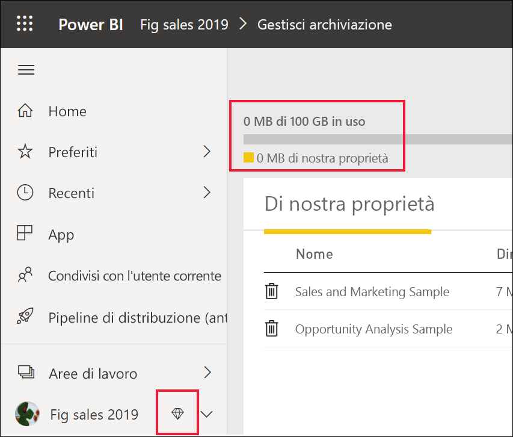

# Uso del servizio Power BI come *utente finale*

[!INCLUDE[consumer-appliesto-ynnn](../includes/consumer-appliesto-ynnn.md)]

In qualità di [*utente finale*](end-user-consumer.md), è possibile usare il servizio Power BI per esplorare i report e i dashboard e prendere così decisioni a livello aziendale basate sui dati. Se si usa Power BI da un po' di tempo o si è parlato con colleghi *progettisti*, si è probabilmente riscontrato che alcune funzionalità sono attive solo se si ha un determinato tipo di licenza, sottoscrizione o autorizzazione. 

Le operazioni che è possibile eseguire nel servizio Power BI dipendono da tre elementi:
-    tipo di licenza e sottoscrizione in uso
-    posizione di archiviazione del contenuto
-    ruoli e autorizzazioni assegnati

In questo articolo vengono descritte le capacità di ogni tipo di licenza e viene spiegato come la *posizione in cui il contenuto è archiviato* determina quali *operazioni si possono eseguire con il contenuto*. Si apprenderà anche come cercare la licenza e la sottoscrizione e come capire dove è archiviato il contenuto. Per altre informazioni su ruoli e autorizzazioni, vedere [Ruoli nelle aree di lavoro](end-user-workspaces.md).

## Licenze

Ogni utente del servizio Power BI usa una licenza *gratuita* o una licenza *Pro*. Gli *utenti finali* di Power BI in genere usano una licenza gratuita gestita dall'amministratore. 

È possibile avere più di una licenza nello stesso momento.  Il servizio offre sempre un'esperienza uguale alla migliore licenza attualmente disponibile. 

## Capacità Power BI Premium

Premium è una sottoscrizione aziendale che offre una diversa modalità di archiviazione del contenuto, ovvero la capacità dedicata. Con Premium, tutti gli utenti, all'interno o all'esterno dell'organizzazione, possono visualizzare il contenuto di Power BI senza dover acquistare licenze individuali Power BI Pro. 

Premium consente anche una distribuzione generalizzata dei contenuti da parte degli utenti Pro senza richiedere licenze Pro per la visualizzazione del contenuto da parte dei destinatari. Le licenze Pro sono necessarie per i progettisti dei contenuti. I progettisti si connettono alle origini dati, modellano i dati e creano report e dashboard che vengono offerti come app dell'area di lavoro. Gli utenti senza una licenza Pro possono comunque accedere a un'area di lavoro all'interno della capacità Power BI Premium, a condizione che abbiano il ruolo Visualizzatore.

In tali aree di lavoro i progettisti assegnano i ruoli, ad esempio **Visualizzatore**, **Collaboratore**, **Membro** e **Amministratore**, che determinano in che misura i colleghi possono interagire con il contenuto. Per altre informazioni, vedere [Autorizzazioni e ruoli nelle aree di lavoro](end-user-workspaces.md). 

Per altre informazioni sulla capacità Premium, vedere [Che cos'è Microsoft Power BI Premium?](../service-premium-what-is.md)

## Individuare le licenze in uso

Per verificare le licenze assegnate disponibili, vedere la [pagina di Microsoft **Account personale**](https://portal.office.com/account).  Selezionare la scheda **Sottoscrizioni**.

Il primo utente (Pradtanna) dispone di Office 365 E5, che include una licenza di Power BI Pro.

Il secondo utente (Zalan) dispone di una licenza di Power BI gratuita. 

## Stabilire se si ha accesso alla capacità Premium

Verificare quindi se si fa parte di un'organizzazione con capacità Premium. Uno dei due utenti precedenti, con licenza Pro o gratuita, potrebbe appartenere a un'organizzazione con capacità Premium.  Si prenda in considerazione il secondo utente.  

È possibile determinare se l'organizzazione di Zalan ha capacità Premium cercando la quantità di spazio di archiviazione disponibile. 

- Nel servizio Power BI selezionare **Area di lavoro personale** e quindi selezionare l'icona dell'ingranaggio nell'angolo superiore destro. Scegliere **Gestisci archivio personale**.

    

    Se sono disponibili più di 10 GB, l'utente è membro di un'organizzazione con una sottoscrizione Premium. L'immagine seguente mostra che l'organizzazione di Zalan ha fino a 100 GB di spazio di archiviazione.  

    

Osservare che un utente Pro ha già condiviso un'area di lavoro con Zalan. L'icona a forma di diamante indica che questa area di lavoro è archiviata nella capacità Premium. 

## Identificare il contenuto ospitato nella capacità Premium

Un altro modo per verificare se l'organizzazione ha capacità Premium consiste nel cercare app e aree di lavoro per le app con un'icona a forma di diamante. Il diamante indica che il contenuto è archiviata nella capacità Premium. 

Nell'immagine riportata di seguito tre delle app vengono archiviate nella capacità Premium.

    
Come *utente finale*, a condizione che il *progettista* includa l'area di lavoro nella capacità dedicata Premium, **in tale area di lavoro** è possibile visualizzare contenuti condivisi, collaborare con i colleghi, usare i dashboard e i report delle app e altro ancora. L'estensione delle autorizzazioni disponibili viene impostata dall'amministratore di Power BI e dal progettista dei contenuti. 

   

## Riassumendo

Quando un'organizzazione acquista una sottoscrizione Premium, l'amministratore assegna in genere licenze Pro ai dipendenti che dovranno operare nella capacità Premium, creare e condividere contenuto e licenze gratuite a tutti gli utenti che utilizzeranno tale contenuto. Gli utenti Pro creano [aree di lavoro per le app](end-user-workspaces.md) e aggiungono contenuto (dashboard, report, app) a tali aree di lavoro. Per consentire agli utenti della versione gratuita di collaborare in tali aree di lavoro, l'amministratore o l'utente Pro assegna le aree di lavoro alla *capacità dedicata*.    
 

|Tipo di licenza  |Capacità condivisa  |Capacità dedicata  |
|---------|---------|---------|
|**Free**     |  Da usare come sandbox personale, in cui creare contenuto per se stessi e interagire con tale contenuto. Questo è un ottimo modo per provare il servizio Power BI. Non è possibile utilizzare il contenuto di nessun altro né condividere il proprio contenuto con altri1     |   Interagire con il contenuto assegnato alla capacità dedicata e condivisa. Gli utenti con licenza gratuita e Pro possono collaborare senza che gli utenti con licenza gratuita debbano avere un account Pro.      |
|**Pro**     |  Collaborare con altri utenti Pro creando e condividendo contenuto.        |  Collaborare con utenti con licenza gratuita e Pro creando e condividendo il contenuto.       |

1 Vedere [Considerazioni e risoluzione dei problemi](#considerations-and-troubleshooting). 

Nel diagramma seguente il lato sinistro rappresenta gli utenti Pro che creano e condividono contenuto nelle aree di lavoro per le app. 

- L'**Area di lavoro A** è stata creata in un'organizzazione che non ha capacità Premium. 

- L'**Area di lavoro B** è stata creata in un'organizzazione con una sottoscrizione Premium ed è stata salvata nella capacità dedicata. Accanto a quest'area di lavoro è visualizzata l'icona a forma di diamante.  

    

Il *progettista* di Power BI Pro può condividere contenuti e collaborare con altri utenti Pro in una delle tre aree di lavoro. Tuttavia, l'utente di Power BI Pro può condividere contenuto e collaborare con gli utenti con licenza gratuita solo usando l'area di lavoro B, che è nella capacità dedicata Premium.  All'interno dell'area di lavoro il progettista assegna ruoli ai collaboratori. Il ruolo determina le azioni che il collaboratore può eseguire nell'area di lavoro. In genere agli utenti *consumer* di Power BI viene assegnato il ruolo *Visualizzatore*. Per altre informazioni sui ruoli, vedere [Aree di lavoro per consumer di Power BI](end-user-workspaces.md).

## Considerazioni e risoluzione dei problemi
- È possibile avere più di una licenza di Power BI. Il servizio Power BI offrirà sempre l'esperienza corrispondente alla licenza migliore attualmente disponibile. Se ad esempio sono disponibili sia una licenza Pro che una gratuita, il servizio Power BI userà la licenza Pro.

- Per condividere e creare contenuto (dashboard, report, app), non è sufficiente essere un *utente finale* di Power BI, ma è necessario essere un *progettista*. Valutare l'opportunità di passare a una licenza utente Pro. È possibile iscriversi per una singola versione di valutazione gratuita da 60 giorni di Power BI Pro selezionando la finestra di dialogo di aggiornamento visualizzata nel servizio Power BI quando si prova a usare una funzionalità Pro.

    

  Alla scadenza del periodo di valutazione di 60 giorni, si tornerà alla licenza di Power BI gratuita. In questo caso, non si avrà più accesso alle funzionalità che richiedono una licenza di Power BI Pro. Per continuare con una licenza Pro, contattare l'amministratore per informazioni sull'acquisto di una licenza Power BI Pro. Se non esiste un amministratore, vedere [la pagina dei prezzi di Power BI](https://powerbi.microsoft.com/pricing/).     

- Le licenze gratuite non scadono mai. Se quindi si esegue l'aggiornamento a una versione di valutazione Pro o se l'organizzazione fornisce una licenza Pro e la versione di valutazione termina o se l'organizzazione rimuove la licenza Pro, sarà comunque possibile eseguire il fallback alla licenza gratuita, a meno che questa non venga annullata. 

- 1 Una licenza utente gratuita per il servizio Power BI è ideale per l'esplorazione o per l'analisi e le visualizzazioni dei dati personali in **Area di lavoro personale**. Un utente con licenza gratuita non usa Power BI per collaborare con i colleghi. Gli utenti con licenze gratuite non possono visualizzare contenuto condiviso da altri utenti o condividere il proprio contenuto con altri utenti di Power BI. 

    

## Passaggi successivi
- [Caratteristiche degli *utenti finali* di Power BI](end-user-consumer.md)    
- [Informazioni sulle aree di lavoro](end-user-workspaces.md)    
- [Visualizzare le funzionalità degli utenti finali di Power BI in base al tipo di licenza](end-user-features.md)
