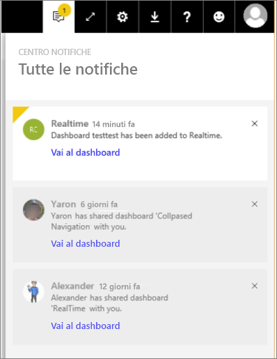

# Visualizzare le notifiche di Power BI
Il centro notifiche è un feed sequenziale di informazioni relative all'esperienza utente di Power BI. Aprirlo per visualizzare messaggi sui nuovi dashboard condivisi con l'utente, informazioni relative a eventi e riunioni di Power BI, gli avvisi impostati e altro ancora. È possibile [impostare gli avvisi nel servizio Power BI](end-user-alerts.md) e anche nelle app per dispositivi mobili di Power BI.

In questo video Amanda esamina e gestisce le notifiche e risponde a esse. Seguire quindi le istruzioni sotto il video per fare una prova in prima persona.    

> [!NOTE]
> Questo video mostra una versione precedente del servizio Power BI. 

<iframe width="560" height="315" src="https://www.youtube.com/embed/bZMSv5KAlcE" frameborder="0" allowfullscreen></iframe>

1. Quando si accede a Power BI, al feed vengono aggiunte le nuove notifiche inviate all'utente mentre era offline. Se sono presenti nuove notifiche, Power BI mostra una bolla gialla con il numero di nuovi elementi.
   
   
2. Sulla barra dei menu di Power BI selezionare l'icona **Notifiche**.
   
   
3. Le notifiche vengono visualizzate a partire dalla più recente e con i messaggi non letti evidenziati. Le notifiche vengono conservate per 90 giorni, a meno che non vengano eliminate o che non si raggiunga il limite massimo di 100.
   
   
4. Per eliminare una notifica, selezionare l'icona X.

### Passaggi successivi
* [Avvisi per i dati nel servizio Power BI](end-user-alerts.md)
* [Impostare avvisi per i dati nell'app iPhone (Power BI per iOS)](mobile/mobile-set-data-alerts-in-the-mobile-apps.md)
* [Impostare gli avvisi per i dati nell'app Power BI per dispositivi mobili per Windows 10](mobile/mobile-set-data-alerts-in-the-mobile-apps.md)
* Altre domande? [Provare la community di Power BI](http://community.powerbi.com/)

