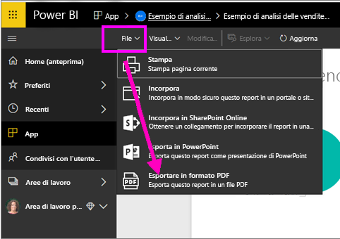
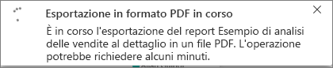
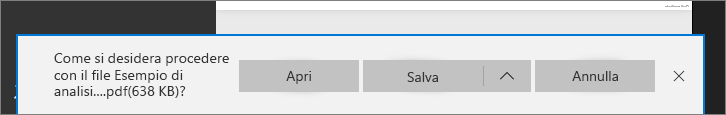

# Esportare report da Power BI in PDF
Con Power BI, è possibile pubblicare il report in formato PDF e creare facilmente un documento basato su un report di Power BI. Quando si **esporta in formato PDF** ogni pagina del report di Power BI diventa una singola pagina del documento PDF.

## Come esportare il report di Power BI in PDF
Nel servizio Power BI selezionare un report per visualizzarlo nell'area di disegno. È anche possibile selezionare un report dalla home page, da App o da qualsiasi altra sezione del riquadro di spostamento a sinistra.

1. Selezionare **File** > **Esporta in PDF** dalla barra dei menu.

    

    Verrà visualizzata una finestra popup in cui è possibile selezionare **Visualizzazione corrente** oppure **Visualizzazione predefinita**.  **Visualizzazione corrente** consente di esportare il report nello stato corrente, comprese le modifiche attive apportate ai valori del filtro dei dati e del filtro.  La maggior parte degli utenti seleziona questa opzione.  In alternativa, se si seleziona **Visualizzazione predefinita**, il report viene esportato allo stato originale, ovvero come è stato condiviso dall'autore, e non riflette le modifiche apportate a tale stato.
    
    È anche disponibile una casella di controllo per scegliere se esportare le schede nascoste di un report.  Selezionare questa casella se si vogliono esportare solo le schede del report che sono visibili all'utente nel browser.  Se si preferisce esportare tutte le schede nascoste, lasciare l'opzione deselezionata.  Se la casella di controllo è disattivata, non sono presenti schede nascoste nel report.  Dopo aver eseguito le selezioni, fare clic sul pulsante Esporta per continuare.
    
    Nell'angolo superiore destro viene visualizzato un indicatore di stato. L'esportazione del report può richiedere alcuni minuti ma consente di continuare a lavorare in Power BI.

    

    Al termine della procedura, il banner di notifica cambia, informando che il servizio Power BI ha terminato il processo di esportazione.

2. Il file sarà quindi disponibile nel percorso in cui il browser visualizza i file scaricati. Nella figura seguente, è visualizzato come banner di download nella parte inferiore della finestra del browser.

    

E questo è tutto. È possibile scaricare il file e aprirlo con qualsiasi visualizzatore PDF, ad esempio quello disponibile in Microsoft Edge.

## Limitazioni e considerazioni
Quando si lavora con la funzionalità **Esporta in PDF** è necessario tenere presenti alcune considerazioni e limitazioni.

* Gli **oggetti visivi R** non sono attualmente supportati. Nel file PDF questi oggetti visivi sono vuoti e visualizzano un messaggio di errore.  

* Gli **oggetti visivi personalizzati** che sono stati **certificati** sono supportati. Per altre informazioni sugli oggetti visivi personalizzati certificati, tra cui come certificare un oggetto visivo personalizzato, vedere [Ottenere la certificazione di un oggetto visivo personalizzato](../power-bi-custom-visuals-certified.md). Gli oggetti visivi personalizzati che non sono stati certificati non sono supportati. Nel file PDF vengono visualizzati con un messaggio di errore.   

* I report con più di 30 pagine attualmente non possono essere esportati.

* Il completamento del processo di esportazione del report in PDF può richiedere alcuni minuti. I fattori che possono influire sul tempo necessario includono la struttura del report e il carico corrente del servizio Power BI.

* Se la voce di menu **Esporta in PDF** non è disponibile nel servizio Power BI, con molta probabilità l'amministratore tenant ha disabilitato questa funzionalità. Per informazioni dettagliate, contattare l'amministratore tenant.

* Le immagini di sfondo verranno ritagliate con l'area di delimitazione del grafico. Si consiglia vivamente di rimuovere le immagini di sfondo prima dell'esportazione in PDF.

* Non è possibile pubblicare in PDF i report di proprietà di un utente esterno al dominio del tenant di Power BI, ad esempio un report il cui proprietario è esterno all'organizzazione e che è condiviso con l'utente attivo.

* Se si condivide un dashboard con un utente esterno all'organizzazione, quindi con un utente non incluso nel tenant di Power BI, tale utente non potrà esportare i report associati del dashboard condiviso in PDF. Se, ad esempio, si è aaron@contoso.com, è possibile condividere con cassie@cohowinery.com, ma cassie@cohowinery.com non può esportare i report associati in PDF.

* Il servizio Power BI usa l'impostazione di lingua di Power BI come lingua per l'esportazione in PDF. Per visualizzare o impostare la preferenza per la lingua, selezionare l'icona a forma di ingranaggio  **Impostazioni** > **Generali** > **Lingua**.

## Passaggi successivi
[Stampare un report](end-user-print.md)
