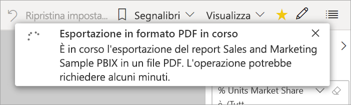

# Esportare report da Power BI in PDF

[!INCLUDE [power-bi-service-new-look-include](../includes/power-bi-service-new-look-include.md)]

Con Power BI è possibile pubblicare il report in formato PDF e creare facilmente un documento basato su un report di Power BI. Quando si esporta in formato PDF ogni pagina nel report di Power BI diventa una singola pagina nel documento PDF.

## Esportare il report di Power BI in formato PDF
Nel servizio Power BI selezionare un report per visualizzarlo nell'area di disegno. È anche possibile selezionare un report dalla pagina **Home**, da **App** o da qualsiasi altro contenitore dalla barra di spostamento a sinistra.

1. Selezionare **Esporta** > **PDF** nella barra dei menu.

    

    Viene visualizzata una finestra popup in cui è possibile selezionare **Valori correnti** oppure **Valori predefiniti**. **Valori correnti** consente di esportare il report nello stato corrente, comprese le modifiche attive apportate ai valori del filtro dei dati e del filtro. La maggior parte degli utenti seleziona questa opzione. In alternativa, se si seleziona **Valori predefiniti**, il report viene esportato nello stato originale, ovvero come è stato condiviso dal *progettista*, e non riflette le modifiche apportate a tale stato.
    
    È anche disponibile una casella di controllo per scegliere se esportare le schede nascoste di un report. Selezionare questa casella di controllo se si vogliono esportare solo le schede dei report visibili per l'utente nel browser. Se si preferisce includere tutte le schede nascoste nell'esportazione, è possibile lasciare deselezionata questa casella di controllo. Se la casella di controllo è disattivata, non sono presenti schede nascoste nel report. Dopo aver eseguito le selezioni, selezionare **Esporta** per continuare.
    
    Nell'angolo superiore destro viene visualizzato un indicatore di stato. L'esportazione potrebbe richiedere alcuni minuti. È possibile continuare a lavorare in Power BI durante l'esportazione del report.

    

    Al termine della procedura, il banner di notifica cambia, informando che il servizio Power BI ha terminato il processo di esportazione.

2. Il file sarà quindi disponibile nel percorso in cui il browser visualizza i file scaricati. Nella figura seguente, è visualizzato come banner di download nella parte inferiore della finestra del browser.

    

E questo è tutto. È possibile scaricare il file e aprirlo con qualsiasi visualizzatore PDF, ad esempio quello disponibile in Microsoft Edge.

## Limitazioni e considerazioni
Quando si usa la funzionalità **Esporta in PDF** è necessario tenere presenti alcune considerazioni e limitazioni.

* Gli oggetti visivi R non sono attualmente supportati. Nel file PDF questi oggetti visivi sono vuoti e visualizzano un messaggio di errore. 
* Gli oggetti visivi personalizzati che sono stati certificati sono supportati. Per altre informazioni sugli oggetti visivi personalizzati certificati, tra cui come certificare un oggetto visivo personalizzato, vedere [Ottenere la certificazione di un oggetto visivo personalizzato](../power-bi-custom-visuals-certified.md). Gli oggetti visivi personalizzati non certificati non sono supportati. Nel file PDF vengono visualizzati con un messaggio di errore. 
* I report con più di 30 pagine non possono attualmente essere esportati.
* Il completamento del processo di esportazione del report in PDF può richiedere alcuni minuti. I fattori che possono influire sul tempo necessario includono la struttura del report e il carico corrente del servizio Power BI.
* Se la voce di menu **Esporta in PDF** non è disponibile nel servizio Power BI, con molta probabilità l'amministratore tenant ha disabilitato questa funzionalità. Per informazioni dettagliate, contattare l'amministratore tenant.
* Le immagini di sfondo verranno ritagliate con l'area di delimitazione del grafico. Si consiglia di rimuovere le immagini di sfondo prima di eseguire l'esportazione in formato PDF.
* Non è possibile pubblicare in formato PDF i report di proprietà di un utente esterno al dominio del tenant di Power BI, ad esempio un report il cui proprietario è esterno all'organizzazione e che è condiviso con l'utente attivo.
* Se si condivide un dashboard con un utente esterno all'organizzazione, quindi con un utente non incluso nel tenant di Power BI, tale utente non potrà esportare i report associati del dashboard condiviso in formato PDF. L'utente aaron@contoso.com non può ad esempio condividere con cassie@cohowinery.com, ma cassie@cohowinery.com non può esportare i report associati in formato PDF.
* Durante l'esportazione in formato PDF con report che contengono un'immagine di sfondo, si potrebbe vedere un'immagine distorta nell'esportazione se si usa l'opzione **Normale** o **Riempimento** per **Sfondo della pagina**. Per ottenere risultati ottimali, usare l'opzione **Adatta** per evitare problemi con il documento esportato.
* Il servizio Power BI usa l'impostazione di lingua di Power BI come lingua per l'esportazione in PDF. Per visualizzare o impostare la preferenza per la lingua, selezionare l'icona a forma di ingranaggio  > **Impostazioni** > **Generale** > **Lingua**.
* I filtri URL non vengono attualmente rispettati quando si sceglie **Valori correnti** per l'esportazione.

## Passaggi successivi
[Stampare un report](end-user-print.md)
