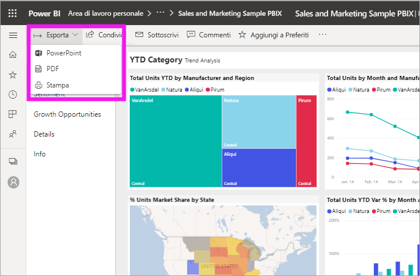
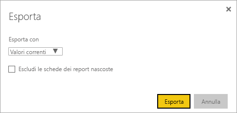
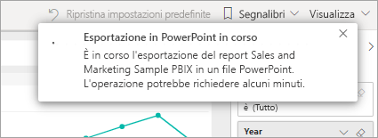

# Esportare report da Power BI in PowerPoint

[!INCLUDE[consumer-appliesto-yyny](../includes/consumer-appliesto-yyny.md)]

[!INCLUDE [power-bi-service-new-look-include](../includes/power-bi-service-new-look-include.md)]

Con Power BI è possibile pubblicare il report in Microsoft PowerPoint e creare facilmente una presentazione basata su un report di Power BI. Quando si esporta in PowerPoint, si verifica quanto segue:

* Ogni pagina nel report di Power BI diventa una singola diapositiva di PowerPoint.
* Ogni pagina nel report di Power BI viene esportata come singola immagine ad alta risoluzione in PowerPoint.
* È possibile mantenere le impostazioni di filtri e filtri dei dati aggiunte al report.
* In PowerPoint viene creato un collegamento che indirizza al report di Power BI.

Esportare il **report di Power BI** in **PowerPoint** è veloce. Seguire i passaggi descritti nella sezione successiva.

## Esportare il report di Power BI in PowerPoint
Nel **servizio Power BI** selezionare un report per visualizzarlo nel canvas. È anche possibile selezionare un report da **Home**, da **App** o da qualsiasi altro contenitore del riquadro di spostamento.

Quando il report da esportare in PowerPoint è visualizzato nell'area di disegno, selezionare **Esporta** > **PowerPoint** dalla barra dei menu.

Viene visualizzata una finestra popup in cui è possibile selezionare **Valori correnti** oppure **Valori predefiniti**. **Valori correnti** consente di esportare il report nello stato corrente, comprese le modifiche attive apportate ai valori del filtro dei dati e del filtro. La maggior parte degli utenti seleziona questa opzione. In alternativa, se si seleziona **Valori predefiniti**, il report viene esportato nello stato originale, ovvero come è stato condiviso dal *progettista*, e non riflette le eventuali modifiche apportate rispetto a tale stato.

> [!NOTE]
> L'opzione **Valori correnti** non include lo stato di scorrimento degli oggetti visivi.

 
È anche disponibile una casella di controllo per scegliere se esportare le schede nascoste di un report. Selezionare questa casella di controllo se si vogliono esportare solo le schede dei report visibili per l'utente nel browser. Se si preferisce includere tutte le schede nascoste nell'esportazione, lasciare deselezionata questa casella di controllo. Se la casella di controllo è disattivata, non sono presenti schede nascoste nel report. Un esempio di scheda nascosta è quella di descrizione comando. Le [descrizioni comando personalizzate](../desktop-tooltips.md) vengono create dai *progettisti* dei report e non vengono visualizzate come schede dei report nel servizio Power BI per gli *utenti finali*. 

Dopo aver eseguito le selezioni, selezionare **Esporta** per continuare. Nell'angolo in alto a destra della finestra del browser del servizio Power BI verrà visualizzato un banner di notifica che informa che si sta esportando il report in PowerPoint. L'esportazione potrebbe richiedere alcuni minuti. È possibile continuare a lavorare in Power BI durante l'esportazione del report.

Al termine della procedura, il banner di notifica cambia, informando che il servizio Power BI ha terminato il processo di esportazione. Il file sarà quindi disponibile nel percorso in cui il browser visualizza i file scaricati. Nella figura seguente, è visualizzato come banner di download nella parte inferiore della finestra del browser.

E questo è tutto. È possibile scaricare il file, aprirlo con PowerPoint e quindi modificarlo o migliorarlo come si farebbe con qualsiasi altra presentazione di PowerPoint.

## Controllare il file di PowerPoint esportato
Quando si apre il file di PowerPoint esportato da Power BI, si noteranno alcuni elementi interessanti e utili. Osservare l'immagine seguente, quindi osservare gli elementi numerati che descrivono alcune delle funzionalità più interessanti.

1. La prima pagina della presentazione include il nome del report, nonché un collegamento per poter **visualizzare in Power BI** il report su cui è basata.
2. Si ottengono anche alcune informazioni utili sul report. **Ultimo aggiornamento dati** Visualizza la data e l'ora dei dati su cui è basato il report esportato. **Downloaded at** (Data/ora download) indica la data e l'ora in cui il report di Power BI è stato esportato in un file di PowerPoint.
3. Ogni pagina del report è una diapositiva separata, come mostrato nel riquadro di spostamento. 
4. Il rendering del report pubblicato viene eseguito nella lingua delle impostazioni di Power BI oppure in base alle impostazioni locali del browser. Per visualizzare o impostare la preferenza per la lingua, selezionare l'icona a forma di ingranaggio  > **Impostazioni** > **Generale** > **Lingua**. Per altre informazioni, vedere [Lingue e paesi o aree geografiche supportate per Power BI](../supported-languages-countries-regions.md).

Quando si passa a una singola diapositiva, si noterà che ogni pagina del report è un'immagine indipendente.

Da questo momento in poi, le operazioni da eseguire con la presentazione di PowerPoint o con qualsiasi immagine ad alta risoluzione sono responsabilità dell'utente.

## Considerazioni e risoluzione dei problemi
Quando si lavora con la funzionalità **Esporta in PowerPoint** è necessario tenere presenti alcune considerazioni e limitazioni.

* Gli oggetti visivi R e Python non sono attualmente supportati. Tutti questi oggetti visivi vengono esportati come un'immagine vuota in PowerPoint con un messaggio di errore che informa che l'oggetto visivo non è supportato.
* Gli oggetti visivi di Power BI che sono stati certificati sono supportati. Per altre informazioni sugli oggetti visivi personalizzati certificati, tra cui come certificare un oggetto visivo personalizzato, vedere [Ottenere la certificazione di un oggetto visivo personalizzato](../developer/power-bi-custom-visuals-certified.md). Gli oggetti visivi personalizzati non certificati non sono supportati. Vengono esportati come un'immagine vuota in PowerPoint con un messaggio di errore che informa che l'oggetto visivo non è supportato.
* L'oggetto visivo ESRI non è supportato.
* I report con più di 30 pagine attualmente non possono essere esportati.
* Gli oggetti visivi con barre di scorrimento vengono esportati nello stato predefinito. L'oggetto visivo in PowerPoint mostrerà solo la parte superiore dei dati. Lo scorrimento in PowerPoint non è disponibile perché ogni diapositiva è un'immagine. 
* Il completamento del processo di esportazione del report in PowerPoint potrebbe richiedere alcuni minuti, quindi è consigliabile attendere. I fattori che possono influire sul tempo necessario includono la struttura del report e il carico corrente del servizio Power BI.
* Se la voce di menu **Esporta in PowerPoint** non è disponibile nel servizio Power BI, con molta probabilità l'amministratore tenant ha disabilitato questa funzionalità. Per informazioni dettagliate, contattare l'amministratore tenant.
* Le immagini di sfondo verranno ritagliate con l'area di delimitazione del grafico. Si consiglia di rimuovere le immagini di sfondo prima di eseguire l'esportazione in PowerPoint.
* Le pagine in PowerPoint vengono create sempre nel formato standard 9:16, a prescindere dalle dimensioni originali della pagina nel report di Power BI.
* Non è possibile pubblicare in PowerPoint i report di proprietà di un utente esterno al dominio del tenant di Power BI, ad esempio un report di proprietà di un utente esterno all'organizzazione e condiviso con l'utente attivo.
* Se si condivide un dashboard con un utente esterno all'organizzazione, ovvero quindi con un utente non incluso nel tenant di Power BI, tale utente non può esportare i report associati del dashboard condiviso in PowerPoint. L'utente aaron@contoso.com non può ad esempio condividere con david@cohowinery.com, ma david@cohowinery.com non può esportare i report associati in PowerPoint.
* L'esportazione potrebbe non funzionare con le versioni precedenti di PowerPoint.
* Come indicato in precedenza, ogni pagina del report viene esportata come singola immagine nel file di PowerPoint.
* Il servizio Power BI usa l'impostazione di lingua di Power BI come lingua per l'esportazione in PowerPoint. Per visualizzare o impostare la preferenza per la lingua, selezionare l'icona a forma di ingranaggio  > **Impostazioni** > **Generale** > **Lingua**.
* L'orario **scaricato alle** indicato sulla diapositiva di copertina per il file di PowerPoint esportato è impostata sul fuso orario del computer al momento dell'esportazione.
* Quando si esegue l'esportazione in un file con estensione pptx, nei report che usano temi con tipi di carattere personalizzati il tipo di carattere personalizzato viene sostituito con un tipo di carattere predefinito.
* I filtri URL non vengono attualmente rispettati quando si sceglie **Valori correnti** per l'esportazione.

## Passaggi successivi
[Stampare un report](end-user-print.md)
