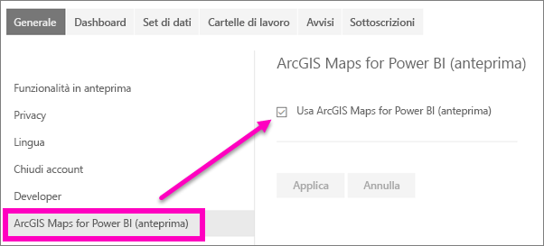

# Acconsentire esplicitamente alle funzionalità di anteprima del servizio Power BI
## Cosa sono le *funzionalità di anteprima*?
Nell'ottica dei continui miglioramenti del servizio Power BI saranno rilasciate alcune nuove *funzionalità di anteprima*, che è possibile attivare e disattivare, permettendo così agli utenti anche solo di provarle.

> [!TIP]
> Le funzionalità di anteprima sono disponibili anche per Power BI Desktop. Per altre informazioni, [visitare il forum della community di Power BI Desktop](https://community.powerbi.com/t5/Desktop/bd-p/power-bi-designer).
> 
> 

## Trovare anteprime e attivarle o disattivarle
1. Aprire il menu Impostazioni selezionando l'icona dell'ingranaggio nell'angolo in alto a destra dello schermo e scegliendo **Impostazioni**.
   
   .
2. Selezionare la scheda **Generale**. Se sono disponibili anteprime, verrà visualizzata un'opzione per **Funzionalità in anteprima** oppure una funzionalità in anteprima sarà inclusa nell'elenco a sinistra.  In questo esempio l'elenco include un'anteprima per ArcGIS Maps. 
   
   
3. Selezionare il pulsante di opzione **Sì** o selezionare la casella di controllo per provare la nuova esperienza. Selezionare quindi **Applica**.
4. Per disattivare le funzionalità in anteprima, seguire i passaggi da 1 a 3 e nel passaggio 3 scegliere **No** o deselezionare la casella di controllo, quindi selezionare **Applica**.

Domande o commenti? [Visitare il forum della community di Power BI](http://community.powerbi.com/t5/Navigation-Preview-Forum/bd-p/NavigationPreview).

