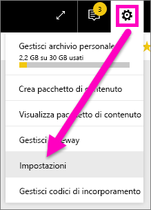
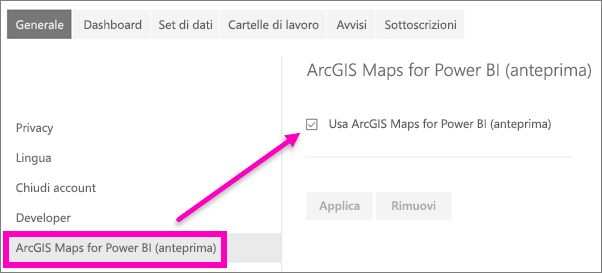

# Acconsentire esplicitamente alle funzionalità di anteprima del servizio Power BI
## Cosa sono le *funzionalità di anteprima*?
Nell'ottica dei continui miglioramenti del servizio Power BI saranno rilasciate alcune nuove *funzionalità di anteprima*, che è possibile attivare e disattivare, permettendo così agli utenti anche solo di provarle.

Alcune funzionalità di anteprima possono essere attivate e disattivate dal dashboard di Power BI, dalla home page o dal report stesso.

   

Altre funzionalità di anteprima vengono invece rese disponibili nel menu *Impostazioni*. Questo articolo illustra come accedere alle funzionalità di anteprima tramite il menu Impostazioni.

## Trovare anteprime e attivarle o disattivarle
1. Aprire il menu Impostazioni selezionando l'icona dell'ingranaggio nell'angolo in alto a destra della schermata di Power BI e scegliendo **Impostazioni**.
   
   .
2. Selezionare la scheda **Generale**. Se sono disponibili anteprime, verrà visualizzata un'opzione per **Funzionalità in anteprima** oppure una funzionalità in anteprima sarà inclusa nell'elenco a sinistra.  In questo esempio l'elenco include un'anteprima per ArcGIS Maps. 
   
   
3. Selezionare il pulsante di opzione **Sì** o selezionare la casella di controllo per provare la nuova esperienza. Selezionare **Applica**.
4. Per disattivare le funzionalità di anteprima, seguire i passaggi da 1 a 3 e nel passaggio 3 scegliere **No** o deselezionare la casella di controllo, quindi selezionare **Applica**.

Altre domande, commenti o suggerimenti? [Visitare il forum della community di Power BI](https://community.powerbi.com/t5/Navigation-Preview-Forum/bd-p/NavigationPreview).

