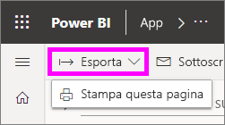
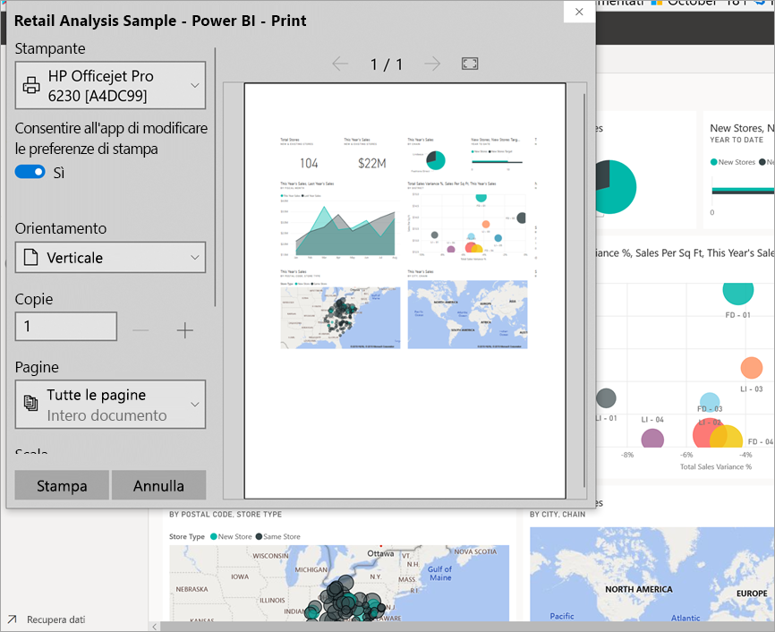
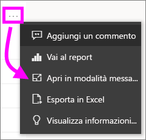
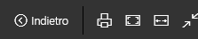
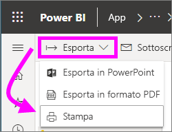

# Stampa dal servizio Power BI

[!INCLUDE[consumer-appliesto-yynn](../includes/consumer-appliesto-yynn.md)]
## Elementi stampabili
[!INCLUDE [power-bi-service-new-look-include](../includes/power-bi-service-new-look-include.md)]

È possibile stampare un intero dashboard, un riquadro del dashboard, una pagina del report o un oggetto visivo del report dal servizio Power BI. Se il report contiene più pagine, è necessario stampare ogni pagina separatamente. 

## Considerazioni sulla stampa

I dashboard e i report di Power BI vengono creati dai *progettisti* di report per lo più per essere usati online e avere un aspetto straordinario su una varietà di dispositivi. Quando si stampa un report, è il browser che controlla il modo in cui il contenuto appare sulla carta. 

Sono disponibili alcune impostazioni del browser da usare per modificare la stampa, ma non garantiscono che si ottenga il risultato desiderato. È consigliabile [esportare il contenuto in un file PDF](end-user-pdf.md) e quindi stampare il PDF. 

## Modificare le impostazioni di stampa del browser
Quando si avvia la stampa da Power BI, il browser apre la finestra Stampa. La finestra di stampa è diversa da un browser all'altro, ma ognuna offre opzioni simili da usare per controllare l'aspetto della stampa. 

Ecco alcuni suggerimenti rapidi per la formattazione della stampa.

   > 
1. Se la larghezza del dashboard, del report o dell'oggetto visivo è superiore all'altezza, è consigliabile usare il layout **Orizzontale**. 

   

2. Per includere più contenuto in una pagina stampata, regolare impostazioni come i margini e la scala. 

    

Provare le varie impostazioni del browser in uso fino a ottenere l'aspetto desiderato. Alcuni browser offrono anche opzioni per stampare la grafica di sfondo. 

## Stampare un dashboard
1. Aprire il dashboard che si vuole stampare.
2. Nell'angolo in alto a sinistra selezionare Esporta e scegliere **Stampa questa pagina**.
   
    

3. Viene visualizzata la finestra di stampa del browser in uso. Scegliere le impostazioni. Ad esempio, se la larghezza del dashboard è superiore alla lunghezza, è consigliabile impostare il layout su **Orizzontale**. Selezionare **Stampa**.
   
    

## Stampare un riquadro del dashboard
1. Per aprire il dashboard nella [modalità schermo intero](end-user-focus.md), selezionare l'icona di tale modalità  nella barra dei menu superiore.

3. [Aprire il riquadro in modalità messa a fuoco](end-user-focus.md) passando il puntatore per visualizzare **Altre opzioni (...)** e scegliendo **Apri in modalità messa a fuoco** o l'icona della modalità messa a fuoco .
   
    

4. Passare il puntatore sul riquadro per visualizzare il menu delle opzioni.
   
    

4. Selezionare l'icona di stampa. .     

5. Viene visualizzata la finestra di stampa del browser in uso. Scegliere le impostazioni. Ad esempio, se il riquadro supera i limiti della pagina, è possibile ridurre la scala al 75%. Selezionare **Stampa**.

     

> [!TIP]
> Se sono stati seguiti tutti questi passaggi ma il riquadro non ha ancora l'aspetto desiderato, provare con le operazioni seguenti.
> 1. Aprire la finestra Stampa e apportare le modifiche alle impostazioni di stampa che si ritiene produrranno il risultato di stampa migliore. Ad esempio, modificare il layout, i margini e la scala. 
> 2. Invece di stampare, selezionare **Annulla**. 
> 3. Ripetere i passaggi da 1 a 5. Il riquadro verrà modificato in base alle nuove impostazioni della finestra Stampa e sarà pronto per la stampa.

## Stampare una pagina del report
I report possono essere stampati una pagina alla volta.

1. Aprire il report e selezionare **Esporta** > **Stampa** per stampare la pagina del report corrente.
   
    
2. Viene visualizzata la finestra di stampa del browser in uso.

3. Seguire la procedura di stampa descritta nella precedente sezione **Stampare un dashboard**.
   

## Stampare un oggetto visivo del report
1. Per [aprire l'oggetto visivo nella modalità messa a fuoco](end-user-focus.md), passare con il puntatore del mouse sul riquadro e selezionare l'icona di tale modalità  nell'angolo in alto a destra.

2. Nell'angolo in alto a sinistra selezionare **Esporta** > **Stampa** per stampare l'oggetto visivo.

    

3. Seguire la procedura di stampa descritta nella precedente sezione **Stampare un dashboard**.

## Considerazioni e risoluzione dei problemi

* D: non è possibile stampare tutte le pagine del report contemporaneamente.    
* A: è normale. Le pagine dei report possono essere stampate solo una alla volta.
* D: non è possibile a stampare in formato PDF.    
* A: questa opzione viene visualizzata solo se il driver PDF è già stato configurato nel browser.    
* D: quando si seleziona **Stampa**, la visualizzazione non corrisponde a quanto mostrato in questo articolo.    
* A: le schermate di stampa variano a seconda del browser e della versione del software.
* D: l'immagine stampata non è ridimensionata correttamente.  Il dashboard non si rientra nella pagina. Altre domande su ridimensionamento e orientamento.    
* A: non è possibile garantire che la copia stampata sarà esattamente identica a come appare nel servizio Power BI. Elementi come il ridimensionamento, i margini, le informazioni visive, l'orientamento e le dimensioni non sono controllati da Power BI. Provare a modificare le impostazioni di stampa del browser. Alcune delle impostazioni suggerite in precedenza sono l'orientamento della pagina (verticale o orizzontale), le dimensioni dei margini e la scala. Se il problema persiste, consultare la documentazione relativa al browser in uso.      
* D: in modalità schermo intero, l'opzione di stampa non viene visualizzata quando si passa il mouse sull'oggetto visivo.   
* A: tornare al dashboard o al report nella visualizzazione predefinita e riaprire l'oggetto visivo in modalità messa a fuoco e quindi in modalità schermo intero. 

## Passaggi successivi
[Condividere dashboard e report con i colleghi e altri utenti](../collaborate-share/service-share-dashboards.md)

Altre domande? [Provare la community di Power BI](https://community.powerbi.com/)
