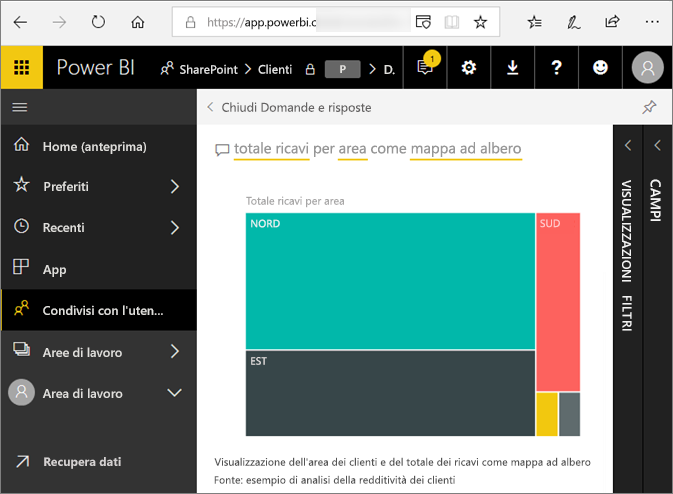
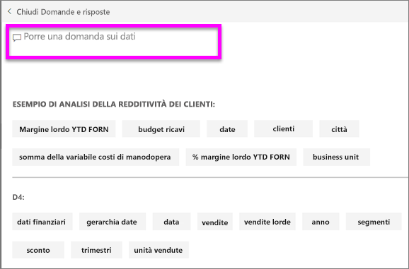
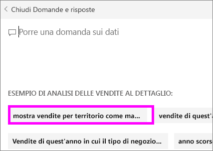

# Domande e risposte per i **consumer** di Power BI
## Che cosa sono le domande e risposte?
A volte il modo più rapido per ottenere una risposta dai dati consiste nel porre una domanda usando il linguaggio naturale. ad esempio "a quanto ammontano le vendite totali dello scorso anno".

Domande e risposte consente di esplorare i dati tramite funzionalità intuitive basate sul linguaggio naturale e di ricevere le risposte sotto forma di grafici. Domande e risposte è diverso da un motore di ricerca in quanto consente di ottenere risultati relativi solo ai dati in Power BI.

**Domande e risposte di Power BI** supporta solo le risposte alle query in linguaggio naturale espresse in inglese. È disponibile un'anteprima per lo spagnolo che può essere abilitata dall'amministratore di Power BI.

**Domande e risposte di Power BI** è disponibile con una licenza Pro o Premium. 
>

Porre la domanda è solo l'inizio.  È possibile spostarsi tra i dati perfezionando o espandendo la domanda, scoprendo nuove informazioni preziose e usando le caratteristiche di zoom avanti o indietro per visualizzare rispettivamente i dettagli o una vista più ampia. Le informazioni approfondite che si possono individuare sono di qualità eccezionale.

L'esperienza è completamente interattiva... e veloce. Basata su un sistema di archiviazione in memoria, la risposta è quasi istantanea.

## Dove è possibile usare Domande e risposte?
Troverai risposte nei dashboard e report nel servizio Power BI e nella parte inferiore del dashboard in Power BI per dispositivi mobili. Se il designer non concede all'utente le autorizzazioni di modifica, è possibile usare Domande e risposte per esplorare i dati, ma non sarà possibile salvare le visualizzazioni create con Domande e risposte.

## Come fa Domande e rispondere alle domande?
Domande e risposte cerca le risposte in tutti i set di dati associati al dashboard. Se un riquadro del set di dati è presente nel dashboard, Domande e risposte cerca le risposte nel set di dati. 

## Come iniziare?
Prima di tutto è importante acquisire familiarità con il contenuto. Esaminare le visualizzazioni nel dashboard e nel report. Farsi un'idea del tipo e della gamma di dati disponibili per l'utente. Quindi tornare al dashboard e posizionare il cursore nella casella delle domande. Viene aperta la schermata Domande e risposte.

 

* Se le etichette degli assi e i valori delle visualizzazioni includono "vendite", "account", "mese" e "opportunità", è possibile porre tranquillamente domande come questa: "Quale *account* ha la massima *opportunità*" oppure "Mostra le *vendite* per mese come grafico a barre".

* Se si hanno dati relativi alle prestazioni del sito Web in Google Analytics, è possibile chiedere a Domande e risposte di indicare il tempo trascorso su una pagina Web, il numero di visite singole in una pagina e i tassi di coinvolgimento degli utenti. Se invece si cercano dati demografici, è possibile porre domande sull'età e sul reddito familiare per luogo.

Nella parte inferiore della schermata vengono visualizzati altri elementi utili. Per ogni set di dati, Domande e risposte mostra le parole chiave e talvolta anche alcuni esempi o suggerimenti per le domande. Selezionare uno di questi elementi per aggiungerlo alla casella della domanda. 

Domande e risposte aiuta a porre le domande anche mediante richieste di conferma, elementi di completamento automatico e suggerimenti visivi. 

 

### Quali visualizzazioni usa Domande e risposte?
Domande e risposte sceglie la visualizzazione ottimale in base ai dati da visualizzare. Talvolta per i dati nei set di dati sottostanti sono specificati il tipo o la categoria e questo aiuta Domande e risposte a decidere come visualizzarli. Se ad esempio i dati sono definiti come tipo data, è più probabile che vengano visualizzati come grafico a linee. Per i dati classificati come città è invece più probabile che venga usata la visualizzazione mappa.

È anche possibile specificare quale visualizzazione si vuole usare aggiungendola alla domanda. Tenere comunque presente che non sempre Domande e risposte è in grado di visualizzare i dati usando il tipo di visualizzazione richiesto. Domande e risposte fornisce un elenco di tipi di visualizzazione utilizzabili.

## Considerazioni e risoluzione dei problemi
**Domanda**: Domande e risposte non viene visualizzato nel dashboard corrente.    
**Risposta 1**: se non viene visualizzata una casella della domanda, prima di tutto verificare le impostazioni. Per fare ciò selezionare l'icona della ruota dentata in alto a destra nella barra degli strumenti di Power BI.   

Quindi scegliere **Impostazioni** > **Dashboard**. Verificare che sia presente un segno di spunta accanto a **Visualizza la casella di ricerca di Domande e risposte in questo dashboard**.    
  

**Risposta 2**: in alcuni casi il *designer* del dashboard o l'amministratore disattiva Domande e risposte. Contattarli per vedere se è possibile riattivare la funzionalità.   

**Domanda**: quando si digita una domanda, non si ottengono i risultati desiderati.    
**Risposta**: rivolgersi al *designer* del dashboard. Il designer può adottare varie misure per migliorare i risultati di Domande e risposte. Ad esempio, il designer può rinominare le colonne del set di dati usando termini di facile comprensione (`CustomerFirstName` invece di `CustFN`). Poiché conosce particolarmente bene il set di dati, il designer può anche ideare domande utili e aggiungerle al canvas di Domande e risposte.

## Passaggi successivi

