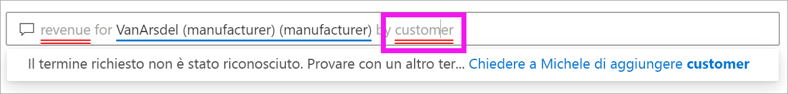

# Domande e risposte per i **consumer** di Power BI

[!INCLUDE [power-bi-service-new-look-include](../includes/power-bi-service-new-look-include.md)]

## Che cosa sono le domande e risposte?
A volte il modo più rapido per ottenere una risposta dai dati consiste nel porre una domanda usando il linguaggio naturale. ad esempio "a quanto ammontano le vendite totali dello scorso anno".

Domande e risposte consente di esplorare i dati tramite funzionalità intuitive basate sul linguaggio naturale e di ricevere le risposte sotto forma di grafici. Domande e risposte è diverso da un motore di ricerca in quanto consente di ottenere risultati relativi solo ai dati in Power BI.

## Quali visualizzazioni usa Domande e risposte?
Domande e risposte sceglie la visualizzazione ottimale in base ai dati da visualizzare. Talvolta per i dati nel set di dati sottostante sono specificati il tipo o la categoria e questo aiuta Domande e risposte a decidere come visualizzarli. Se ad esempio i dati sono definiti come tipo data, è più probabile che vengano visualizzati come grafico a linee. Per i dati classificati come città è invece più probabile che venga usata la visualizzazione mappa.

È anche possibile specificare quale oggetto visivo si vuole usare aggiungendolo alla domanda. Tenere comunque presente che non sempre Domande e risposte è in grado di visualizzare i dati usando il tipo di oggetto visivo richiesto. Domande e risposte fornisce un elenco di tipi di oggetti visivi utilizzabili.

## Dove è possibile usare Domande e risposte?
Domande e risposte è disponibile nei dashboard del servizio Power BI e nella parte inferiore del dashboard in Power BI per dispositivi mobili. Se il designer non concede all'utente le autorizzazioni di modifica, è possibile usare Domande e risposte per esplorare i dati, ma non sarà possibile salvare le visualizzazioni create con Domande e risposte.

È anche possibile trovare Domande e risposte nei report, se il *designer* del report ha aggiunto un [oggetto visivo Domande e risposte](../visuals/power-bi-visualization-q-and-a.md).   

## Domande e risposte nei dashboard

**Domande e risposte di Power BI** è disponibile con una licenza Pro o Premium.  Gli argomenti relativi a [Domande e risposte nelle app Power BI per dispositivi mobili](mobile/mobile-apps-ios-qna.md) e [Domande e risposte con Power BI Embedded](../developer/qanda.md) vengono illustrati in articoli separati. Attualmente, **Domande e risposte di Power BI** supporta solo le risposte alle query in linguaggio naturale espresse in inglese, anche se è disponibile un'anteprima per lo spagnolo che può essere abilitata dall'amministratore di Power BI.

Porre la domanda è solo l'inizio.  È possibile spostarsi tra i dati perfezionando o espandendo la domanda, scoprendo nuove informazioni preziose e usando le caratteristiche di zoom avanti o indietro per visualizzare rispettivamente i dettagli o una vista più ampia. Le informazioni approfondite che si possono individuare sono di qualità eccezionale.

L'esperienza è completamente interattiva... e veloce. Basata su un sistema di archiviazione in memoria, la risposta è quasi istantanea.

## Usare Domande e risposte in un dashboard nel servizio Power BI
Nel servizio Power BI (app.powerbi.com) un dashboard contiene riquadri aggiunti da uno o più set di dati ed è quindi possibile porre domande su tutti i dati inclusi in questi set di dati. Per visualizzare i report e i set di dati usati per creare il dashboard, selezionare **Visualizza elementi correlati** dall'elenco a discesa **Altre azioni**.

## Come iniziare?
Prima di tutto è importante acquisire familiarità con il contenuto. Esaminare gli oggetti visivi nel dashboard e nel report. Farsi un'idea del tipo e della gamma di dati disponibili per l'utente. 

ad esempio:

* Se le etichette dell'asse e i valori di un oggetto visivo includono "vendite", "account", "mese" e "opportunità", è possibile porre tranquillamente domande come questa: "Quale *account* ha la massima *opportunità*" oppure "Mostra le *vendite* per mese come grafico a barre".

* Se si hanno dati relativi alle prestazioni del sito Web in Google Analytics, è possibile chiedere a Domande e risposte di indicare il tempo trascorso su una pagina Web, il numero di visite singole in una pagina e i tassi di coinvolgimento degli utenti. Se invece si cercano dati demografici, è possibile porre domande sull'età e sul reddito familiare per luogo.

Una volta acquisita familiarità con i dati, tornare al dashboard e posizionare il cursore nella casella delle domande. Viene aperta la schermata Domande e risposte.

 

Ancora prima di iniziare a digitare, Domande e risposte mostra una nuova schermata con suggerimenti utili a formulare la domanda. Verranno visualizzate frasi e domande contenenti i nomi delle tabelle nei set di dati sottostanti e, in alcuni casi, domande *in primo piano* create dal proprietario del set di dati.

È possibile selezionarne una qualsiasi per aggiungerla alla casella delle domande e perfezionarla per trovare una risposta specifica. 

Domande e risposte aiuta a porre le domande anche tramite richieste di conferma, elementi di completamento automatico e suggerimenti visivi. 

<!--  -->

## Oggetto visivo Domande e risposte

L'oggetto visivo Domande e risposte consente di porre domande in linguaggio naturale e ottenere risposte sotto forma di oggetti visivi. L'oggetto visivo Domande e risposte si comporta come qualsiasi altro oggetto visivo, può essere filtrato o evidenziato in modo incrociato e inoltre supporta segnalibri e commenti. 

Un oggetto visivo Domande e risposte è identificabile in base alla casella delle domande visualizzata nella parte superiore, in cui è possibile immettere domande usando il linguaggio naturale. L'oggetto visivo Domande e risposte può essere usato più volte per porre domande sui dati. Quando si esce dal report, viene reimpostato l'oggetto visivo Domande e risposte predefinito. 

## Usare l'oggetto visivo Domande e risposte
Per usare l'oggetto visivo Domande e risposte, selezionare una delle domande suggerite o digitare una propria domanda in linguaggio naturale. 

### Creare un oggetto visivo Domande e risposte usando una domanda suggerita

In questo esempio è stato selezionato **top geo states by total units**. Power BI seleziona automaticamente il tipo di oggetto visivo migliore da usare. In questo caso viene selezionata una mappa.

È anche possibile indicare a Power BI il tipo di oggetto visivo da usare aggiungendolo alla query in linguaggio naturale. Tenere presente che non tutti i tipi di oggetti visivi funzioneranno o avranno senso con i dati in uso. Questi dati, ad esempio, non producono un grafico a dispersione particolarmente utile, ma risultano più significativi sotto forma di mappa colorata.

### Creare un oggetto visivo Domande e risposte digitando una query in linguaggio naturale

Se non si è certi del tipo di domande da porre o della terminologia da usare, espandere **Mostra tutti i suggerimenti** o esaminare gli altri oggetti visivi nel report. In questo modo si acquisirà familiarità con i termini e il contenuto del set di dati.

1. Digitare la domanda nel campo di Domande e risposte usando il linguaggio naturale. Quando si digita una domanda, Power BI offre funzionalità di completamento automatico, suggerimenti e feedback.

    - Per le parole che Power BI non è in grado di riconoscere viene usata la sottolineatura rossa. Quando possibile, Power BI aiuta a definire queste parole. Se viene visualizzata la definizione corretta, selezionarla dall'elenco a discesa.  

        

    - Se nessuna delle definizioni è corretta, provare con un altro termine oppure selezionare la parola sottolineata in rosso per chiedere al proprietario del report di aggiungere la parola.

        

    - Mentre si va avanti a digitare, Power BI informa che non è in grado di comprendere la domanda e tenta di aiutare l'utente. Nell'esempio riportato di seguito Power BI chiede "Si intendeva..." e suggerisce un modo diverso per formulare una domanda usando la terminologia del set di dati. 

        

2. Dopo la selezione della correzione di Power BI, i risultati vengono visualizzati come grafico a linee. 

    

3. È tuttavia possibile modificare il grafico a linee in un altro tipo di oggetto visivo.  

    

## Considerazioni e risoluzione dei problemi

**Domanda**: Domande e risposte non viene visualizzato nel dashboard corrente.    
**Risposta 1**: se non viene visualizzata una casella della domanda, prima di tutto verificare le impostazioni. Per fare ciò selezionare l'icona della ruota dentata in alto a destra nella barra degli strumenti di Power BI.   

Quindi scegliere **Impostazioni** > **Dashboard**. Verificare che sia presente un segno di spunta accanto a **Visualizza la casella di ricerca di Domande e risposte in questo dashboard**.    
  

**Risposta 2**: in alcuni casi non è possibile accedere alle impostazioni. Se l'amministratore o il *designer* del dashboard ha disattivato Domande e risposte, contattarli per vedere se è possibile riattivare questa funzionalità.   

**Domanda**: quando si digita una domanda, non si ottengono i risultati desiderati.    
**Risposta**: selezionare l'opzione per contattare il proprietario del report o del dashboard. È possibile eseguire questa operazione direttamente dalla pagina del dashboard di Domande e risposte o dall'oggetto visivo Domande e risposte. In alternativa, è possibile cercare il proprietario dall'intestazione di Power BI.  Il designer può adottare varie misure per migliorare i risultati di Domande e risposte. Ad esempio, il designer può rinominare le colonne del set di dati usando termini di facile comprensione (`CustomerFirstName` invece di `CustFN`). Poiché conosce particolarmente bene il set di dati, il designer può anche ideare domande utili e aggiungerle alle domande suggerite di Domande e risposte.

## Passaggi successivi
Per informazioni sul modo in cui un oggetto visivo Domande e risposte viene creato e gestito da un *designer* di report, vedere [Tipo di oggetto visivo Domande e risposte](../visuals/power-bi-visualization-q-and-a.md).
