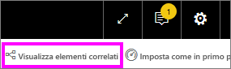

# Domande e risposte per i **consumer** di Power BI
## Che cosa sono le domande e risposte?
A volte il modo più rapido per ottenere una risposta dai dati consiste nel porre una domanda usando il linguaggio naturale. ad esempio "a quanto ammontano le vendite totali dello scorso anno".

Domande e risposte consente di esplorare i dati tramite funzionalità intuitive basate sul linguaggio naturale e di ricevere le risposte sotto forma di grafici. Domande e risposte è diverso da un motore di ricerca in quanto consente di ottenere risultati relativi solo ai dati in Power BI.

**Domande e risposte di Power BI** è disponibile con una licenza Pro o Premium.  Gli argomenti relativi a [Domande e risposte nelle app Power BI per dispositivi mobili](mobile/mobile-apps-ios-qna.md) e [Domande e risposte con Power BI Embedded](../developer/qanda.md) vengono illustrati in articoli separati. Attualmente, **Domande e risposte di Power BI** supporta solo le risposte alle query in linguaggio naturale espresse in inglese, anche se è disponibile un'anteprima per lo spagnolo che può essere abilitata dall'amministratore di Power BI.

Porre la domanda è solo l'inizio.  È possibile spostarsi tra i dati perfezionando o espandendo la domanda, scoprendo nuove informazioni preziose e usando le caratteristiche di zoom avanti o indietro per visualizzare rispettivamente i dettagli o una vista più ampia. Le informazioni approfondite che si possono individuare sono di qualità eccezionale.

L'esperienza è completamente interattiva... e veloce. Basata su un sistema di archiviazione in memoria, la risposta è quasi istantanea.

## Dove è possibile usare Domande e risposte?
Domande e risposte è disponibile nei dashboard del servizio Power BI e nella parte inferiore del dashboard in Power BI per dispositivi mobili. Se il designer non concede all'utente le autorizzazioni di modifica, è possibile usare Domande e risposte per esplorare i dati, ma non sarà possibile salvare le visualizzazioni create con Domande e risposte.

## Usare Domande e risposte in un dashboard nel servizio Power BI
Nel servizio Power BI (app.powerbi.com) un dashboard contiene riquadri aggiunti da uno o più set di dati ed è quindi possibile porre domande su tutti i dati inclusi in questi set di dati. Per visualizzare i report e i set di dati usati per creare il dashboard, selezionare **Visualizza elementi correlati** dalla barra dei menu.

## Come iniziare?
Prima di tutto è importante acquisire familiarità con il contenuto. Esaminare gli oggetti visivi nel dashboard e nel report. Farsi un'idea del tipo e della gamma di dati disponibili per l'utente. 

ad esempio:

* Se le etichette dell'asse e i valori di un oggetto visivo includono "vendite", "account", "mese" e "opportunità", è possibile porre tranquillamente domande come questa: "Quale *account* ha la massima *opportunità*" oppure "Mostra le *vendite* per mese come grafico a barre".

* Se si hanno dati relativi alle prestazioni del sito Web in Google Analytics, è possibile chiedere a Domande e risposte di indicare il tempo trascorso su una pagina Web, il numero di visite singole in una pagina e i tassi di coinvolgimento degli utenti. Se invece si cercano dati demografici, è possibile porre domande sull'età e sul reddito familiare per luogo.

Una volta acquisita familiarità con i dati, tornare al dashboard e posizionare il cursore nella casella delle domande. Viene aperta la schermata Domande e risposte.

 

Ancora prima di iniziare a digitare, Domande e risposte mostra una nuova schermata con suggerimenti utili a formulare la domanda. Verranno visualizzate frasi e domande contenenti i nomi delle tabelle nei set di dati sottostanti e, in alcuni casi, domande *in primo piano** create dal proprietario del set di dati.

È possibile selezionarne una qualsiasi per aggiungerla alla casella delle domande e perfezionarla per trovare una risposta specifica. 

Domande e risposte aiuta a porre le domande anche mediante richieste di conferma, elementi di completamento automatico e suggerimenti visivi. 

 

### Quali visualizzazioni usa Domande e risposte?
Domande e risposte sceglie la visualizzazione ottimale in base ai dati da visualizzare. Talvolta per i dati nei set di dati sottostanti sono specificati il tipo o la categoria e questo aiuta Domande e risposte a decidere come visualizzarli. Se ad esempio i dati sono definiti come tipo data, è più probabile che vengano visualizzati come grafico a linee. Per i dati classificati come città è invece più probabile che venga usata la visualizzazione mappa.

È anche possibile specificare quale oggetto visivo si vuole usare aggiungendolo alla domanda. Tenere comunque presente che non sempre Domande e risposte è in grado di visualizzare i dati usando il tipo di oggetto visivo richiesto. Domande e risposte fornisce un elenco di tipi di oggetti visivi utilizzabili.

## Considerazioni e risoluzione dei problemi
**Domanda**: Domande e risposte non viene visualizzato nel dashboard corrente.    
**Risposta 1**: se non viene visualizzata una casella della domanda, prima di tutto verificare le impostazioni. Per fare ciò selezionare l'icona della ruota dentata in alto a destra nella barra degli strumenti di Power BI.   

Quindi scegliere **Impostazioni** > **Dashboard**. Verificare che sia presente un segno di spunta accanto a **Visualizza la casella di ricerca di Domande e risposte in questo dashboard**.    
  

**Risposta 2**: in alcuni casi il *designer* del dashboard o l'amministratore disattiva Domande e risposte. Contattarli per vedere se è possibile riattivare la funzionalità.   

**Domanda**: quando si digita una domanda, non si ottengono i risultati desiderati.    
**Risposta**: rivolgersi al *designer* del dashboard. Il designer può adottare varie misure per migliorare i risultati di Domande e risposte. Ad esempio, il designer può rinominare le colonne del set di dati usando termini di facile comprensione (`CustomerFirstName` invece di `CustFN`). Poiché conosce particolarmente bene il set di dati, il designer può anche ideare domande utili e aggiungerle al canvas di Domande e risposte.

## Passaggi successivi
[Suggerimenti per Domande e risposte per i consumer di Power BI](end-user-q-and-a.md)
