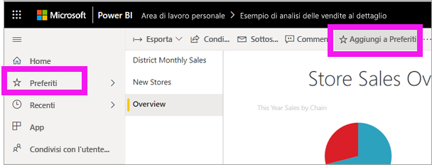

# Avvio rapido: Informazioni sulle funzionalità di Power BI per i *consumer*

[!INCLUDE[consumer-appliesto-ynny](../includes/consumer-appliesto-ynny.md)]

In questo Avvio rapido si apprende come interagire con Power BI per trovare informazioni dettagliate derivanti dai dati aziendali. Questo articolo non costituisce un'analisi approfondita, ma piuttosto un esame rapido di varie azioni disponibili per i **consumer** di Power BI.

Se non si è ancora iscritti a Power BI, [iscriversi per ottenere una versione di prova gratuita](https://app.powerbi.com/signupredirect?pbi_source=web) prima di iniziare.

## Che cos'è Power BI? 
Power BI è una raccolta di servizi software, app e connettori che interagiscono per trasformare le origini dei dati non correlate in un insieme di informazioni dettagliate coerenti, visivamente accattivanti e interattive. Non importa se i dati provengono da un semplice foglio di calcolo di Excel o da una raccolta di dati da origini diverse: Power BI consente di connettersi facilmente alle origini dati, visualizzare o individuare gli elementi importanti e condividerli con tutti gli utenti selezionati. 

## Visualizzazione di lettura
La visualizzazione di lettura è disponibile nel servizio Power BI per i *consumer* di report. Quando un collega condivide un report, un dashboard o un'app, la visualizzazione di lettura è lo strumento per esplorare e interagire con il report. 

È sufficiente aprire il servizio Power BI, in un browser o in un dispositivo mobile. Tutti gli utenti possono lavorare basandosi sugli stessi dashboard, report e app attendibili, che vengono aggiornati automaticamente, in modo da avere sempre a disposizione il contenuto più aggiornato.   

Dato che il contenuto non è statico, è possibile approfondire, cercare tendenze, informazioni dettagliate e altri dati di business intelligence, nonché filtrare e sezionare il contenuto o persino porre domande usando parole proprie. È anche possibile sfruttare le funzionalità automatiche di individuazione di informazioni interessanti dai dati, invio di avvisi per le modifiche dei dati e invio dei report tramite posta elettronica in base a una pianificazione impostata. Tutti i dati sono a disposizione in qualsiasi momento, nel cloud o in locale, da qualsiasi dispositivo. 

Continuare a leggere per informazioni su queste e altre funzionalità.

## Contenuto di Power BI
Quando si usa il termine "contenuto" in Power BI, si fa riferimento a report, dashboard e app. Questi sono gli elementi fondamentali che verranno usati per esplorare i dati e prendere decisioni aziendali. 

> [!NOTE]
> I dashboard, i report e le app possono essere visualizzati e condivisi anche nei dispositivi mobili.

###  App

Un'*app* è un tipo di contenuto di Power BI che combina tutti i dashboard e i report correlati in un'unica posizione. Un'app può avere uno o più dashboard e uno o più report, tutti aggregati insieme. Le app vengono create dai *designer* di Power BI che distribuiscono e condividono le app con gli *utenti*. 

Un modo per visualizzare le app consiste nel selezionare **App** nel riquadro di spostamento e scegliere un'app da aprire.

Per altre informazioni sulla visualizzazione delle app, vedere [App di Power BI](end-user-apps.md)

### Report

Un report di Power BI consente di visualizzare un set di dati da più punti di vista, grazie a oggetti visivi che rappresentano conclusioni e approfondimenti diversi ottenuti dal set di dati. Un report può includere un solo oggetto visivo oppure contenere pagine con più oggetti visivi. I report vengono creati dai *progettisti* di Power BI che distribuiscono e condividono le app con i *consumer*.

Per informazioni su come visualizzare i report, vedere [Report di Power BI](end-user-reports.md)

### Dashboard

Un dashboard di Power BI è una singola pagina, spesso denominata area di disegno, che usa le visualizzazioni per raccontare una storia. Essendo limitato a una pagina, un dashboard ben progettato contiene solo gli elementi più importanti per tale storia.

Le visualizzazioni mostrate nel dashboard vengono chiamate riquadri e vengono aggiunte al dashboard dai *progettisti* dei report. Nella maggio parte dei casi, selezionando un riquadro viene aperta la pagina del report in cui è stata creata la visualizzazione. 

Per informazioni su come visualizzare i dashboard, vedere [Dashboard di Power BI](end-user-dashboards.md)
 
## Interagire nel servizio Power BI

### Collaborare con i colleghi
Ignorare il messaggio di posta elettronica. Aggiungere un commento personale o avviare una conversazione con i colleghi in merito a un dashboard, direttamente nel dashboard. La funzionalità di commento è solo uno dei modi in cui è possibile collaborare con altri utenti. 

Altre informazioni sui [commenti](end-user-comment.md)

### Funzionalità automatiche di Power BI
Due delle funzionalità automatiche offerte dal servizio Power BI agli utenti sono le sottoscrizioni e gli avvisi. 

#### Effettuare la sottoscrizione a un dashboard o un report
Non è necessario aprire Power BI per monitorare un dashboard.  È sufficiente effettuare la sottoscrizione e Power BI invierà tramite posta elettronica uno snapshot del dashboard in base alla pianificazione impostata. 

.

 Altre informazioni sulle [sottoscrizioni di Power BI](end-user-subscribe.md)

#### Ricevere avvisi quando i dati raggiungono una soglia
I dati sono dinamici e gli oggetti visivi vengono aggiornati automaticamente per riflettere questo aspetto. Se si vuole ricevere una notifica quando i dati cambiano rispetto a una soglia impostata, usare gli avvisi per i dati. Gli avvisi funzionano per misuratori, indicatori KPI e schede.    

Power BI invia un messaggio di posta elettronica quando il valore aumenta o diminuisce oltre il limite impostato.  

Altre informazioni sugli [avvisi di Power BI](end-user-alerts.md)

### Usare Domande e risposte per porre domande sui dati con il linguaggio naturale
A volte il modo più rapido per ottenere una risposta dai dati consiste nel porre una domanda usando il linguaggio naturale. La casella Domande e risposte si trova nella parte superiore del dashboard. Ad esempio, "show me count of large opportunities by sales stage as a funnel" ("mostra il numero di opportunità importanti per fase di vendita come grafico a imbuto"). 

Altre informazioni su [Domande e risposte di Power BI](end-user-q-and-a.md)

### Visualizzare i dettagli di una visualizzazione
Gli oggetti visivi sono costituiti da punti dati e, passando il puntatore del mouse su un punto dati, è possibile visualizzare i dettagli.

### Aggiungere un dashboard ai Preferiti
Dopo aver aggiunto contenuto ai *Preferiti* sarà possibile accedere al contenuto nel riquadro di spostamento. Il riquadro di spostamento è visibile in quasi tutte le aree di Power BI. Gli elementi preferiti sono in genere i dashboard, le pagine di report e le app a cui si accede più spesso.

Nell'angolo superiore destro del servizio Power BI selezionare **Aggiungi a Preferiti** o, se non è visibile, selezionare **Altre opzioni** (...) e selezionare **Aggiungi a preferiti** nell'elenco a discesa. 
   

Esaminare le altre azioni disponibili nell'elenco a discesa.  In questo articolo non vengono trattate tutte, ma lo sono in altri articoli.  Per altre informazioni, usare il sommario di Power BI o il campo **Cerca**. 

Altre informazioni su [Preferiti ed elementi in primo piano](end-user-favorite.md)

### Regolare le dimensioni dello schermo
I report vengono visualizzati su dispositivi diversi, le cui dimensioni e proporzioni possono variare.  Il rendering predefinito potrebbe quindi non corrispondere a quello che si intende visualizzare sul dispositivo.  

Per modificarlo, nella barra dei menu in alto a destra selezionare **Visualizza** e scegliere una delle opzioni di visualizzazione. 

### Vedere come sono collegati tutti gli oggetti visivi di una pagina
Evidenziazione incrociata e filtro incrociato delle visualizzazioni correlate in una pagina di report. Le visualizzazioni in una singola pagina del report sono tutte "connesse" tra loro.  Questo significa che se si selezionano uno o più valori in una visualizzazione, le altre visualizzazioni che usano lo stesso valore verranno modificate in base alla selezione.

> 

Altre informazioni sulle [interazioni degli oggetti visivi](end-user-interactions.md)

<!-- ###  Open the **Selection** pane
Easily navigate between the visualizations on the report page. 

1. Select **View > Selection pane** to open the Selection pane. Toggle **Selection pane** to On.

    

2. The Selection pane opens on your report canvas. Select a visual from the list to make it active.

     -->

### Eseguire lo zoom avanti su singoli oggetti visivi
Passare il puntatore del mouse sull'oggetto visivo e selezionare l'icona **Modalità messa a fuoco**. Quando si espande in Modalità messa a fuoco, la visualizzazione riempie tutta l'area di disegno del report, come illustrato di seguito.

<!-- To display that same visualization without the distraction of menubars, filter pane, and other chrome -- select the **Full Screen** icon from the top menubar    .

 -->

Altre informazioni sulla [modalità messa a fuoco e sulla modalità schermo intero](end-user-focus.md)

### Ordinare una visualizzazione
Gli oggetti visivi in una pagina del report possono essere ordinati e salvati con le modifiche applicate. 

Passare il puntatore del mouse su un oggetto visivo per attivarlo e selezionare **Altre opzioni** (...) per aprire le opzioni di ordinamento.

 

Altre informazioni sull'[ordinamento degli oggetti visivi](end-user-search-sort.md)

### Mostrare i dati usati per creare la visualizzazione
Una visualizzazione di Power BI viene costruita con i dati dei set di dati sottostanti. Se si è interessati a visualizzare il "dietro le quinte", Power BI consente di *visualizzare* i dati usati per creare l'oggetto visivo. Quando si seleziona **Mostra i dati**, Power BI mostra i dati di sotto o accanto alla visualizzazione.

Con un oggetto visivo attivo, selezionare **Altre opzioni** (...) e scegliere **Mostra i dati**.
   
   

### Esportare i dati in Excel
Oltre a visualizzare i dati usati per creare un oggetto visivo, è anche possibile esportare i dati e visualizzarli in Microsoft Excel. Quando si esporta in Excel, si crea un documento separato, un foglio di calcolo che non fa parte di Power BI. Eventuali modifiche apportate nel file di Excel non avranno alcun effetto sui dati in Power BI. Power BI offre la flessibilità di esaminare più in dettaglio i dati o di usarli in un'altra applicazione o per altri scopi.

<!-- Exporting isn't limited to individual visuals; you can export entire reports to PowerPoint or PDF to share with your colleagues.

 -->

Questa rapida panoramica ha illustrato solo alcune azioni eseguibili dal *consumer* con il servizio Power BI.  

## Pulire le risorse
- Se si è connessi a un'app, nel riquadro di spostamento selezionare **App** per aprire l'elenco contenuti App. Passare il mouse sopra l'app da eliminare e selezionare l'icona del Cestino.

- Se è stata eseguita l'importazione o la connessione a un report di esempio di Power BI, nel riquadro di spostamento aprire **Area di lavoro personale**. Usando le schede nella parte superiore trovare il dashboard, il report e il set di dati e selezionare l'icona Cestino per ogni elemento.

## Passaggi successivi
[Power BI per i consumatori](end-user-consumer.md)

