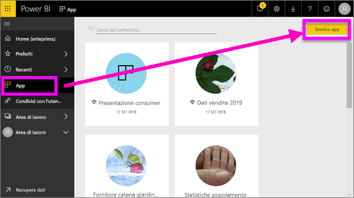
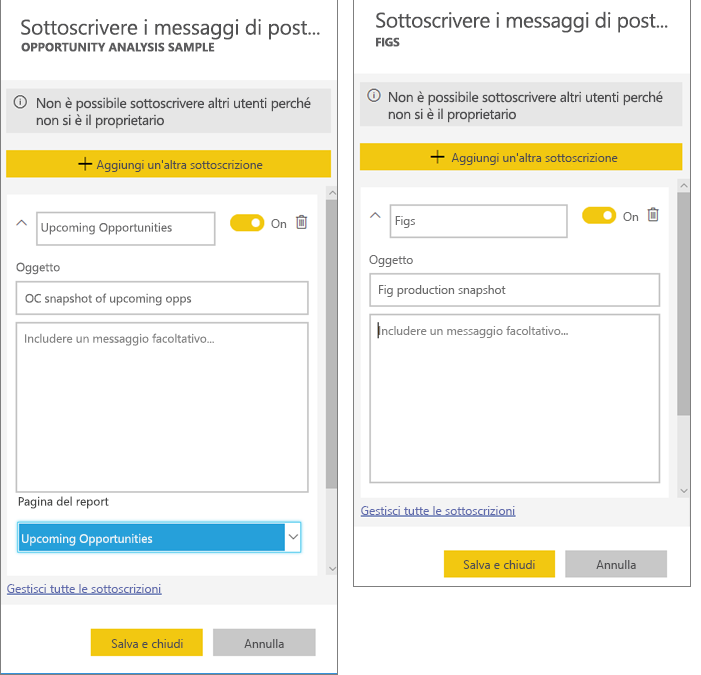
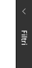
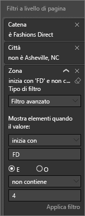

<!-- once the sample apps are live, change this so consumers can follow along -->
# Avvio rapido: Informazioni sulle funzionalità di Power BI per i ***consumer***
In questo Avvio rapido si apprende come interagire con Power BI per trovare informazioni dettagliate derivanti dai dati aziendali. Questo articolo non costituisce un'analisi approfondita, ma piuttosto un esame rapido di varie azioni disponibili per i **consumer** di Power BI.

Se non si è ancora iscritti a Power BI, [iscriversi per ottenere una versione di prova gratuita](https://app.powerbi.com/signupredirect?pbi_source=web) prima di iniziare.

## Prerequisiti
- Servizio Power BI (app.powerbi.com)
<!-- app from AppSource -->

## Visualizzazione di lettura
La visualizzazione di lettura è disponibile nel servizio Power BI per i *consumer* di report. Quando un collega condivide un report, la Visualizzazione di lettura è la modalità per esplorare e interagire con il report. 

L'altra modalità report del servizio Power BI è la [Visualizzazione di modifica](../service-interact-with-a-report-in-editing-view.md), disponibile per i *designer* dei report.  

La Visualizzazione di lettura è un metodo completo e sicuro per esplorare i dashboard e i report. Mentre si eseguono analisi approfondite dei dashboard e dei report condivisi, i set di dati sottostanti rimangono intatti e invariati. 

In Visualizzazione di lettura è ad esempio possibile evidenziare e filtrare gli oggetti visivi di una pagina in modo correlato.  È sufficiente evidenziare o selezionare un valore in un oggetto visivo per verificarne immediatamente l'impatto sugli altri oggetti. Usare il riquadro Filtro per aggiungere e modificare i filtri in una pagina del report e modificare il modo in cui vengono ordinati i valori in una visualizzazione. Questi sono solo alcune delle funzionalità *consumer* in Power BI.  Continuare a leggere per informazioni su queste e altre funzionalità.

 
### Visualizzare un'app
In Power BI le *app* riuniscono in un'unica posizione dashboard e report correlati.

1. Selezionare **App**  > **Scarica app**. 
   
     
2. In AppSource, in **Organizzazione** eseguire una ricerca per limitare il numero di risultati e trovare l'app che si sta cercando.
   
     
3. Selezionare **Scarica adesso** per aggiungerla al contenitore App. 

### Visualizzare un dashboard
Quest'app si apre automaticamente con un dashboard. Un ***dashboard*** Power BI è una singola pagina, spesso denominata area di disegno, che usa le visualizzazioni per raccontare una storia. Essendo limitato a una pagina, un dashboard ben progettato contiene solo gli elementi più importanti per tale storia.

Le visualizzazioni mostrate nel dashboard vengono chiamate *riquadri* e sono *aggiunte* al dashboard dai report.

### Effettuare la sottoscrizione a un dashboard o un report
Non è necessario aprire Power BI per monitorare un dashboard.  È sufficiente effettuare la sottoscrizione e Power BI invierà tramite posta elettronica uno snapshot del dashboard in base alla pianificazione impostata. 

.

1. Nella barra dei menu superiore selezionare **Sottoscrivi** oppure l'icona a forma di busta .
   
   

3. Usare il dispositivo di scorrimento giallo per attivare e disattivare la sottoscrizione.  Facoltativamente, aggiungere i dettagli del messaggio di posta elettronica. 

    Nelle schermate riportate di seguito si noti che quando si sottoscrive un report, viene in realtà eseguita una sottoscrizione a una *pagina* di report.  Per sottoscrivere più di una pagina di un report, selezionare **Aggiungi un'altra sottoscrizione** e selezionare una pagina diversa. 
      
   
   
    L'aggiornamento della pagina del report non aggiorna il set di dati. Solo il proprietario del set di dati può aggiornare manualmente un set di dati. Per cercare il nome dei set di dati sottostanti, selezionare **Visualizza elementi correlati** nella barra dei menu superiore.

### Visualizza il contenuto correlato
Il riquadro **Contenuto correlato** mostra come è interconnesso il contenuto del servizio Power BI: dashboard, report e set di dati. Non solo il riquadro mostra il contenuto correlato, ma consente anche di intervenire sul contenuto e spostarsi facilmente tra il contenuto correlato.

Da un dashboard o un report, selezionare **Visualizza elementi correlati** nella barra dei menu superiore.

### Usare Domande e risposte per porre domande sui dati con il linguaggio naturale
A volte il modo più rapido per ottenere una risposta dai dati consiste nel porre una domanda usando il linguaggio naturale. La casella Domande e risposte si trova nella parte superiore del dashboard. Ad esempio, "show me count of large opportunities by sales stage as a funnel" ("mostra il numero di opportunità importanti per fase di vendita come grafico a imbuto"). 

### Aggiungere un dashboard ai Preferiti
Dopo aver aggiunto un contenuto a *Preferiti* è possibile accedere a tale contenuto dalla barra di spostamento a sinistra. La barra di spostamento a sinistra è visibile da quasi tutte le aree di Power BI. Gli elementi preferiti sono in genere i dashboard, le pagine di report e le app a cui si accede più spesso.

1. Uscire da Domande e risposte per tornare a un dashboard.    
2. Nell'angolo in alto a destra del servizio Power BI selezionare **Aggiungi a Preferiti** o l'icona a forma di stella .
   
   

### Aprire e visualizzare report e pagine di report
Un report è costituito da una o più pagine di oggetti visivi. I report vengono creati dai *designer* di Power BI e [condivisi con i *consumer* direttamente](end-user-shared-with-me.md) o nel contesto di un'[app](end-user-apps.md). 

I report possono essere aperti da un dashboard. La maggior parte dei riquadri del dashboard viene *aggiunta* dai report. Se si seleziona un riquadro, viene aperto il report usato per creare il riquadro stesso. 

1. In un dashboard selezionare un riquadro. In questo esempio è stato selezionato il riquadro dell'istogramma "Revenue" (Ricavi).

    

2.  Viene aperto il report associato. Si noti che la pagina corrente è "Revenue overview" (Panoramica ricavi). Si tratta della pagina del report che contiene l'istogramma selezionato dal dashboard.

    

### Regolare le dimensioni dello schermo
I report vengono visualizzati su dispositivi diversi, le cui dimensioni e proporzioni possono variare.  Il rendering predefinito potrebbe quindi non corrispondere a quello che si intende visualizzare sul dispositivo.  

1. Per la regolazione, nella barra dei menu superiore selezionare **Visualizza**.

    

2.  Scegliere una delle opzioni disponibili. In questo esempio è stata scelta l'opzione **Adatta alla pagina**.

        

### Usare il riquadro Filtri del report
Se l'autore del report ha aggiunto filtri a una pagina di un report, è possibile interagire con i filtri.

1. Selezionare l'icona **Filtri** nell'angolo in alto a destra.
   
     

2. Selezionare un oggetto visivo per attivarlo. Verranno visualizzati tutti i filtri applicati nell'oggetto visivo (Filtri a livello di oggetto visivo), in tutta la pagina del report (Filtri a livello di pagina) e nell'intero report (Filtri a livello di report).
   
   

3. Passare con il mouse su un filtro ed espanderlo selezionando la freccia verso il basso.
   
   

4. Modificare i filtri e verificarne l'impatto sugli oggetti visivi.  
   
     
     

### Vedere come sono collegati tutti gli oggetti visivi di una pagina
Evidenziare le visualizzazioni correlate e i filtri correlati in una pagina. Le visualizzazioni in una singola pagina del report sono tutte "connesse" tra loro.  Questo significa che se si selezionano uno o più valori in una visualizzazione, le altre visualizzazioni che usano lo stesso valore verranno modificate in base alla selezione.

> 
### Visualizzare i dettagli di una visualizzazione
Passare con il mouse sugli oggetti visivi per visualizzarne i dettagli

### Ordinare una visualizzazione
Gli oggetti visivi in una pagina del report possono essere ordinati e salvati con le modifiche applicate. 

1. Passare il mouse sopra un oggetto visivo per attivarlo.    
2. Selezionare i puntini di sospensione (...) per aprire le opzioni di ordinamento.

     

###  Aprire il riquadro **Selezione**
È possibile spostarsi con facilità tra visualizzazioni nella pagina del report. 

1. Selezionare **Visualizza > Riquadro di selezione** per aprire il riquadro di selezione. Attivare **Riquadro di selezione**.

    

2. Il riquadro di selezione viene aperto nel canvas del report. Selezionare un oggetto visivo nell'elenco per attivarlo.

    

### Eseguire lo zoom avanti su singoli oggetti visivi
Passare il puntatore del mouse sull'oggetto visivo e selezionare l'icona **Modalità messa a fuoco** . Quando si espande in Modalità messa a fuoco, la visualizzazione riempie tutta l'area di disegno del report, come illustrato di seguito.

Per aprire la stessa visualizzazione senza elementi di distrazione come barre dei menu, riquadro dei filtri e altri riquadri, selezionare l'icona **Schermo intero** dalla barra dei menu in alto .

### Mostrare i dati usati per creare la visualizzazione
Una visualizzazione di Power BI viene costruita con i dati dei set di dati sottostanti. Se si è interessati a visualizzare il "dietro le quinte", Power BI consente di *visualizzare* i dati usati per creare l'oggetto visivo. Quando si seleziona **Mostra i dati**, Power BI mostra i dati di sotto o accanto alla visualizzazione.

1. Nel servizio Power BI aprire un report e selezionare un oggetto visivo.  
2. Per visualizzare i dati su cui si basa l'oggetto visivo, selezionare i puntini di sospensione (...) e scegliere **Mostra i dati**.
   
   

Questa rapida panoramica ha illustrato alcune azioni eseguibili dal **consumer** con il servizio Power BI.  

## Pulire le risorse
- Se si è connessi a un'app, nella barra di spostamento a sinistra selezionare **App** per aprire l'elenco contenuti App. Passare il mouse sopra l'app da eliminare e selezionare l'icona del Cestino.

- Se è stata eseguita l'importazione o la connessione a un report di esempio di Power BI, nella barra di spostamento a sinistra aprire **Area di lavoro personale**. Usando le schede nella parte superiore trovare il dashboard, il report e il set di dati e selezionare l'icona Cestino per ogni elemento.

## Passaggi successivi

