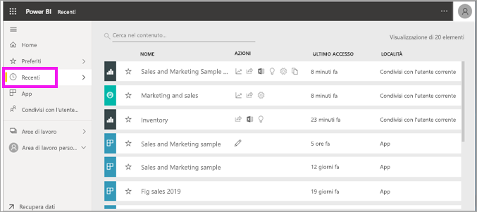
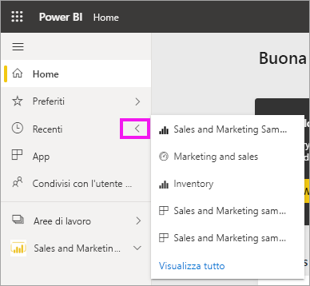
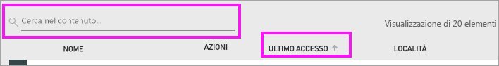

# Trovare il contenuto **recente** nel servizio Power BI
Il contenuto recente è costituito dagli ultimi elementi visitati nel servizio Power BI, per un massimo di 20 elementi.  Sono inclusi dashboard, report, app e cartelle di lavoro.

Il video seguente illustra come vengono popolati gli elenchi di contenuti **Recenti** del servizio Power BI. Seguire quindi tutte le istruzioni riportate sotto il video per provare a farlo da soli.

<iframe width="560" height="315" src="https://www.youtube.com/embed/G26dr2PsEpk" frameborder="0" allowfullscreen></iframe>

> [!NOTE]
> Questo video usa una versione precedente del servizio Power BI.

## Visualizzare il contenuto recente
Per visualizzare gli ultimi cinque elementi visitati di recente, dal riquadro di spostamento selezionare la freccia a destra di **Recenti**.  Da qui è possibile selezionare il contenuto recente per aprirlo. Sono elencati solo i cinque elementi più recenti.

Se sono presenti più di cinque elementi visitati di recente, selezionare **Visualizza tutto** per aprire la schermata Recenti. È anche possibile selezionare **Recenti** o l'icona Recenti  dal riquadro di spostamento.

## Azioni disponibili dall'elenco di contenuto **Recenti**
Le azioni disponibili dipenderanno dalle impostazioni assegnate dal *progettista* del contenuto. Ecco alcune delle opzioni:
* Selezionare l'icona a forma di stella per [aggiungere un dashboard, un report o un'app a Preferiti](end-user-favorite.md) .
* Alcuni dashboard e report possono essere ricondivisi  .
* [Aprire il report in Excel](end-user-export.md)  
* [Visualizzare le informazioni dettagliate](end-user-insights.md) trovate da Power BI nei dati .
* In più, se gli elenchi si allungano, [usare il campo di ricerca e l'ordinamento per trovare le informazioni necessarie](end-user-search-sort.md). Per determinare se una colonna può essere ordinata, passare il puntatore del mouse sulla colonna per verificare se viene visualizzata una freccia. In questo esempio, se si passa il puntatore del mouse su **Ultimo accesso** viene visualizzata una freccia e ciò indica che il contenuto recente può essere ordinato in base alla data di accesso. 

    

## Passaggi successivi
[App del servizio Power BI](end-user-apps.md)

Altre domande? [Provare la community di Power BI](https://community.powerbi.com/)

