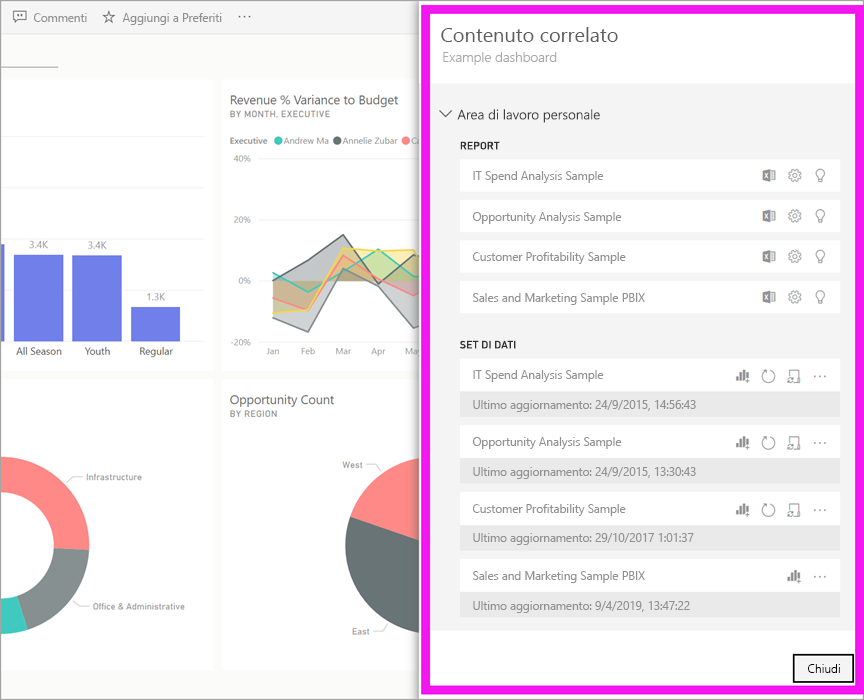
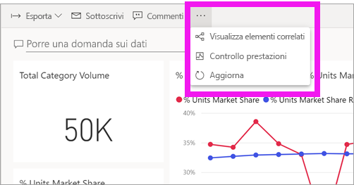
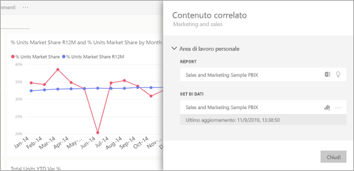
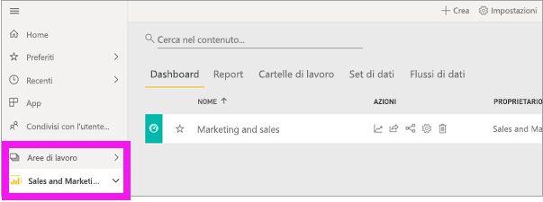
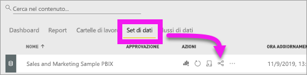
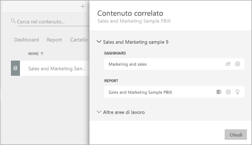

# Visualizzare il contenuto correlato nel servizio Power BI

[!INCLUDE [power-bi-service-new-look-include](../includes/power-bi-service-new-look-include.md)]

Il riquadro **Contenuto correlato** mostra come è interconnesso il contenuto del servizio Power BI: dashboard, report e set di dati. Il riquadro **Contenuto correlato** è anche un punto di partenza per eseguire azioni. Da qui è possibile eseguire operazioni come aprire un dashboard, aprire un report, generare informazioni dettagliate, analizzare i dati in Excel e altro ancora.  

In Power BI, i report sono basati sui set di dati, gli oggetti visivi del report vengono aggiunti ai dashboard e gli oggetti visivi del dashboard si collegano ai report. Ma come si fa a sapere quali dashboard ospitano gli oggetti visivi provenienti dal report Marketing? E come si individuano quei dashboard? Il dashboard Procurement usa oggetti visivi da più di un set di dati? In questo caso, come sono denominati e come è possibile aprirli e modificarli? Il set di dati HR è effettivamente usato in report o dashboard? Oppure può essere spostato senza causare collegamenti interrotti? Domande come queste trovano tutte una risposta nel riquadro **Contenuto correlato**.  Non solo il riquadro mostra il contenuto correlato, ma consente anche di intervenire sul contenuto e spostarsi facilmente tra il contenuto correlato.

> [!NOTE]
> La funzionalità Contenuto correlato non funziona per i set di dati di streaming.
> 
> 

## Visualizzare il contenuto correlato di un dashboard o report
Questo video illustra come visualizzare il contenuto correlato di un dashboard. Seguire quindi tutte le istruzioni riportate sotto il video per provare a farlo da soli usando il set di dati di esempio Analisi dell'approvvigionamento.

<iframe width="560" height="315" src="https://www.youtube.com/embed/B2vd4MQrz4M#t=3m05s" frameborder="0" allowfullscreen></iframe>

Con un dashboard o un report aperto, selezionare **Altre opzioni** (...) nella barra dei menu e scegliere **Visualizza elementi correlati** nell'elenco a discesa.

Viene visualizzato il riquadro **Contenuto correlato**, Per un cruscotto digitale vengono visualizzati tutti i report con visualizzazioni aggiunte al dashboard e i set di dati associati. Per questo dashboard sono presenti visualizzazioni aggiunte da un solo report e il report è basato su un solo set di dati. 

A questo punto, è possibile intervenire direttamente sul contenuto correlato.  Ad esempio, selezionare un nome di dashboard o report per aprirlo.  Per un report elencato, selezionare l'icona [Analizza in Excel](../service-analyze-in-excel.md) oppure [Ottieni informazioni dettagliate](end-user-insights.md). Per un set di dati, è possibile visualizzare la data e l'ora dell'ultimo aggiornamento, selezionare [Analizza in Excel](end-user-insights.md) e [Ottieni informazioni dettagliate](../service-analyze-in-excel.md).  

## Visualizzare il contenuto correlato di un set di dati
Per aprire il riquadro *Contenuto correlato* sono necessarie almeno le autorizzazioni di **visualizzazione** per un set di dati. In questo esempio verrà usato l'esempio [Procurement Analysis Sample](../sample-procurement.md).

Nel riquadro di spostamento trovare l'intestazione **Aree di lavoro** e selezionare un'area di lavoro nell'elenco. Se è presente contenuto in un'area di lavoro, verrà visualizzato nell'area di disegno a destra. 

In un'area di lavoro selezionare la scheda **Set di dati** e quindi trovare l'icona **Visualizza elementi correlati**.

Selezionare l'icona per aprire il riquadro **Contenuto correlato**.

A questo punto, è possibile intervenire direttamente sul contenuto correlato. Ad esempio, selezionare un nome di report o dashboard per aprirlo.  Per i dashboard nell'elenco, selezionare un'icona per [Condividere il dashboard con altri utenti](../service-share-dashboards.md) o per aprire la finestra **Impostazioni** per il dashboard. Per un report, selezionare l'icona [Analizza in Excel](../service-analyze-in-excel.md), [Rinomina](../service-rename.md) oppure [Ottieni informazioni dettagliate](end-user-insights.md).  

## Limitazioni e risoluzione dei problemi
* Se l'opzione "Visualizza elementi correlati" non è disponibile, cercare invece l'icona . Selezionare l'icona per aprire il riquadro **Contenuto correlato**.
* Per aprire il contenuto correlato per un report, è necessario essere in [Visualizzazione di lettura](end-user-reading-view.md).
* La funzionalità Contenuto correlato non funziona per i set di dati di streaming.

## Passaggi successivi
* [Introduzione al servizio Power BI](../service-get-started.md)
* Altre domande? [Provare la community di Power BI](https://community.powerbi.com/)

